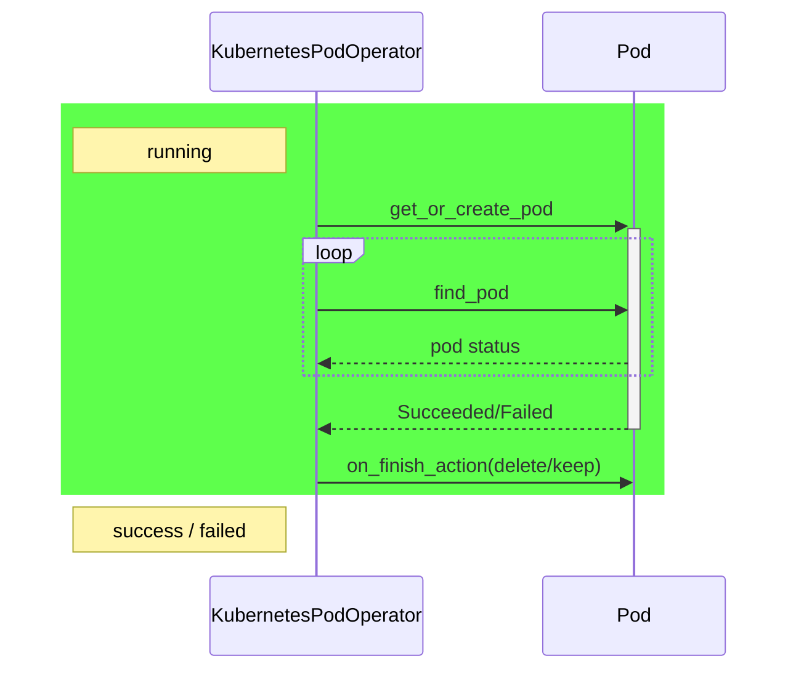
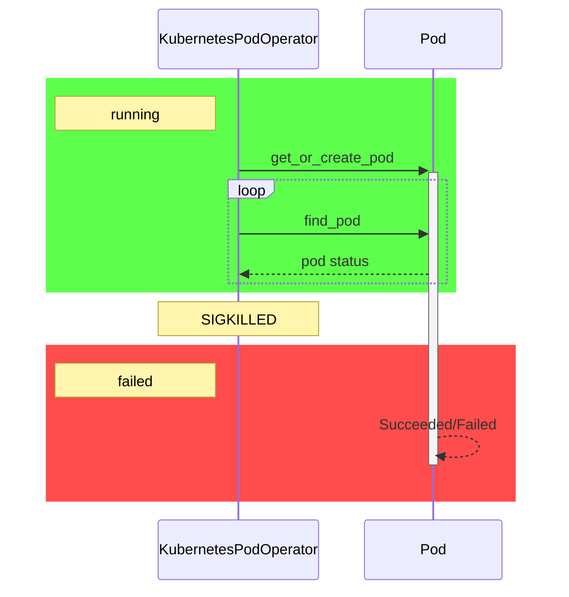
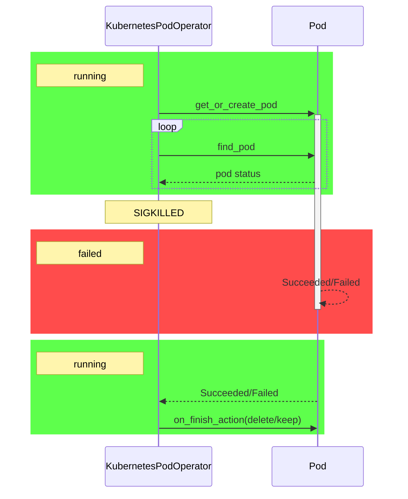
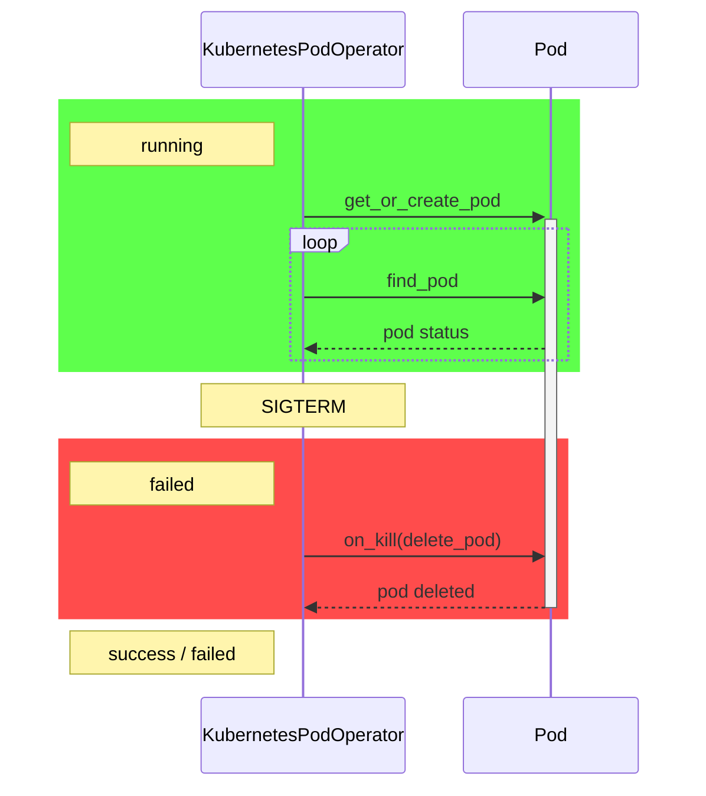
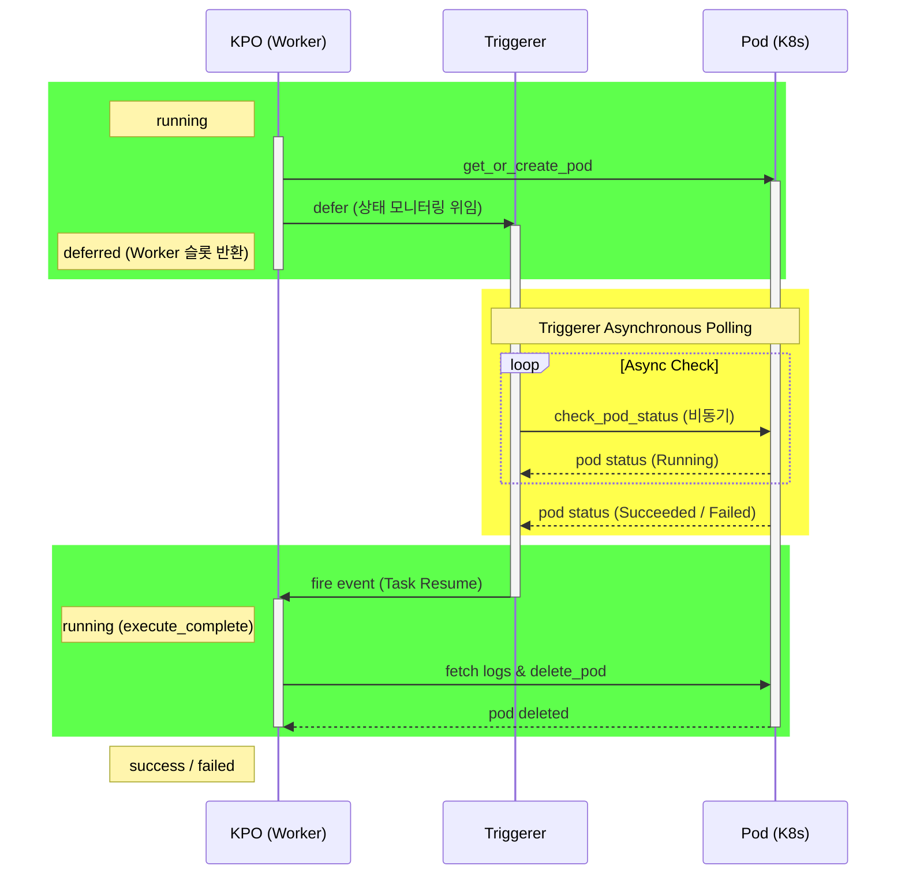
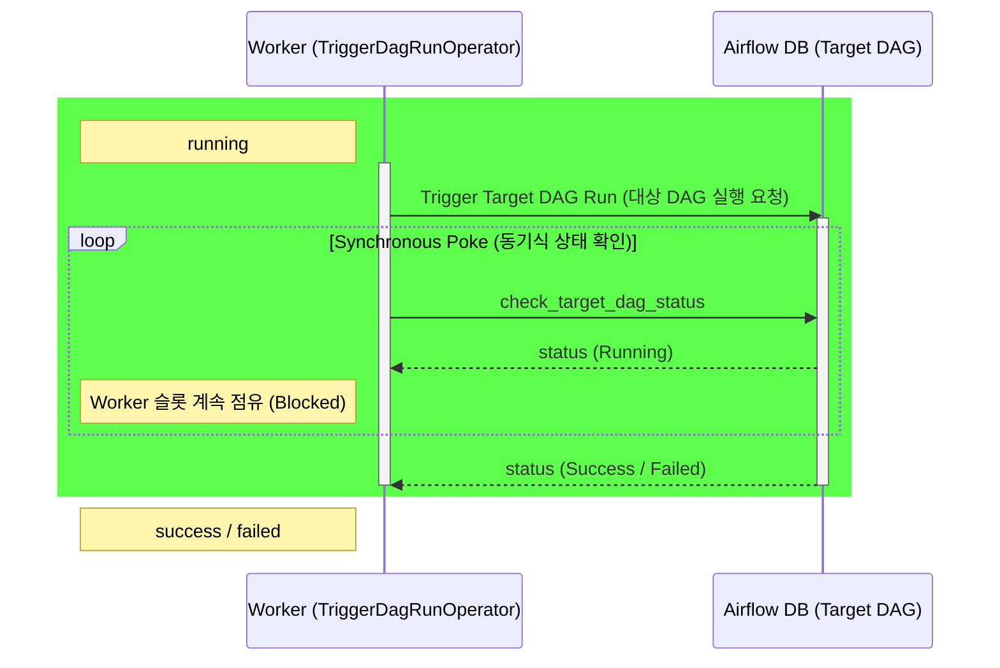
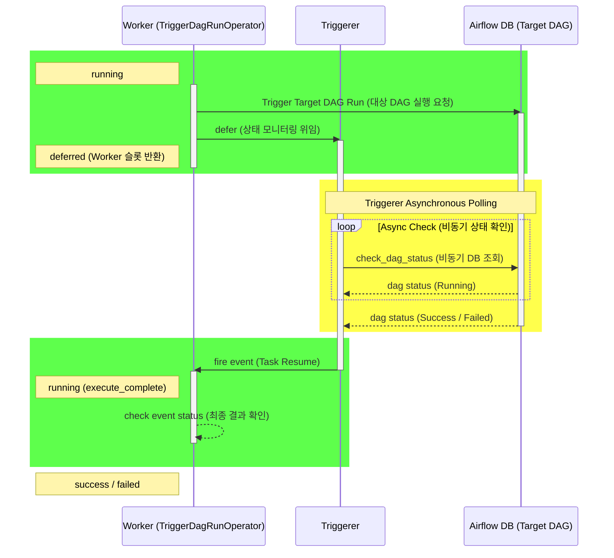
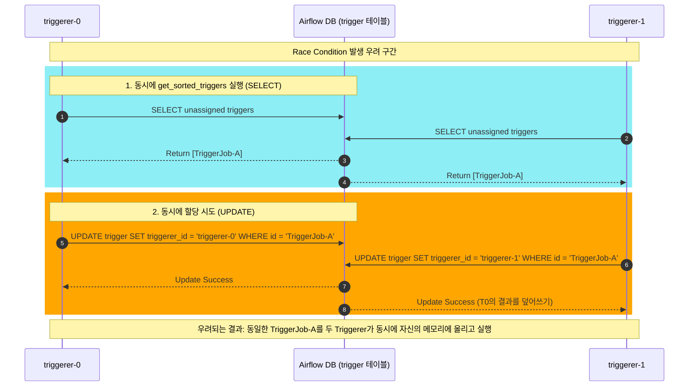
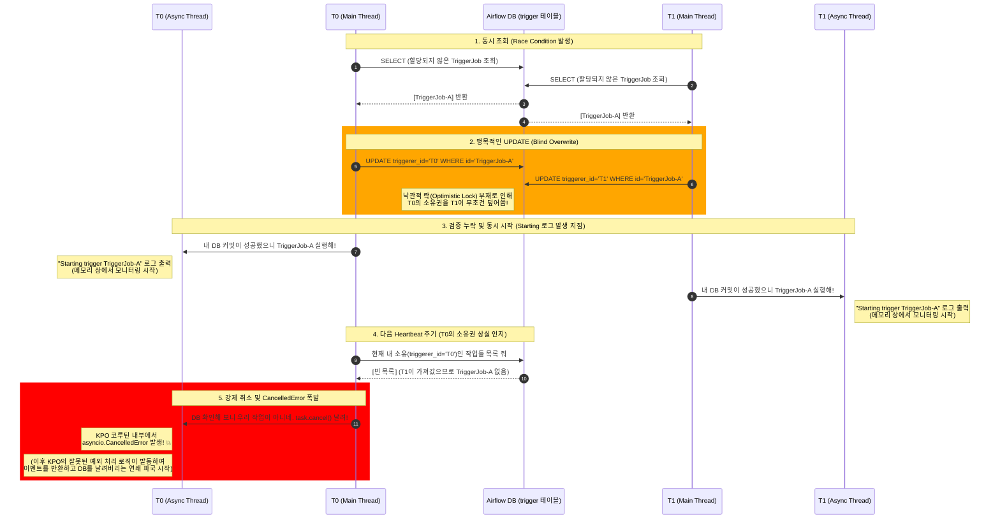
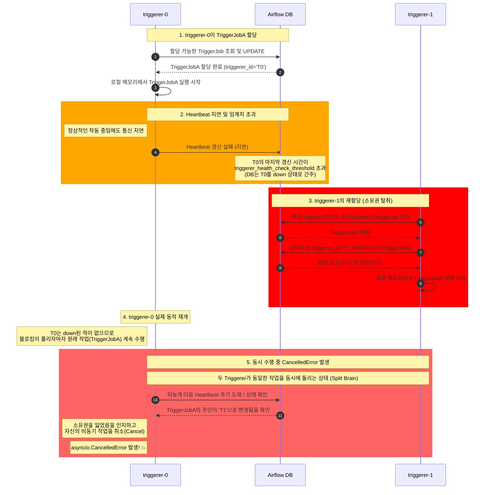

Airflow Triggerer를 사용하면서 겪었던 장애를 정리합니다.

# 문제 상황

airflow의 KubernetesPodOperator, TriggerDagRunOperator를 위주로 데이터 파이프라인을 구축하여 운영 중이었습니다. airflow를 재배포하거나 장애로 인해 airflow worker가 종료되는 경우에 이 operator들에 의해 실행되는 task들도 failed 처리됩니다.

airflow를 운영하는 입장에서 이 문제를 해결하고 싶었고, 해결하기 위해 탐색해나가는 과정을 글로 기록합니다.

# KubernetesPodOperator의 연속성을 유지하자

KubernetesPodOperator(이하 KPO라 적음)는 Pod을 생성하고, 해당 Pod phase가 Running에서 Failed 혹은 Succeeded로 변경되는 지를 감시합니다. 물론, 옵션에 따라 Pod 내부의 base conatiner를 감시하도록 설정할 수 있습니다. 여기서는 단순화하여 Pod phase를 기준으로 설명하겠습니다. 



## airflow worker 장애(SIGKILLED): Pod Adoption
KPO를 실행 중인 airflow worker가 장애로 인해 갑자기 종료된다면(worker get SIGKILLED) 어떻게 될까요?



위 다이어그램처럼 SIGKILLED로 인해 KPO가 중간에 비정상종료되더라도 KPO에 의해 생성된 Pod는 계속 실행됩니다. 그리고 Pod가 Succeeded되더라도 KPO 입장에서는 이를 알 수 없기 때문에 failed인 상태로 남아있습니다.

대부분의 경우에 이런 현상이 발생하면 KPO를 재실행(retry)하여 새로운 Pod를 생성하여 작업을 재수행합니다. 하지만 Pod의 러닝타임이 몇 시간씩이나 걸리는 무거운 작업이라면 이는 부담스럽고 복구에 많은 시간이 소요됩니다. 뿐만 아니라 이미 Succeded Pod라면 재실행 자체가 불필요한 시도입니다. 

여기서 Pod Adoption이 등장합니다. airflow에 몇가지 설정을 주면 KPO를 재실행했을 때 기존에 KPO가 실행했던 Pod를 입양하여 그 상태를 다시 모니터링합니다. 



재실행까지 Pod가 완료되지 않아도 로직은 같습니다. 1 try일 때 생성했던 Pod를 그대로 이어받아 Pod Phase를 감시합니다. 

이와 같은 Pod Adoptation이 동작하기 위해서는 아래와 같이 `reattach_on_restart=True`로 설정하고 반드시 `retries`를 2 이상으로 설정해야합니다. reattach(=pod adoption)은 KPO를 재실행(retry)하는 과정에서 기존에 이미 생성된 Pod가 있다면 해당 Pod를 찾아 입양하기 때문입니다. 입양할 Pod는 Pod의 label(dag_id, run_id, task_id로 조합)을 기준으로 찾게됩니다. 
```
task = KubernetesPodOperator(
    task_id="example_task",
    namespace="default",
    image="ubuntu:latest",
    cmds=["bash", "-c"],
    arguments=["echo hello && sleep 300"],
    reattach_on_restart=True, 
    retries=2
    ...
)
```

## airflow worker 재배포(SIGTERM): Delete Pod
worker 장애(SIGKILLED)에 대해서는 위와 같이 대응이 가능했으나 재배포 시에는 SIGKILLED가 아니라 SIGTERM이 발생합니다. 




SIGTERM이 발생하면 KPO는 `on_kill`을 실행하여 실행 중인 Pod를 삭제해버립니다. KPO를 재실행해도 1 try 때 생성되었던 Pod는 이미 삭제되어 존재하기 때문에 Pod Adoption이 불가능합니다. 즉 위와 같은 설정으로는 airflow worker의 장애에는 대응할 수 있었으나 무중단 배포는 불가능했습니다.

## Deferrable

KPO의 deferrable을 적용하면 무중단 배포가 가능합니다. defer란 worker가 해당 task를 실행하지 않고(지연하고) triggerer에게 이관하는 것을 의미힙니다. triggerer는 operator에 정의된 조건을 만족할 때까지 대기하다가, 조건을 만족하면 operator를 다시 재실행합니다. 

KPO의 triggerer(KubernetesPodTrigger)는 Pod Phase가 Running을 벗어났을 때 KPO를 다시 실행시킵니다.



KPO가 실행된 뒤 Pod 생성까지만 성공하고 deferred 상태가 된다면 worker가 SIGKILLED, SIGTERM을 받더라도 관계 없이 Pod는 계속 실행됩니다. triggerer의 장애도 크게 상관 없습니다. triggerer는 poll 방식으로 특정 조건을 만족하면 KPO를 재개하는 event를 발행합니다. triggerer가 잠시 장애가 발생하더라도 재복구되어 끊어졌던 poll을 다시 할 수 있다면 airflow 외부의 Pod의 영속성은 계속 유지됩니다. 

# TriggerDagRunOperator
지금까지 KPO를 기준으로 defer의 필요성에 대해 설명했습니다. TriggerDagRunOperator(이하 TDRO)도 KPO와 동일한 패턴을 가지고 있기 때문에 KPO를 적용하기에 적합합니다.



이처럼 TDRO도 주기적으로 실행시킨 dagrun을 관찰하는 포지션이고 이는 굳이 worker cpu를 계속 점유하며 실행할 이유가 없는 동작입니다. 
따라서 deferrable을 적용하면 아래와 같은 구조로 실행됩니다. 



# deferrable 활성화하기

deferrable을 사용하기 위해선 두가지 작업이 필요합니다. 

## 1. airflow triggerer 추가
airflow triggerer에 대해 처음 들어보셨을 수도 있습니다. triggerer를 실행하기는 쉽습니다. `airflow triggerer` 명령어가 끝입니다. 따로 복잡한 설정이 필요하지도 않습니다. 이미 airflow를 배포할 때 MySQL에 `trigger` 테이블도 생성되어 있을 겁니다. helm으롭 배포한다면 triggerer를 배포하는 template만 활성화하도록 수정해주면 됩니다. 보통 triggerer는 2개 이상 배포하여 HA(고가용성)을 확보합니다. 1대가 장애로 인해 다운되더라도 trigger job을 실행하기 위해서입니다. 

## 2. `deferrable=True`
deferrable이 사용 가능한 Operator에서 명시적으로 `deferrable=True`를 입력합니다. 
```python
task = KubernetesPodOperator(
    task_id="example_task",
    namespace="default",
    image="ubuntu:latest",
    cmds=["bash", "-c"],
    arguments=["echo hello && sleep 300"],
    deferrable=True,
    ...
)

task2 = TriggerDagRunOperator(
    ...
    deferrable=True
    ...
)
```

defer 모드가 있는 모든 Operator를 일괄로 defer 모드로 전환하고 싶다면 `airflow.cfg`에서 다음 섹션을 수정하면 됩니다. 

```cfg
# airflow.cfg
[operator]
default_deferrable=True
```

이렇게 설정하면 모든 deferrable이 사용 가능한 operator가 일괄로 defer 모드로 전환됩니다. 


# KPO + airflow triggerer 사용기

이제부터는 KPO defer 모드로 airflow tirggerer를 사용하면서 겪었던 사례들에 대해 설명해보려고 합니다.triggerer 2대를 사용하면서 발생하는 race condition에 대한 디버깅 사례입니다. 


최신 버전을 사용하는 경우에 아래 내용은 의미가 없을 수 있지만 airflow 내부 동작을 이해하는 경험이었어서 정리해봅니다.

## use_row_level_locking

1. triggerer를 2대 이상 운영한다
2. providers-cncf-kubernetes==7.14 버전을 사용한다 (최신 버전에서는 개선되었음)

위 두 가지 조건에 모두 해당되고, 아래처럼 설정했다면 이런 현상이 발생할 수 있습니다.

```
use_row_level_locking=False # default: True
```

보통 건드리지 않는 설정이긴 하지만, scheduler를 1개만 사용하고 있다면 설정하는 경우가 있기도 합니다.

위 옵션을 적용하면 airflow 내부의 모든 쿼리가 `SELECT ... FOR UPDATE` 대신 단순히 `SELECT`만 실행하게 되어 성능이 조금 빨라지는 장점이 있습니다. 그러나 UPDATE를 위한 LOCK을 걸지 않기 때문에 아래와 같은 케이스가 발생할 수 있습니다.

triggerer는 TriggerJob을 할당받기 위해 아직 할당되지 않은 TriggerJob을 검색합니다. 
`Trigger.get_sorted_triggers`가 이 역할입니다. 이 함수는 아래와 같은 쿼리를 실행합니다. 
```sql
SELECT trigger.id
FROM trigger
INNER JOIN task_instance 
    ON trigger.id = task_instance.trigger_id
WHERE trigger.triggerer_id IS NULL 
   OR trigger.triggerer_id NOT IN (:alive_triggerer_ids_1, :alive_triggerer_ids_2, ...)
ORDER BY COALESCE(task_instance.priority_weight, 0) DESC, trigger.created_date ASC
LIMIT :capacity;
```
위 쿼리의 실행 결과는 triggerer를 할당받지 못한 TriggerJob들이고 이 TriggerJob들에 대해서 triggerer를 할당하게 됩니다. 

이때 triggerer-0, triggerer-1이 동시에 위 쿼리를 실행하면 동일한 TriggerJob을 2개의 triggerer가 동시에 할당받게됩니다.



이처럼 거의 동시에 2개의 triggerer(예: triggerer-0, triggerer-1)가 동일한 TriggerJob을 조회하여 경합(Race Condition)이 발생하면, TriggerJob을 할당받은 2대의 triggerer에서 강제 종료 신호(asyncio.CancelledError)가 발생합니다.

문제는 triggerer 내부에서 실행 중인 코드 로직이 이 에러를 조용히 무시하지 않고, 작업을 끝내도록 이벤트(TriggerEvent)를 반환해 버린다는 점입니다. 이때 `KubernetesPodTriggerer`는 [`CancellerError`를 발생시킵니다](https://github.com/apache/airflow/blob/providers-cncf-kubernetes/7.14.0/airflow/providers/cncf/kubernetes/triggers/pod.py#L204). 이를 전달받은 Airflow 코어는 작업이 완료되었다고 착각하여 trigger 테이블에서 해당 TriggerJob 레코드를 영구 삭제해 버립니다.

결과적으로 정당하게 할당받아 모니터링을 수행 중이던 triggerer-0은, 다음 상태 확인 주기에 DB에서 자신의 담당 레코드가 흔적 없이 사라진 것을 발견합니다. 이를 사용자에 의한 삭제로 오판한 triggerer-0마저 자신의 TriggerJob을 취소(Cancel)하게 되면서, 최종적으로 작업이 유실되는 연쇄 실패가 발생합니다.



다이어그램엔 없지만, T0이 TriggerJob에 해당하는 레코드를 삭제해 버리기 때문에 T1도 다음 HeartBeat에서 본인이 실행해야하는 TriggerJob을 취소(CancellerError)를 발생시키게 됩니다(그리고 어차피 KPO가 재개되어 Running이기 때문에 T1이 발생시키는 TriggerEvent를 수신할 KPO도 존재하지 않습니다). 

이를 방지하는 방법은 간단합니다. 
```
use_row_level_locking=True
```
`SELECT ... FOR UPDATE` 쿼리가 실행되도록 하면 T0, T1가 동일한 TriggerJob을 절대 할당받을 수 없으므로 위 시나리오는 발생하지 않습니다. 


## slow query로 인한 Heartbeat Latency

1. triggerer를 2대 이상 운영한다
2. airflow < 3.01 버전을 사용한다 (최신 버전에서는 개선되었음)
3. `task_instance` 테이블 사이즈가 매우 크다(airflow 운영을 오래했고 airflow db clean을 정기적으로 실행하지 않았다)

위 두 가지 조건에 모두 해당되는 경우에 발생할 수 있습니다.

Lock을 걸고 나서는 triggerer 간의 경합이 발생하지 않을거라 생각했지만, 실제는 달랐습니다.
이번에는 Heartbeat 지연으로 인해 triggerer 간의 경합이 발생했습니다. 



이러한 시나리오가 발생하는 근본적인 원인은 T0에서 발생한 heartbeat 지연 때문이고 제 경우에는 이는 slow query때문이었습니다. 

`Trigger.get_sorted_triggers`에서 실행했던 쿼리가 기억 나시나요? 

```sql
SELECT trigger.id
FROM trigger
INNER JOIN task_instance 
    ON trigger.id = task_instance.trigger_id
WHERE trigger.triggerer_id IS NULL 
   OR trigger.triggerer_id NOT IN (:alive_triggerer_ids_1, :alive_triggerer_ids_2, ...)
ORDER BY COALESCE(task_instance.priority_weight, 0) DESC, trigger.created_date ASC
LIMIT :capacity;
```

이 쿼리는 `trigger`, `task_instance` 2개의 테이블이 사용됩니다. airflow 내에서 실제로 실행될 때는 session 내에서 alive_triggerer_ids를 획득하는 쿼리가 서브쿼리 형태로 실행되기 때문에 `job`까지 총 3개의 테이블이 사용됩니다. 

쿼리 자체가 항상 문제가 되는 것은 아닙니다만, 이 쿼리는 `task_instance` 테이블 사이즈가 커지면 driving table이 `trigger`에서 `task_instance`로 변경됩니다. driving table이 변경되면 `task_instance에는` 필터링이 없기 때문에 해당 테이블을 FullScan하게 되고 실행 시간이 10초 이상 소요되는 slow query가 됩니다. 

triggerer는 매 loop마다 위 쿼리를 실행하므로 이 쿼리 완료에 10초 이상이 소요되면 hearbeat 지연이 더 자주 발생하고 위의 시퀀스처럼 TriggerJob 탈취 현상이 더 자주 발생하는 것입니다. 

해결책은 크게 두 가지입니다. 

## airflow 3.01 이상으로 업데이트

해당 쿼리의 문제점은 이 [PR](https://github.com/apache/airflow/pull/46303)에서 보고되었고 해결책으로 JOIN HINT(`STRAIGHT_JOIN`)을 추가했습니다. 따라서 airflow 3.1에서는 위와 같은 slow query 이슈가 해결되었습니다. 


## `task_instance` 테이블 정리

이 현상은 `task_instance`의 크기가 매우 큰 경우에만 발생합니다. 따라서 `airflow db clean` 명령어를 이용하여 해당 테이블의 레코드를 삭제해주면 쿼리 실행 계획이 다시 `trigger`를 driving table로 사용하면서 자연스레 해결됩니다. 

[참고]  
