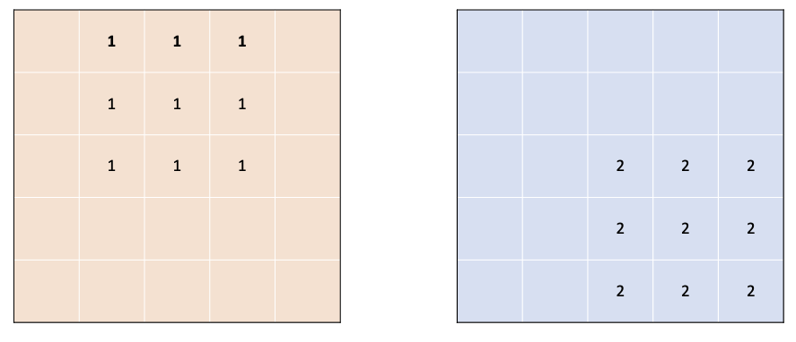
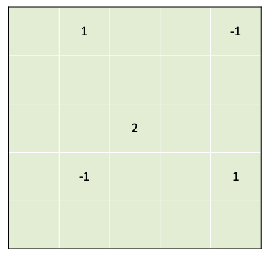
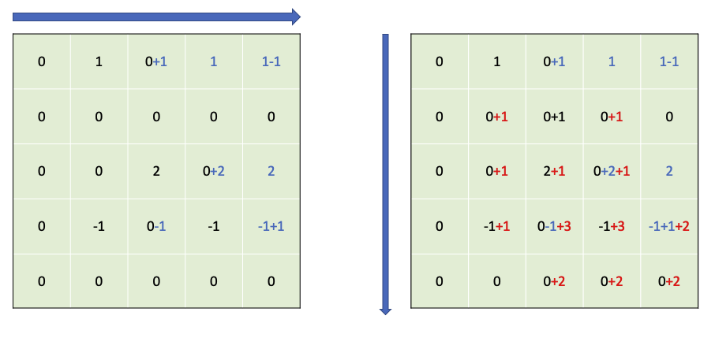
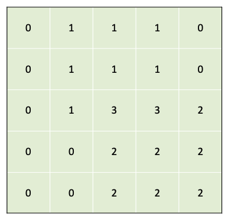

누적 합(Prefix Sum) 알고리즘 (2022 KAKAO BLIND RECRUITMENT 6 파괴되지 않은 건물)

## index별 합 구하기

일정 구간[x, y]이 주어지고, 각 배열에서 [x, y]구간이 1일 때, 해당 배열들의 index 값의 합을 구하고자 합니다.  

| index  | 0    | 1    | 2    | 3    | 4    |
| ------ | ---- | ---- | ---- | ---- | ---- |
| array1 | 1    | 1    | 1    | 0    | 0    |
| array2 | 0    | 0    | 1    | 1    | 1    |
| array3 | 0    | 1    | 1    | 1    | 0    |

간단하게 각 index별로 loop를 돌면서 index의 합을 구하면 될 것 같습니다.

python 코드로 구현해본다면 아래와 같을 것입니다. 

```python
range1 = [0, 2 +1]
range2 = [2, 4 +1]
range3 = [1, 3 +1]

array1 = [0, 0, 0, 0, 0]
for idx in range(*range1):
    array1[idx] = 1
array2 = [0, 0, 0, 0, 0]
for idx in range(*range2):
    array2[idx] = 1
array3 = [0, 0, 0, 0, 0]
for idx in range(*range3):
    array3[idx] = 1

answer = [0, 0, 0, 0, 0]

for idx in range(5) : 
    for arr in [array1, array2, array3]:
        answer[idx] += arr[idx]
print(answer)
# [1, 2, 3, 2, 1]
```

답은 찾을 수 있지만, 이러한 구현의 문제점은 이중 루프가 사용되면서 시간복잡도가 증가한다는 것입니다. 주어지는 배열의 개수를 $$N$$, 주어지는 배열 중 최대길이를 $$M$$이라고 하면, 시간복잡도는 $$O(NM)$$이 됩니다. 이는 시간 제한을 통과할 수 없는 수준입니다.

## $$O(NM)$$ 시간복잡도를 $$O(N)$$으로 줄이기

어떻게 하면 $$O(N)$$이라는 시간 안에 배열합을 구할 수 있을까요. 각 배열의 정보를 미리 캐싱해둔다면 가능합니다.

array를 입력받을 때마다, 특정 정보를 기록해둠으로써 이러한 구현이 가능해집니다. 각 배열에서 1이 시작되는 index 그리고 1이 끝나는 index의 다음 index에 1과 -1을 cache에 저장합니다. 즉, 배열에서 값의 시작과 끝만을 기록합니다.

| index                 | 0    | 1    | 2    | 3    | 4    |
| --------------------- | ---- | ---- | ---- | ---- | ---- |
| array1                | 1    | 1    | 1    | 0    | 0    |
| cache(arr1)           | 0+1  | 0    | 0    | 0-1  | 0    |
| array2                | 0    | 0    | 1    | 1    | 1    |
| cache(arr1+arr2)      | 1    | 0    | 0+1  | -1   | 0    |
| array3                | 0    | 1    | 1    | 1    | 0    |
| cache(arr1+arr2+arr3) | 1    | 0+1  | 1    | -1   | -1   |

최종적으로 구해진 cache 값을 처음부터 차례대로 더해나가면, 앞의 결과와 같은 결과를 나옵니다.

| index  | 0    | 1    | 2    | 3    | 4    |
| ------ | ---- | ---- | ---- | ---- | ---- |
| cache  | 1    | 1    | 1    | -1   | -1   |
| answer | 1    | 2    | 3    | 2    | 1    |

코드로 구현해보면 아래와 같습니다. 

```python
range1 = [0, 2 +1]
range2 = [2, 4 +1]
range3 = [1, 3 +1]

cache = [0, 0, 0, 0, 0]
for start, end in [range1, range2, range3]:
    cache[start] = 1
    if end > 4 : continue
    cache[end] = -1

answer = [0, 0, 0, 0, 0]
answer[0] = cache[0]
for idx in range(1, 5) :
    answer[idx] += answer[idx-1] + cache[idx]
print(answer)
# [1, 2, 3, 2, 1]
```

위와 같이 Prefix를 가지고 계산하는 경우의 시간복잡도는, 각 input으로부터 cache를 만드는 $$O(N)$$, 주어진 배열을 index 0부터 더해나가는 과정인 $$O(M)$$입니다. 그리고 이 둘은 루프로 겹치지 않고 각각 따로 계산되므로 최종적으로 시간복잡도는
$$
O(N) + O(M)
$$
입니다.


## 이차원 배열에서 누적합의 적용

이러한 원리는 이차원 배열에서도 똑같이 적용됩니다. 

예를 들어 5*5 배열에 다음과 같은 배열 2개를 더한다고 합시다.



이 경우에 chache는 아래와 같이 만들어집니다.



다음은 왼쪽에서 오른쪽, 위에서 아래의 두 번의 합 과정을 수행합니다.



이렇게 수행하게 되면 2차원 배열에서도 부분합 결과를 계산할 수 있습니다.



## 2022 KAKAO BLIND RECRUITMENT 6 파괴되지 않은 건물

2차원 배열에 누적 합을 적용하여 풀이하는 문제였습니다.([https://programmers.co.kr/learn/courses/30/lessons/92344](https://programmers.co.kr/learn/courses/30/lessons/92344))

풀이 코드는 아래와 같습니다.

```python
def solution(board, skill):
    row = len(board)
    col = len(board[0])
    point_board = [[0 for i in range(col)] for i in range(row)]

    for tp, r1, c1, r2, c2, degree in skill :
        if tp == 1 : 
            pm = -1
        else : pm = 1
        point = pm * degree
        rev_point = point * (-1)
        # 시작점 좌표
        point_board[r1][c1] += point
        # 끝점 좌표
        if r2+1 < row and c2+1 < col : 
            point_board[r2+1][c2+1] += point
        # y축 종료 알림
        if r2+1 < row : 
            point_board[r2+1][c1] += rev_point 
        # x축 종료 알림
        if c2+1 < col : 
            point_board[r1][c2+1] += rev_point
    # point 누적합 계산        
    for idx1 in range(row) :
        for idx2 in range(1, col) : 
            point_board[idx1][idx2] += point_board[idx1][idx2-1]
    for idx1 in range(1,row) :
        for idx2 in range(col) : 
            point_board[idx1][idx2] += point_board[idx1-1][idx2]
    # 기존 점수판에 더하기
    for idx1 in range(row) :
        for idx2 in range(col) : 
            board[idx1][idx2] += point_board[idx1][idx2]
    # 정답 내기(양수 카운트)
    answer = 0
    for idx1 in range(row): 
        for idx2 in range(col) :
            if board[idx1][idx2] > 0 :
                answer += 1

    return answer
```

좌표계 계산에서 헷갈려서 풀이에 오래 걸렸지만 어찌됬든 정답은 찾아냈습니다!