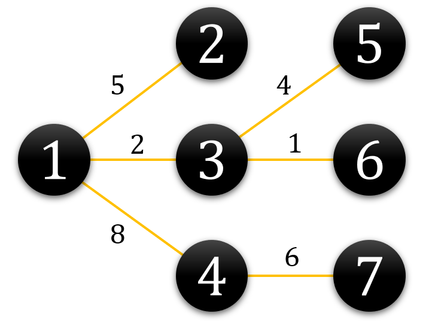
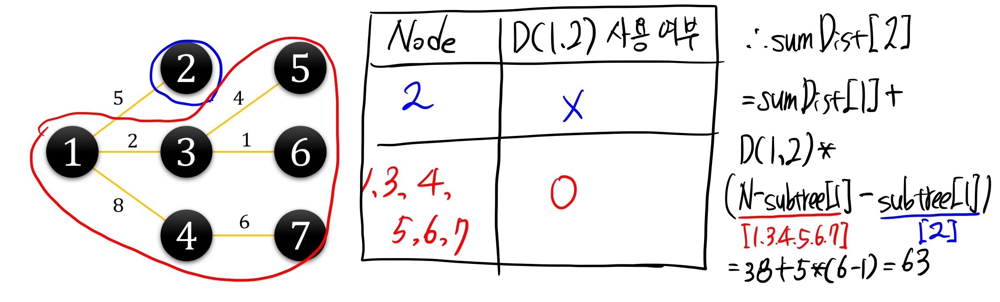
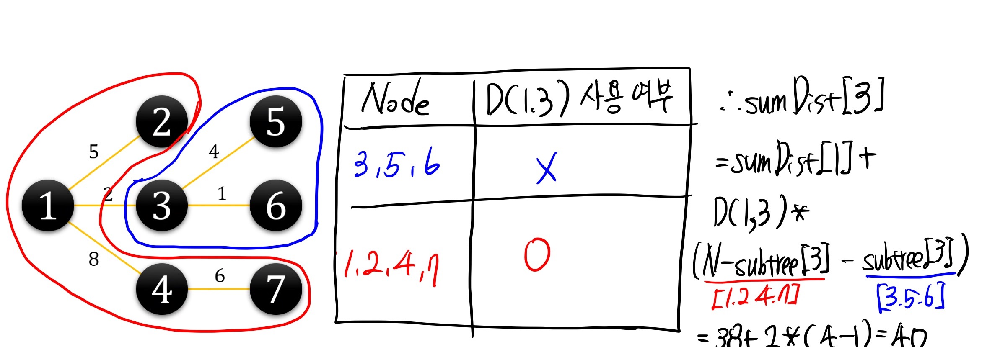

Subtree를 이용한 거리 합 구하기

# 문제

[거리 합 구하기](https://softeer.ai/practice/info.do?eventIdx=1&psProblemId=635) 

# 잘못된 접근 방법 - 모든 노드에서 DFS를 실행

처음 생각해낸 접근은 모든 노드를 시작점으로 하여 DFS를 실행하는 것입니다.

 ```python
 for start_node in range(N) :
   dist = dfs(start_node)
   print(sum(dist))
 ```

이러한 접근은 시간초과를 피할 수 없습니다. 시간복잡도 계산은 다음과 같습니다. 

노드의 개수 $$N$$, 간선의 개수 $$N-1$$입니다. 

DFS의 시간복잡도가 $$O(N+E)$$이므로, 위 문제의 경우에는 $$O(N+N-1)=O(N)$$으로 계산됩니다.

DFS를 $$N$$번 반복하므로 이 경우 시간 복잡도는 $$N*O(N)=O(N^2)$$으로 계산됩니다. $$N≤2*10^5$$인 경우에 $$N^2≤2*10^{10}$$ 이기 때문에 시간제한인 2초(Python의 경우 6초) 내에 답을 찾을 수 없습니다.

# 올바른 접근 - Subtree

## What is Subtree?

Tree에서 어떤 한 노드를 Root로 하고, 해댕 노드의 Child로 이루어진 tree를 subtree라고 부릅니다. 이 정의에 따르면 전체 노드를 포함하는 트리(`subtree 1a`)도 subtree로 정의됩니다.


## Subtree Size

subtree size란 subtree에 포함된 노드의 개수를 의미합니다. 위 그림에서 subtree size는 아래 표와 같습니다.

| subtree | size |
| ------- | ---- |
| 1a      | 9    |
| 2b      | 3    |
| 2a      | 5    |
| 3a      | 3    |


`subtree 1a`의 subtree size는 `subtree 2b`와 `subtree 2a`의 subtree size의 합에 1(root node, 1)을 더한 값인 9입니다. 마찬가지로 `subtree 2a`는 `[5]` 와 `[4,8,9]` 로 이루어진 2개 subtree의 size(1, 3)의 합에 1을 더한 값인 5(1+3+1)입니다.

이러한 규칙을 고려해보았을 때, DFS로 노드를 탐색하면서 동시에 각 노드를 root로 하는 subtree size를 구할 수 있습니다. 

```python
def dfs(cur, par) :
    subSize[cur] = 1 # root node를 반드시 포함하므로 1부터 시작됨
    for idx in range(len(nodes[cur])) : 
        child, weight = nodes[cur][idx]
        if child != par : 
            dfs(child, cur)
            subSize[cur] += subSize[child] # cur node의 child의 subtree size를 더해뭄
```

주어진 문제에 대해 subtree size를 구해보면 아래와 같습니다.



| root | subtree size |
| ---- | ------------ |
| 1    | 7            |
| 2    | 1            |
| 3    | 3            |
| 4    | 2            |
| 5    | 1            |
| 6    | 1            |
| 7    | 1            |

## Distance

문제의 예시에서, 1번 노드에서 각 노드 사이의 거리의 합은 아래와 같이 계산됩니다.

| from | to            | distance |
| ---- | ------------- | -------- |
| 1    | 2             | 5        |
| 1    | 3             | 2        |
| 1    | 4             | 8        |
| 1    | 5             | 6        |
| 1    | 6             | 3        |
| 1    | 7             | 14       |
| 1    | (2,3,4,5,6,7) | 38       |

우리가 구하고자 하는 값은 38이고, 이를 `sumDist[1]`이라고 정의하겠습니다.

만약 2번 노드에서 각 노드 사이의 거리 합을 구하고자 한다면, 우리는 위에서 계산된 1번 노드에서의 계산 결과를 이용할 수 있습니다.

| from | to            | distance          |                           |
| ---- | ------------- | ----------------- | ------------------------- |
| 2    | 1             | 5                 | D(1,2)와 같음             |
| 2    | 3             | 2 + 5             | D(1,3) + D(1,2)           |
| 2    | 4             | 8 + 5             | D(1,4) + D(1,2)           |
| 2    | 5             | 6 + 5             | D(1,5) + D(1,2)           |
| 2    | 6             | 3 + 5             | D(1,6) + D(1,2)           |
| 2    | 7             | 14 + 5            | D(1,7) + D(1,2)           |
| 2    | (1,3,4,5,6,7) | 38 + 5*(6-1) = 63 | `sumDist[1]` + D(1,2) * 5 |

3번 노드 역시 마찬가지입니다.

| from | to            | distance          |                           |
| ---- | ------------- | ----------------- | ------------------------- |
| 3    | 1             | 2                 | D(1,3)와 같음             |
| 3    | 2             | 5 + 2             | D(2,1) + D(1,3)           |
| 3    | 4             | 8 + 2             | D(4,1) + D(1,3)           |
| 3    | 5             | 6 - 2             | D(5,1) - D(1,3)           |
| 3    | 6             | 3 -  2            | D(6,1) - D(1,3)           |
| 3    | 7             | 14 + 2            | D(7,1) + D(1,3)           |
| 3    | (1,2,4,5,6,7) | 38 + 2*(3-2) = 40 | `sumDist[1]` + D(1,2) * 1 |

이러한 계산의 규칙은 각 노드의 subtree size를 이용합니다. 

2번 노드는 subtree size가 1이기 때문에(직접 연결된 child가 없기 때문에) 다른 노드와 연결되기 위해서는 부모노드인 1을 반드시 지날 수 밖에 없습니다.

따라서, 2번 노드에서 계산되는 거리합은 1번 노드에서 계산된 거리합에 `D(1,2)=5`가 항상 추가되고(반드시 `D(1,2)`를 사용하고) 1번 노드에서는 계산된 값을 그대로 사용합니다.




반대로 3번 노드는 subtree size가 3이기 때문에 2개 노드(`[5, 6]`)에 대해서는 직접 접근이 가능하고, 나머지 노드(`[2,4,7]`)은 부모노드를 거쳐야합니다. 따라서, `[5, 6]`에 노드에 대해서는 `D(1,3)`을 빼주어야하고, `[2, 4, 7]` 에 대해서는  `D(1,3)`을 더해줍니다.



이러한 계산을 위해서는 DFS 탐색을 한번 더 수행해야합니다. 

# Answer

```python
import sys
input = sys.stdin.readline
sys.setrecursionlimit(10**6)
N = int(input())
nodes = [[] for i in range(N+1)]
for _ in range(N-1):
    x, y, t = map(int, input().split())
    nodes[x].append((y, t))
    nodes[y].append((x, t))

# 1번 노드를 기준으로는 똑같이 계산한다
# 1과 인접한 노드에 대해서는 상수 시간에 구한다
# 이를 위해 subtree size가 필요하다
# subtree size란 ? 어떤 노드를 root로 했을 때, 본인을 포함한 노드 개수는 ?

# 2번 노드를 기준으로 생각했을 때, 
# 나머지 6개 노드에 대해서 1번을 거쳐서 2번으로 들어오므로, D(1,2) = 5 만큼 증가한다
# 2의 subtree들은 5가 감소한다
subSize = [0 for i in range(N+1)]
dist = [0 for i in range(N+1)]
def dfs(cur, par) :
    subSize[cur] = 1
    for idx in range(len(nodes[cur])) : 
        child, weight = nodes[cur][idx]
        
        if child != par : 
            dfs(child, cur)
            dist[cur] += subSize[child] * weight + dist[child]
            subSize[cur] += subSize[child]
            
def dfs2(cur, par) : 
    for idx in range(len(nodes[cur])): 
        child, weight = nodes[cur][idx]
        if child != par : 
            dist[child] = dist[cur] + weight * (N-subSize[child]-subSize[child])
            dfs2(child, cur)

dfs(1,1)
dfs2(1,1)

for idx in range(1, N+1) : 
    print(dist[idx])
```

결국 DFS를 2번 수행하므로 시간복잡도는 $$2*O(N+E)$$이고 위 문제에서는 $$O(N)$$의 시간복잡도로 정답을 찾을 수 있습니다.

[참고]

[Sum of subtree depths for every node of a given Binary Tree](https://www.geeksforgeeks.org/sum-of-subtree-depths-for-every-node-of-a-given-binary-tree/)

[[2021년 재직자 대회 본선] 거리 합 구하기](https://softeer.ai/community/view.do?idx=674&cd=edu&pageNo=1)