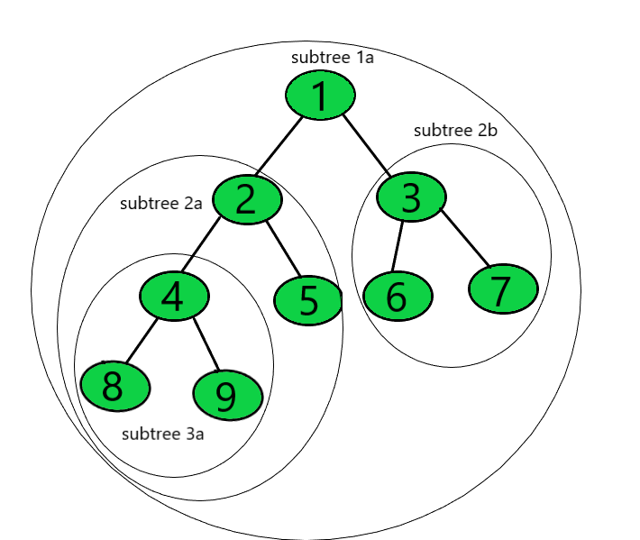

Subtree를 이용한 거리 합 구하기

# 문제

https://softeer.ai/practice/info.do?eventIdx=1&psProblemId=635

# 잘못된 접근 방법 - 모든 노드에서 DFS를 실행

# 올바른 접근 - Subtree 개념을 이용

## Subtree?

Tree에서 어떤 한 노드를 기준으로 해당 노드의 Child로 이루어진 tree를 subtree라고 부릅니다. 이 정의에 따르면 전체 노드를 포함하는 트리(`subtree 1a`)도 subtree로 정의됩니다.

## Subtree Size

## DFS 실행 시 각 노드의 subtree를 계산

## 

[참고]

[Sum of subtree depths for every node of a given Binary Tree](https://www.geeksforgeeks.org/sum-of-subtree-depths-for-every-node-of-a-given-binary-tree/)