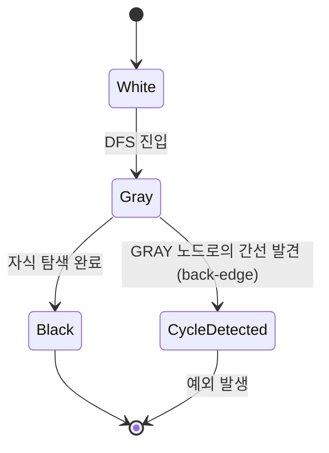
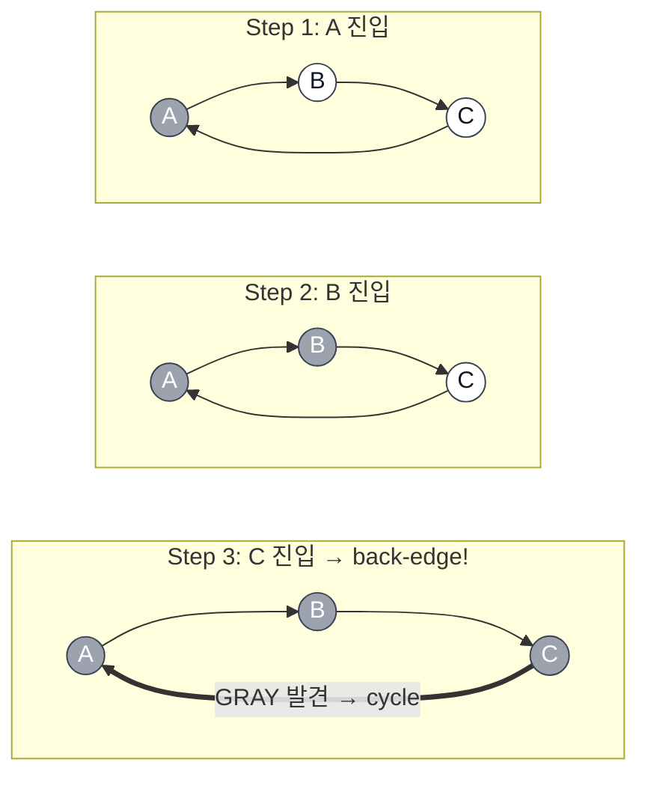
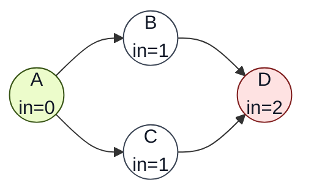
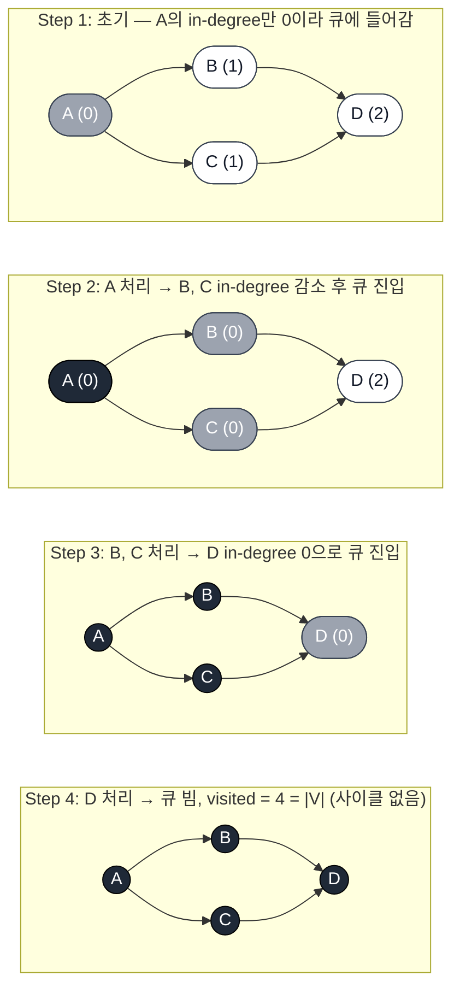
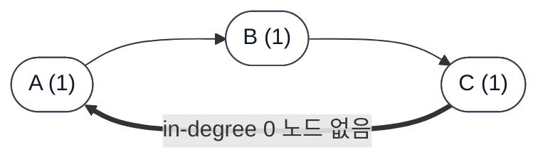
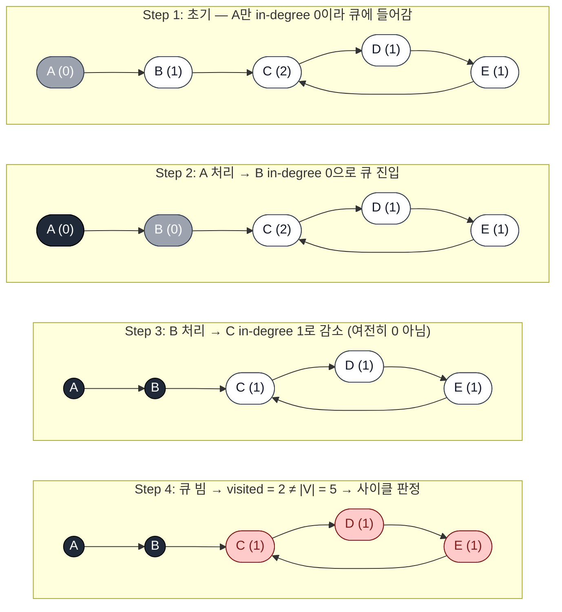

Airflow와 dbt가 DAG의 비순환 여부를 어떤 자료구조와 알고리즘으로 검증하는지 알아봅니다.

# 왜 DAG는 검증되어야 할까

데이터 파이프라인을 다루는 오픈소스 도구는 거의 예외 없이 작업 간 의존 관계를 **DAG(Directed Acyclic Graph, 방향성 비순환 그래프)** 로 모델링합니다. Airflow의 task 의존성, dbt의 모델 `ref()` 의존성이 모두 그렇습니다.

그런데 사용자가 정의한 그래프가 **정말로 DAG인지**, 즉 사이클이 없는지를 누군가는 확인해줘야 합니다. 사이클이 존재하면 실행 순서 자체를 결정할 수 없기 때문에, "DAG"라는 이름은 사용자와의 약속이 아니라 도구가 **검증해야 할 제약**에 가깝습니다.

# 사이클 판별 알고리즘 두 갈래

방향 그래프에서 사이클을 찾는 고전적인 방법은 크게 두 가지가 있습니다. 둘 다 시간복잡도는 $$O(V+E)$$로 동일하지만 사용 목적이 조금 다릅니다.

## (A) DFS 3-color (White / Gray / Black)

각 노드를 세 가지 상태로 관리하면서 깊이 우선 탐색을 수행합니다.

| 상태  | 의미                              |
| ----- | --------------------------------- |
| White | 아직 방문하지 않은 노드           |
| Gray  | 현재 DFS 경로에 포함된 노드(탐색 중) |
| Black | 자식까지 모두 탐색이 끝난 노드    |

탐색 중 인접 노드가 Gray 상태라면 **back-edge**(현재 경로로 되돌아가는 간선)를 발견한 것이고, 이는 곧 사이클이 존재한다는 의미입니다.

상태 전이 자체는 다음과 같이 단순합니다.



`A → B → C → A` 형태의 작은 사이클을 예로 들면, A에서 시작한 DFS가 다음과 같이 진행됩니다. 마지막 단계에서 C가 자기 인접 노드 A를 보는 순간 A는 이미 Gray이므로 곧바로 사이클로 판정됩니다.



```python
WHITE, GRAY, BLACK = 0, 1, 2

def has_cycle(graph):
    color = {v: WHITE for v in graph}

    def dfs(u):
        color[u] = GRAY
        for v in graph[u]:
            if color[v] == GRAY:        # back-edge → cycle
                return True
            if color[v] == WHITE and dfs(v):
                return True
        color[u] = BLACK
        return False

    return any(color[v] == WHITE and dfs(v) for v in graph)
```

DFS 방식의 장점은 사이클을 발견했을 때 **사이클을 구성하는 노드 경로** 자체를 그대로 보고할 수 있다는 점입니다.

## (B) Kahn's Algorithm (in-degree 위상정렬)

### in-degree란

**in-degree(진입 차수)** 는 한 노드로 **들어오는** 간선의 개수입니다. 노드 `v`를 향하는 간선 `* → v`가 몇 개인지 세면 됩니다. 반대로 `v`에서 나가는 간선의 개수는 out-degree(진출 차수)라고 부릅니다.

`A → B`, `A → C`, `B → D`, `C → D`라는 작은 DAG를 예로 들어보겠습니다.



- `A`: 들어오는 간선이 없으므로 0
- `B`: `A → B` 한 개라 1
- `C`: `A → C` 한 개라 1
- `D`: `B → D`, `C → D` 두 개라 2

DAG의 시작점은 항상 **in-degree가 0인 노드**입니다. 사이클이 있는 그래프에서는 사이클을 구성하는 모든 노드가 서로를 가리키기 때문에, 그 노드들 중 in-degree가 0인 것이 단 하나도 존재하지 않습니다. 이 성질을 그대로 알고리즘으로 옮긴 것이 Kahn's입니다.

### 알고리즘 진행

진입 차수가 0인 노드를 큐에서 하나씩 꺼내고, 그 노드와 연결된 간선을 제거하면서 다른 노드의 in-degree를 갱신합니다. 모든 노드를 큐에서 꺼내면 위상정렬에 성공한 것이고, 끝까지 꺼낼 수 없는 노드가 남으면 그 노드들이 사이클에 속한다는 뜻입니다.

위와 같은 DAG로 단계별 진행을 추적해보겠습니다. 각 노드 옆 괄호는 그 시점의 in-degree, 색깔은 노드 상태(흰색=대기, 회색=큐 안, 검정=처리 완료)를 의미합니다.



반대로 사이클이 있는 그래프(`A → B → C → A`)에서는 모든 노드의 in-degree가 1 이상이라 **초기 큐가 비어 있는 상태에서 시작**합니다. 큐에 아무것도 들어오지 못한 채 루프가 끝나고 `visited = 0 ≠ |V| = 3`이 되어 사이클로 판정됩니다.



다만 이 예시는 **알고리즘이 시작도 못 하고 끝나버리는** 극단적인 경우라, 칸 알고리즘이 실제로 어떻게 사이클을 "찾아내는지"를 보여주기엔 부족합니다. 좀 더 일반적인 케이스, 즉 **그래프 일부는 정상 DAG이고 특정 영역에만 사이클이 있는** 상황에서는 알고리즘이 중간까지 정상적으로 진행되다가 멈추는 모습을 볼 수 있습니다.

`A → B → C → D → E`라는 파이프라인 끝부분에 `E → C` 간선이 추가되어 `C → D → E → C` 사이클이 생긴 그래프를 예로 들어보겠습니다.



`A`와 `B`는 **정상적으로 위상정렬 순서대로 처리**되었습니다. 문제는 그다음입니다. `B`를 처리한 뒤 `C`의 in-degree는 2에서 1로 줄어들지만, **`E`가 아직 `C`로의 간선을 들고 있기 때문에 0에는 도달하지 못합니다**. 동시에 `D`는 `C`에 막혀, `E`는 `D`에 막혀 영원히 큐에 들어오지 못합니다. 결국 `C, D, E`는 서로의 사이클에 묶여 어느 누구도 in-degree 0이 될 수 없는 상태로 남고, 큐가 빈 시점에서 `visited = 2`만 카운트된 채 알고리즘이 종료됩니다.

위 그림에서 4단계의 빨간 노드(`C, D, E`)가 바로 **사이클을 구성하면서 처리되지 못한 잔여 노드들**입니다. 즉, "위상정렬을 끝까지 마치지 못하고 남은 노드들 = 사이클에 속한 노드들"이라는 칸 알고리즘의 핵심 통찰을 그대로 보여줍니다.

```python
from collections import deque

def has_cycle_kahn(graph):
    indeg = {v: 0 for v in graph}
    for u in graph:
        for v in graph[u]:
            indeg[v] += 1

    queue = deque(v for v, d in indeg.items() if d == 0)
    visited = 0
    while queue:
        u = queue.popleft()
        visited += 1
        for v in graph[u]:
            indeg[v] -= 1
            if indeg[v] == 0:
                queue.append(v)

    return visited != len(graph)  # 전부 처리 못했으면 cycle
```

Kahn's 방식의 장점은 사이클이 없는 정상 케이스에서 **위상정렬 결과를 함께** 얻는다는 점입니다.

## 두 알고리즘 비교

두 알고리즘 모두 시간복잡도는 $$O(V+E)$$로 동일하지만, **요구하는 자료구조와 사이클 검출 시 얻는 부산물**이 다릅니다.

| 항목                 | DFS 3-color                   | Kahn's                              |
| -------------------- | ----------------------------- | ----------------------------------- |
| 필요한 자료구조      | 인접 리스트(out-going edges)만 | 인접 리스트 **+ in-degree 카운터**  |
| 추가 전처리          | 색깔 초기화 $$O(V)$$          | in-degree 한 번 스캔 $$O(V+E)$$     |
| 메모리               | $$O(V)$$ (color + DFS 스택)   | $$O(V)$$ (in-degree + queue)        |
| 사이클이 있을 때     | back-edge 발견 즉시 종료      | 큐가 비고 `visited < |V|` 확인      |
| 정상 종료 시 부산물  | 사이클 경로(또는 없음)        | **위상정렬 결과**                   |
| 자연스러운 그래프 표현 | "각 노드가 자기 자식만 안다"   | "전체 엣지 목록을 한 번에 본다"     |

이 차이가 사이클 검출만 따로 떼어 놓고 보면 작아 보이지만, **그래프 자료구조 자체가 어떤 정보를 노출하느냐**와 직결됩니다.

- 그래프가 "각 노드 객체가 자기 자식 ID 목록만 들고 있는" 형태로 흩어져 있다면, in-degree를 따로 누적하는 비용이 부담스럽습니다. 이런 경우엔 그 자료구조를 그대로 따라가는 DFS가 자연스럽습니다.
- 반대로 그래프 라이브러리처럼 노드/엣지를 별도 인덱스로 들고 있고 in-degree 조회가 빠른 자료구조라면, Kahn's는 큰 부담 없이 위상정렬 결과까지 덤으로 얻을 수 있습니다.

뒤에서 살펴볼 Airflow와 dbt가 같은 사이클 검출 문제를 두고 다른 선택을 한 배경에는 정확히 이 자료구조 차이가 있습니다.

그렇다면 실제 오픈소스는 어떤 쪽을 선택했을까요.

# Airflow: 자체 구현 + Iterative DFS 3-color

Airflow는 외부 그래프 라이브러리에 의존하지 않고 **DAG 객체 안에 직접** 자료구조와 검증 로직을 두고 있습니다.

## 자료구조: `task_dict`

`airflow/models/dag.py`의 `DAG` 클래스는 task를 단순 딕셔너리로 보관합니다.

```python
class DAG(LoggingMixin):
    ...
    self.task_dict: Dict[str, BaseOperator] = {}
```

각 `BaseOperator`는 자기 자신의 직속 자식(downstream task) ID들을 `get_direct_relative_ids()`로 돌려주는 식으로 인접 관계를 노출합니다. 별도의 인접 리스트가 따로 있는 것이 아니라, **각 task가 자기 이웃 정보를 들고 있는** 형태입니다.

## 알고리즘: `airflow/utils/dag_cycle_tester.py`의 `check_cycle`

핵심 함수는 `airflow/utils/dag_cycle_tester.py`에 있는 `check_cycle(dag)`입니다 (예전 이름은 `test_cycle`이었습니다).

```python
from collections import deque

CYCLE_NEW = 0
CYCLE_IN_PROGRESS = 1
CYCLE_DONE = 2

def check_cycle(dag):
    visited = {task_id: CYCLE_NEW for task_id in dag.task_dict}
    path_stack = deque()                     # ← DFS 호출 스택을 직접 관리
    task_dict = dag.task_dict

    def _check_adjacent_tasks(task_id, current_task):
        for adjacent_task in current_task.get_direct_relative_ids():
            if visited[adjacent_task] == CYCLE_IN_PROGRESS:
                raise AirflowDagCycleException(
                    f"Cycle detected in DAG. Faulty task: {task_id}"
                )
            elif visited[adjacent_task] == CYCLE_NEW:
                return adjacent_task         # 아직 안 가본 자식 하나 반환
        return None                          # 모든 자식이 이미 처리됨

    for dag_task_id in dag.task_dict.keys():
        if visited[dag_task_id] == CYCLE_DONE:
            continue
        path_stack.append(dag_task_id)       # (1) 시작 노드 push
        while path_stack:
            current_task_id = path_stack[-1] # (2) 스택 top = 현재 DFS 위치
            if visited[current_task_id] == CYCLE_NEW:
                visited[current_task_id] = CYCLE_IN_PROGRESS  # WHITE → GRAY
            task = task_dict[current_task_id]
            child_to_check = _check_adjacent_tasks(current_task_id, task)
            if not child_to_check:
                visited[current_task_id] = CYCLE_DONE         # GRAY → BLACK
                path_stack.pop()             # (4) 자식 다 봤으니 pop (= return)
            else:
                path_stack.append(child_to_check)  # (3) 자식으로 들어감 (= 재귀 호출)
```

### `deque`가 어떤 역할을 하는가

`deque`는 여기서 **재귀 호출 스택을 직접 손으로 관리하는 자료구조**로 쓰입니다. 재귀 DFS에서 자연스럽게 일어나는 세 가지 동작 — **들어가기 / 현재 위치 보기 / 빠져나오기** — 가 각각 `append` / `[-1]` / `pop` 으로 1:1 대응됩니다.

| 재귀 DFS                  | iterative + `deque`          | 의미                          |
| ------------------------- | ---------------------------- | ----------------------------- |
| `dfs(child)` 호출         | `path_stack.append(child)`   | 자식으로 한 단계 깊이 들어감  |
| 현재 함수의 `self` 파라미터 | `path_stack[-1]`             | 지금 어떤 노드를 처리 중인가  |
| 함수 `return`             | `path_stack.pop()`           | 자식 탐색 끝나서 한 단계 위로 |
| 호출 체인 자체            | `path_stack` 안의 task_id 목록 | "지금까지 내려온 경로" = GRAY 노드들 |

특히 마지막 줄이 핵심입니다. **`path_stack` 안에 들어 있는 task들이 곧 현재 DFS 경로**이고, 이들이 모두 `CYCLE_IN_PROGRESS`(=GRAY) 상태라는 점이 사이클 검출의 핵심입니다. 어떤 노드의 자식을 보러 갔다가 그 자식이 이미 GRAY라는 건 곧 **그 자식이 이미 `path_stack`에 들어 있다 = 지금 내려온 경로 위에 있다 = back-edge**라는 뜻이고, 그래서 `_check_adjacent_tasks` 안에서 곧바로 `AirflowDagCycleException`을 던집니다.

이렇게 스택을 직접 다루는 방식의 장점은 **Python 함수 호출 스택을 쓰지 않는다**는 점입니다. Python의 기본 재귀 한도(`sys.getrecursionlimit() == 1000`)를 넘는 깊은 DAG에서 재귀 DFS는 `RecursionError`로 죽지만, `deque`는 힙 메모리만 허용한다면 수십만 노드도 처리할 수 있습니다. PR [#6175](https://github.com/apache/airflow/pull/6175)이 해결한 문제가 정확히 이것입니다.

사이클이 발견되면 `AirflowDagCycleException("Cycle detected in DAG. Faulty task: {task_id}")` 예외가 발생하며, DAG 파싱 단계에서 곧바로 실패하게 됩니다.

# dbt: NetworkX DiGraph + `nx.find_cycle`

dbt는 정반대 방향의 선택을 했습니다. 그래프 자료구조를 직접 만드는 대신 **`networkx` 라이브러리에 위임**합니다.

## 자료구조: `Linker.graph` (`networkx.DiGraph`)

`core/dbt/compilation.py`의 `Linker` 클래스 초기화 부분입니다.

```python
import networkx as nx

class Linker:
    def __init__(self, data=None) -> None:
        self.graph: nx.DiGraph = nx.DiGraph(**data)
```

`nx.DiGraph`는 NetworkX가 제공하는 방향 그래프 자료구조로, 노드/엣지 추가, 인접 노드 조회, 위상정렬, 연결 컴포넌트 분석 같은 기능을 모두 포함하고 있습니다. dbt는 이 풍부한 API를 그대로 재활용합니다.

## 알고리즘: `Linker.find_cycles` → `nx.find_cycle`

같은 파일의 `find_cycles` 메서드는 NetworkX의 `find_cycle`을 호출하는 것이 사실상 전부입니다.

```python
def find_cycles(self):
    try:
        cycle = nx.find_cycle(self.graph)
    except nx.NetworkXNoCycle:
        return None
    else:
        return " --> ".join(c[0] for c in cycle)
```

흥미로운 점은 **`NetworkXNoCycle` 예외가 정상 케이스**라는 것입니다. NetworkX는 사이클이 발견되지 않을 때 예외를 던지고, 발견되면 사이클을 구성하는 엣지 리스트를 반환하는 식의 인터페이스를 채택하고 있습니다.

NetworkX 내부 구현을 들여다보면 `find_cycle`도 결국 **DFS 기반 back-edge 탐지**입니다. 즉 알고리즘 본질은 Airflow와 동일한데, dbt 입장에서는 그 구현을 직접 작성할 필요가 없는 셈이죠.

호출 측인 `link_graph()`에서는 `find_cycles()`의 반환값이 `None`이 아니면 사이클 경로를 메시지에 담아 `CompilationError("Found a cycle: {path}")` 예외를 발생시킵니다. dbt 사용자가 모델 의존을 잘못 정의했을 때 흔히 마주치는 그 메시지입니다.

# 비교

| 항목         | Airflow                                | dbt                              |
| ------------ | -------------------------------------- | -------------------------------- |
| 자료구조     | `Dict[str, BaseOperator]` (자체 구현)  | `networkx.DiGraph`               |
| 인접 관계    | `BaseOperator.get_direct_relative_ids()` | NetworkX 내부                    |
| 알고리즘     | 3-color iterative DFS                  | DFS 기반 `nx.find_cycle`         |
| 호출 함수    | `check_cycle(dag)`                     | `Linker.find_cycles()`           |
| 사이클 시 예외 | `AirflowDagCycleException`             | `CompilationError`               |
| 재귀 회피    | 명시적 `deque` 스택                    | NetworkX 내부에서 처리           |
| 시간복잡도   | $$O(V+E)$$                             | $$O(V+E)$$                       |

# 마무리

두 도구가 푸는 문제는 동일하고 알고리즘의 본질도 DFS로 같지만, 자료구조 선택은 정반대입니다.

- **Airflow**는 스케줄러 프로세스가 수많은 DAG를 반복적으로 파싱·검증해야 하는 환경입니다. 외부 라이브러리 의존을 줄이고 메모리·임포트 비용을 통제하기 위해 자체 자료구조와 검증 코드를 유지하는 쪽이 합리적입니다. 거대 DAG에 대비한 반복 DFS 전환(PR #6175)도 그 연장선입니다.
- **dbt**는 컴파일 단계에서 의존 그래프를 한 번 구축하고 검증하는 패턴입니다. 호출 빈도가 낮고, 위상정렬·서브그래프 추출 같은 풍부한 그래프 연산이 추가로 필요합니다. 이런 맥락에서는 NetworkX에 의존을 받아들이는 쪽이 코드량과 유지보수 부담을 모두 줄여줍니다.

같은 알고리즘이라도 **어떤 자료구조 위에 얹을지는 프로젝트의 실행 컨텍스트가 결정**한다는 점이, 두 코드베이스를 나란히 놓고 봤을 때 가장 흥미로운 부분이었습니다.

# 참고

- [apache/airflow — `airflow/utils/dag_cycle_tester.py`](https://github.com/apache/airflow/blob/main/airflow/utils/dag_cycle_tester.py)
- [apache/airflow PR #6175 — Fix recursion in DAG cycle testing](https://github.com/apache/airflow/pull/6175)
- [dbt-labs/dbt-core — `core/dbt/compilation.py`](https://github.com/dbt-labs/dbt-core/blob/main/core/dbt/compilation.py)
- [NetworkX — `find_cycle` documentation](https://networkx.org/documentation/stable/reference/algorithms/generated/networkx.algorithms.cycles.find_cycle.html)
