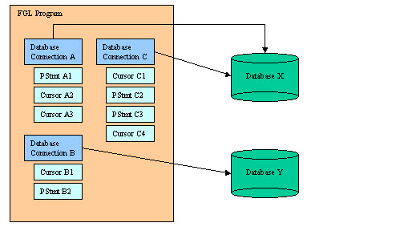

 DBCP(DataBase Connection Pool)에 대해서

#  DataBase Connection

어플리케이션에과 데이터베이스를 연결하기 위해, 어플리케이션은 데이터베이스에게 DataBase Connection을 요구합니다.(A **database connection** is a session of work, opened by the program to communicate with a specific database server, in order to execute SQL statements as a specific user.)

JDBC의 예시를 보면 DataBase Connection을 생성하기 위해서는 Driver 등록, `connection` object 생성(`getConnection()` method)의 과정을 거칩니다.

# DataBase Connection is expensive

DataBase Connection은 한 번 생성하는데 많은 자원과 시간을 사용하는 작업입니다. Driver와  Database Server 간에 많은 통신을 필요로 하며, 이후에 DBMS는 Connection을 위해 DISK I/O를 요구합니다.

> In reality, a connection typically involves **many network round trips between the driver and the database server**. For example, when a driver connectsto Oracle or Sybase, that connection may take anywhere from *seven to ten network round trips* to perform the following actions:
>
> - Validate the user’s credentials.
> - Negotiate code page settings between what the database driver expects and what the database has available, if necessary.
> - Get database version information.
> - Establish the optimal database protocol packet size to be used for communication.
> - Set session settings.
>
> In addition, the database management system establishes resources on behalf of the connection, which involves **performance-expensive disk I/O and memory allocation**.

# DBCP(DataBase Connection Pool)

따라서, DB에 연결하려는 요청이 있을 때마다 Connection을 생성하는 것은 비효율적입니다. 이러한 비효율을 해결하기 위해 등장한 방법이 DBCP(DataBase Connection Pool) 입니다. 미리 DataBase Connection을 생성해두고, 요청이 들어올 때 마다 Connection을 대여해준 뒤 사용이 끝나면 반납 받습니다. 

DBCP를 구현하기 위해서는  Apache의 Commons DBCP, Tomcat-JDBC, BoneCP, HikariCP와 같은 오픈소스 라이브러리들이 사용됩니다.

#  DBCP Settings

적절한 DBCP를 구현하기 위해서는 고려해야할 옵션들이 존재합니다.

- 커넥션의 개수

  - | 속성 이름   | 설명                                                         |
    | ----------- | ------------------------------------------------------------ |
    | initialSize | BasicDataSource 클래스 생성 후 최초로 getConnection() 메서드를 호출할 때 커넥션 풀에 채워 넣을 커넥션 개수 |
    | maxActive   | 동시에 사용할 수 있는 최대 커넥션 개수(기본값: 8)            |
    | maxIdle     | 커넥션 풀에 반납할 때 최대로 유지될 수 있는 커넥션 개수(기본값: 8) |
    | minIdle     | 최소한으로 유지할 커넥션 개수(기본값: 0)                     |

- 커넥션을 얻기 전 대기 시간

  - | 속성 이름                             | 설명                                                         |
    | ------------------------------------- | ------------------------------------------------------------ |
    | maxWait (1.x) maxWaitMillis (2.x) | Pool이 예외를 throw하기 전 연결이 반환될 때까지(사용 가능한 Connection 객체가 없는경우) 대기하는 최대 시간(ms) 또는 무한 대기(-1) |

- 커넥션의 검사와 정리

  - | 속성 이름       | 설명                                                         |
    | --------------- | ------------------------------------------------------------ |
    | testOnBorrow    | 커넥션 풀에서 커넥션을 얻어올 때 테스트 실행(기본값: true)   |
    | testOnReturn    | 커넥션 풀로 커넥션을 반환할 때 테스트 실행(기본값: false)    |
    | testWhileIdle   | Evictor 스레드가 실행될 때 (timeBetweenEvictionRunMillis > 0) 커넥션 풀 안에 있는 유휴 상태의 커넥션을 대상으로 테스트 실행(기본값: false) |
    | validationQuery | Oracle: select 1 from dual  Microsoft SQL Server: select 1  MySQL: select 1  CUBRID: select 1 from db_root |

[참고]

[Understanding database conncections](https://4js.com/online_documentation/fjs-fgl-2.50.02-manual-html/c_fgl_Connections_002.html)

[Java JDBC](https://www.javatpoint.com/steps-to-connect-to-the-database-in-java)

[Database Connections Are Performance Expensive](https://amitstechblog.wordpress.com/2011/06/25/database-connections-are-performance-expensive/)

[DBCP(DataBase Connectiopn Pool), 커넥션 풀이란?](https://zzang9ha.tistory.com/376)

[Commons DBCP 이해하기](https://d2.naver.com/helloworld/5102792)

[Apache DBCP](https://commons.apache.org/proper/commons-dbcp/configuration.html)
