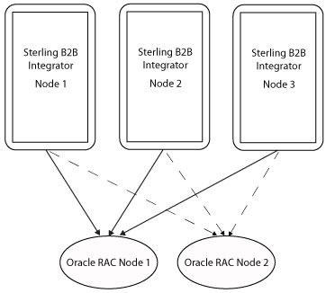

oracle database connection String 설정에 대해 알아봅니다.

# JDBC Driver
 JDBC 드라이버는 Java App이 데이터베이스와 상호작용(데이터를 가져오거나 저장)하는 것을 가능하게 합니다. JDBC 클래스는  `java.sql` 패키지에 포함되어 있습니다. `javax.sql.JDBC`는 아래와 같은 역할을 합니다. 

 - 데이터베이스와 같은 데이터 소스와의 연결
 - 쿼리를 전송
 - 작성한 쿼리에 대한 응답(데이터)을 처리하고 반환

JDK와 함께 제공되는 `java.sql` 패키지에는 기능을 구현하고 있는 여러 클래스를 포함하고 있으며, 서드 파티 드라이버를 이용하여 실제로 구현할 수 있습니다. 서드 파티 공급자(vendor)는 그들의 데이터베이스 드라이버에 `java.sql.Driver` 인터페이스를 구현해야합니다. 이러한 JDBC 드라이버는 사용되는 기술과 연결되는 데이터베이스에 따라 4가지 타입으로 구분됩니다. 
## Type-1: Bridge Driver 
Type-1 Driver JDBC는 브릿지 드라이버(bridge driver)라고도 불립니다. Type-1은 각각의 클라이언트에 설치된 ODBC 드라이버에 접근할 수 있는 다리(bridge)를 제공합니다. Type-1은 JDBC 메소드 호출(calls to JDBC methods)를 ODBC 함수 호출(calls to ODBC functions)로 치환합니다. 브릿지 드라이버는 설치되어있는 ODBC 드라이버에 의해 제공되는 데이터베이스 연결에 JDBC App이 즉각 접근할 수 있도록 합니다.
- 장점
  - 하나의 드라이버로 다른 데이터 소스에 접근할 수 있습니다. 
  - 모든 ODBC가 제공되는 데이터베이스에 사용할 수 있습니다.
- 단점
  - Java APP은 ODBC에만 의존해야합니다.
  - 모든 클라이언트는 ODBC를 설치해야합니다.
  - JDBC 메소드 호출을 ODBC 함수 호출로 변환하기 때문에 성능이 하락할 수 있습니다.

## Type-2: Oracle Call Interface(OCI) Driver
Oracle client 설치와 함께 클라이언트 측에서 사용됩니다. App과 함께할 때에만 사용될 수 있습니다. 즉, Type-2 드라이버는 Java App과 함께 사용됩니다. Type-2 드라이버는 특정 플랫폼에 맞는 OCI 라이브러리를 요구합니다. InterProcessCommunication(IPC), named pipes, TCP/IP, Internetwork Packet Exchange/Sequenced Packet Exchange(IPX/SPX)를 포함하는 설치된 모든 Oracle Net adapter를 지원합니다.  

Java와 C를 이용하여 작성된 OCI 드라이버는 C-entry 포인트를 호출하는 네이티브 메서드를 이용하여 JDBC  호출을 OCI 호출로 변환합니다. 이러한 호출 과정에서 Oracle Net Service를 이용하여 데이터베이스와 커뮤니케이션합니다.  

OCI 드라이버는 클아이언트 컴퓨터에 설치되어 있는 OCI 라이브러리, C-entry points, Oracle Net, core 라이브러리와 다른 필수적인 파일들을 이용합니다.  
OCI는 3세대 언어의 네이티브 프로시저 또는 함수 호출을 사용하여 Oracle Database에 액세스하고 SQL 문 처리의 모든 단계를 제어하는 응용프로그램을 만들 수 있는 API입니다.

## Type-3: Network Protocol Driver
JDBC 호출을 직간접적으로 vendor-specific database protocol로 변환해주는 application server를 이용합니다. Type-3 드라이버는 JDBC 호출을 middleware vendor's protocol로 변환합니다. 이후에 변환된 프로토콜은 다양한  데이터베이스에 연결을 제공하고 있는 middleware server에 의해 database-specific protocol로 다시 변환됩니다.  

middleware는 OS와 OS에서 실행되는 App 사이에 있는 소프트웨어입니다. 필수적으로 hidden translation layer로서 기능하면서, middleware는 분산 응용프로그램(distributed application)을 위한 데이터 매니지먼트와 커뮤니케이션을 가능케 합니다.
- 장점
  - 사용자가 여러 개의 데이터베이스에 연결해야하고, 하나의 드라이버를 사용하고 싶을 경우에 사용됩니다.
  - 이미 서버에 설치되어 있으므로 클라이언트 측에 드라이버 코드를 설치할 필요가 없습니다. 
  - 백엔드 서버 컴포넌트는 데이터베이스가 실행되고 있는 OS에 최적화되어있습니다.
  - Type-1, Type-2에 비해 좋은 성능을 보입니다.
- 단점
  - middleware가 다른 머신에서 실행 중이라면, Type-4가 더 효과적일 수 있습니다. 
  - database에 특화된 코드가 middleware 서버에 설치되어 있어야합니다.

## Type-4: Native Protocol Driver
데이터베이스와 직접적으로 상호작용합니다. native database library를 필요로 하지 않기 때문에 **Thin Driver**라고도 불립니다. native library는 물론, middleware server도 필요로 하지 않으므로, no-client-side이며 no-server-side로 설치됩니다. 완벽하게 Java로 작성되어 있기 때문에 이동가능한(portable) 드라이버입니다.  

Thin Driver는 JDBC 호출을 직접적으로 vendor-specific database protocol로 변환합니다. 또한, Thin Driver는 플랫폼에 영향을 받지 않습니다(platform-independent). 하지만, native protocol을 사용하기 때문에 데이터베이스에 영향을 받습니다.(Protocol can establish a connection between particular server only)  


# JDBC Name URL
JDBC NAME URL의 템플릿은 아래와 같습니다.
```
jdbc:oracle:[driver_type]:[username/password]@[database_specifier]
```
이 중 `driver_type`과 `database_specifier`에 대해서 설명해보고자 합니다. 

## `driver_type`
어떤 `driver_type`을 사용하는지를 결정합니다. 드라이버 타입에 맞는 이름을 작성해주어야합니다.
### server-side internal driver: `kprb`
server-side internal driver를 사용하는 경우에 `kprb`로 입력해야합니다. 이 경우에 다른 속성은 모두 무시됩니다.
```java
Connection conn = DriverManager.getConnection 
                  ("jdbc:oracle:kprb:@" + database, user, password);
```

### JDBC Thin or OCI Driver: `thin`/`oci`
Thin이나 OCI 드라이버를 사용하는 경우입니다. 
- URL 세팅이 user/password를 포함할 수 있다면, 아래와 같이 작성합니다. 특히, `thin`이 이에 해당합니다.  
`jdbc:oracle:thin:HR/hr@localhost:5221:orcl`  
- url property가 존재한다면, tnsEntry, driverType, portNumber, networkProtocol, serverName, databaseName property는 모두 무시됩니다.  
- tnsEntry property가 존재하고, url property가 존재하지 않는다면, databaseName, serverName, portNumber, networkProtocol property는 모두 무시됩니다.  
- OCI 드라이버를 사용하고 `networkProtocol`이 `ipc`로 셋팅되어있다면, 다른 셋팅은 모두 무시됩니다.


## `database_specifier`
database specifier는 어플리케이션이 연결을 필요로하는 특정 데이터베이스를 확인하기 위해 사용됩니다. 일부 데이터베이스는 오직 thin에서만, 혹은 오직 oci 드라이버에서만 작동합니다. thin, oci 모두 사용할 수 있는 데이터베이스(oracle)도 존재합니다.
### IPv6를 지원한다
```
 jdbc:oracle:thin:@(DESCRIPTION=(ADDRESS=(PROTOCOL=tcp)
    (HOST=[2001:0db8:7654:3210:FEDC:BA98:7654:3210])(PORT=5521))
    (CONNECT_DATA=(SERVICE_NAME=sales.example.com))
```
위처럼 IPv6로 host를 전달할 수 있습니다.
### Supported Database Specifiers
데이터베이스에 따라 database specifier를 사용할 수 있는 드라이버 타입이 다릅니다. 구체적인 내용은 아래 표와 같습니다.

| Specifier                        | Supported Drivers | Example                                                      |
| ------------------------------- | ---------------- | ----------------------------------------------------------- |
| Oracle Net connection descriptor | Thin, OCI         | Thin, using an address list:`url="jdbc:oracle:thin:@(DESCRIPTION=  (LOAD_BALANCE=on) (ADDRESS_LIST=  (ADDRESS=(PROTOCOL=TCP)(HOST=host1) (PORT=5221)) (ADDRESS=(PROTOCOL=TCP)(HOST=host2)(PORT=5221))) (CONNECT_DATA=(SERVICE_NAME=orcl)))" `OCI, using a cluster:`"jdbc:oracle:oci:@(DESCRIPTION=  (ADDRESS=(PROTOCOL=TCP)(HOST=cluster_alias)    (PORT=5221))    (CONNECT_DATA=(SERVICE_NAME=orcl)))"` |
| Thin-style service name          | Thin              | Refer to ["Thin-style Service Name Syntax"](https://docs.oracle.com/database/121/JJDBC/urls.htm#BEIDHCBA) for details.`"jdbc:oracle:thin:HR/hr@//localhost:5221/orcl" ` |
| LDAP syntax                      | Thin              | Refer to [LDAP Syntax](https://docs.oracle.com/database/121/JJDBC/urls.htm#CHDBICFA) for details.`"jdbc:oracle:thin:@ldap://ldap.example.com:7777/sales,cn=OracleContext,dc=com" ` |
| Bequeath connection              | OCI               | Empty. That is, nothing after @`"jdbc:oracle:oci:HR/hr/@" `  |
| TNSNames alias                   | Thin, OCI         | Refer to ["TNSNames Alias Syntax"](https://docs.oracle.com/database/121/JJDBC/urls.htm#BEIDIJCE) for details.`OracleDataSource ods = new OracleDataSource(); ods.setTNSEntryName("MyTNSAlias");` |

# 2-Node RAC DB Stystem
database specifier를 작성할 때, `ADDRESS_LIST`라는 옵션은 왜 존재하는 것일까요? 위의 예시에서 `ADDRESS_LIST`에 2개의 host가 작성되어있음을 확인할 수 있습니다.
```
jdbc:oracle:thin:@(DESCRIPTION=  (LOAD_BALANCE=on) 
  (ADDRESS_LIST=  
    (ADDRESS=(PROTOCOL=TCP)(HOST=host1)(PORT=5221)) 
    (ADDRESS=(PROTOCOL=TCP)(HOST=host2)(PORT=5221))) 
  (CONNECT_DATA=(SERVICE_NAME=orcl)))
```
이는 oracle이 2-Node RAC(Real Application Clusters) DB System을 지원하기 때문입니다. 이는 고가용성(High Availability)를 위해 고안된 시스템입니다.

  

이러한 구조를 갖게 되면, 메인으로 연결된 노드(`Node1`)에 대한 연결이 실패하더라도, 예비 노드(`Node2`)로 즉각 연결하여 DB 연결이 끊어지는 문제를 방지할 수 있습니다.  
2-Node RAC DB System이 주는 장점은 아래와 같습니다.
1. Load balancing  
DB에 요청이 많을 경우 2개 노드에 분산하여 처리할 수 있습니다(로드 밸런싱). 다만 성능 이슈가 발생할 수 있으므로 해당 옵션은 꺼두는 것을 권장합니다(`LOAD_BALANCE=OFF`). 
2. SCAN (Single Client Access Name)  
node에 대해 기술하지 않아도, RAC failover가 가능합니다. 기존에는 initial node와 failover node를 설정해야했지만, JDBC URL를 작성하여 oracle과 연결하면 SCAN이 자동으로 initial/failover를 선택합니다. 
3. High availability (Failover)  
최초 연결 시에 `FAILOVER=ON` 옵션을 주고 연결하면 timeout 내에 해당 노드와 연결이 되지 않았을 때 다른 노드로 자동으로 연결을 수행합니다.
4. High availability (Failover), continued  
이러한 고가용성은 연결 중에도 작동합니다. 연결된 노드에 장애가 발생하여 connection이 중간에 끊어지면 다른 노드로 자동으로 연결을 수행합니다. 이때, `lifespan` 옵션을 설정하면 장애가 발생한 노드가 복구되었는지 확인하여 기존 노드로 연결을 수정합니다.


[참고]  
[JDBC – Type 1 Driver
](https://www.geeksforgeeks.org/jdbc-type-1-driver/?ref=rp)  
[Overview of Oracle JDBC Drivers](https://docs.oracle.com/en/database/oracle/oracle-database/21/jjdbc/introducing-JDBC.html#GUID-D6975767-9F5A-4B30-8910-9298DDD7FEF0)  
[JDBC in the Server: the Server-Side Internal Driver
](https://docs.oracle.com/cd/A97335_02/apps.102/a83724/advanc4.htm)  
[oracle-featConnecting](https://docs.oracle.com/database/121/ODPNT/featConnecting.htm#ODPNT164)  
[oracle-urls](https://docs.oracle.com/database/121/JJDBC/urls.htm#JJDBC28267)  
[Using Oracle Real Application Clusters (RAC) for High Availability](https://www.ibm.com/docs/en/b2b-integrator/5.2?topic=odcm-using-oracle-real-application-clusters-rac-high-availability)