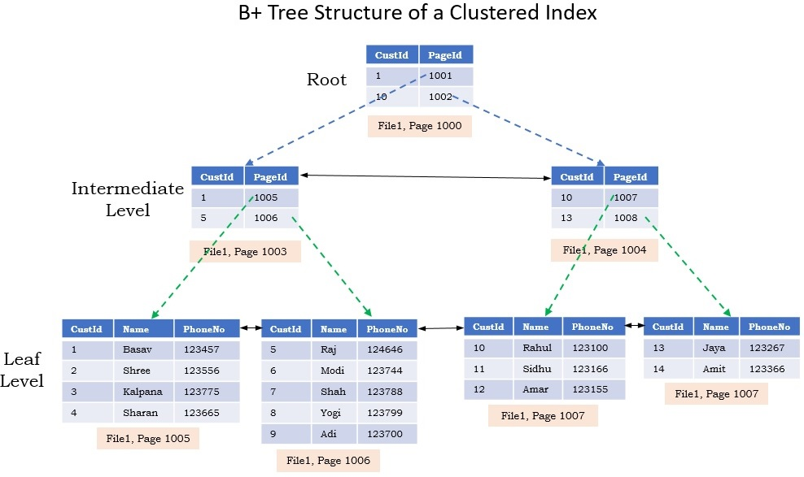

면접 준비용 MySQL Index 개념 정리

# 1. Index는 왜 사용하는 것인가? 

- 목적: **데이터 검색 속도의 향상(SELECT 쿼리 최적화)**
- Full Table Scan을 피하자

## 1-1. Index가 없다면? 
- 특정 record를 찾기 위해 모든 record와 일일히 대조해봐야함
- Full Table Scan 발생 -> 시간 오래걸림 & 리소스 소모 높음

## 1-2. Index를 사용하면?
- 특정 컬럼(들)의 값과 그 값이 저장된 실제 데이터의 물리적 주소를 매핑하여 미리 정렬
- 데이터베이스는 테이블 전체를 뒤지지 않고, 특정 record를 빠르게 찾아낼 수 있음

# 2. Index 사용의 장단점

## 장점 (Pros)
- 검색 속도 대폭 향상: WHERE 절을 통한 조건 검색 시 처리 속도가 비약적으로 빨라집니다.
- 정렬 및 그룹화 효율: 이미 데이터가 정렬된 상태로 저장되므로 ORDER BY나 GROUP BY 작업 시 부하를 크게 줄일 수 있습니다.
- 시스템 부하 감소: 테이블 전체를 읽는 디스크 I/O를 줄여 시스템 전체의 성능이 안정됩니다.

## 단점(Cons) 
- 저장 공간 차지: 인덱스 자체도 별도의 자료구조로 저장되므로, 데이터베이스 내에 추가적인 디스크 공간(보통 테이블 크기의 10% 내외)을 차지합니다.
- 데이터 변경 시 성능 저하 (DML 오버헤드): INSERT, UPDATE, DELETE 작업이 발생할 때마다 테이블의 데이터뿐만 아니라 **인덱스 데이터도 함께 수정하고 재정렬**해야 하므로, 쓰기 속도가 느려집니다.

## 결론
* 인덱스는 '읽기(Read)' 성능을 높이기 위해 **'쓰기(Write)' 성능과 '저장 공간'**을 지불하는 거래(Trade-off)입니다.

# 3. Index의 구현

MySQL(특히 기본 스토리지 엔진인 InnoDB)에서 인덱스를 구현하는 데 주로 사용되는 핵심 자료구조는 다음과 같습니다.

## 3-1. B-Tree (B+Tree) 인덱스
가장 범용적이고 기본적으로 사용되는 인덱스 알고리즘입니다. MySQL의 InnoDB는 B-Tree의 확장 형태인 B+Tree를 사용합니다.

- 구조: 최상위의 루트 노드(Root node), 중간의 브랜치 노드(Branch node), 최하위의 리프 노드(Leaf node)로 구성된 트리 구조입니다.

- 특징: 모든 실제 데이터(또는 포인터)는 최하위 **리프 노드에만 존재**하며, 리프 노드들끼리는 연결 리스트(Linked List)로 이어져 있습니다.

- 장점: `SELECT * FROM users WHERE age = 30` 같은 일치 검색뿐만 아니라, `WHERE age BETWEEN 20 AND 30` 같은 범위(Range) 검색에 매우 탁월한 성능을 발휘합니다. 리프 노드를 타고 쭉 스캔하면 되기 때문입니다.

## 3-2. Hash 인덱스
키 값을 해시 함수에 넣어 나온 결과로 메모리 주소를 찾아가는 방식입니다.

- 장점: `=` 연산자를 이용한 정확한 일치(Exact Match) 검색에 매우 빠릅니다.

- 단점: 해시 함수의 특성상 값이 조금만 달라져도 완전히 다른 해시값이 나오기 때문에, 부등호(<, >)를 사용하는 범위 검색에는 사용할 수 없습니다. 주로 메모리 기반 테이블이나 InnoDB의 '어댑티브 해시 인덱스(Adaptive Hash Index)' 등 보조적인 용도로 사용됩니다.

## 3-3. Index가 사용되지 않는 쿼리 사용

### 1. LIKE 검색에서 와일드카드(%)가 맨 앞에 올 때
* 가장 흔하게 발생하는 인덱스 무용지물 케이스
* 상황: `SELECT * FROM users WHERE name LIKE '%철수';`
* 이유: B+Tree는 기본적으로 데이터가 '왼쪽에서 오른쪽으로(Left-to-Right)' 정렬되어 있습니다. 종이 사전에서 단어를 찾는 것과 같습니다. 'apple'을 찾으려면 'a'부터 찾고 그다음 'p'를 찾습니다.
* 최악인 이유: 검색어 앞에 %가 붙으면, 시작 글자가 무엇인지 알 수 없으므로 B+Tree의 정렬된 구조(루트 -> 브랜치 -> 리프 노드 탐색)를 전혀 이용할 수 없습니다. 결국 데이터베이스는 **인덱스 풀 스캔(Index Full Scan)이나 테이블 풀 스캔(Table Full Scan)**을 강제당하며 $O(N)$의 탐색 시간을 소모하게 됩니다.

### 2. 인덱스 컬럼의 값을 가공하거나 타입이 다를 때
* 인덱스가 걸려있는 컬럼 자체에 연산을 가하거나 함수를 씌우면 인덱스가 깨집니다.
* 상황 (함수 사용): `SELECT * FROM users WHERE YEAR(created_at) = 2023;`
* 상황 (타입 불일치): `SELECT * FROM users WHERE phone_number = 01012345678;` (문자열 컬럼에 숫자 입력)
* 이유: B+Tree 인덱스는 테이블에 저장된 **'원본 값'**을 기준으로 정렬된 트리를 만듭니다. 쿼리에서 YEAR() 같은 함수로 값을 가공해버리면, B+Tree 안에 그 가공된 값은 존재하지 않습니다.
* 최악인 이유: 데이터베이스 엔진은 모든 행(Row)의 created_at 값을 하나하나 꺼내서 YEAR() 함수를 실행해 본 뒤에야 2023년인지 판단할 수 있습니다. (암묵적 형변환도 마찬가지입니다.) 이 역시 풀 테이블 스캔을 유발합니다.

### 3. 무작위 값(UUID 등)을 기본키로 설정하고 대량 INSERT 할 때
* 이 경우는 '검색(SELECT)'이 아니라 **'쓰기(INSERT)'** 시에 발생하는 물리적인 최악의 상황입니다.
* 상황: 순차적으로 증가하는 숫자(AUTO_INCREMENT)가 아니라, 규칙 없이 무작위로 생성되는 UUID나 해시값을 클러스터링 인덱스(기본키)로 사용할 때.
* 이유: B+Tree는 데이터가 항상 정렬된 상태를 유지해야 합니다. 데이터베이스는 디스크를 '페이지(Page)'라는 블록 단위로 관리하는데, 무작위 값이 들어오면 기존에 꽉 차 있던 페이지 중간에 데이터를 억지로 끼워 넣어야 합니다.
* 최악인 이유 (페이지 분할 - Page Split): 공간이 없는 페이지 중간에 데이터가 들어오면, 데이터베이스는 해당 페이지를 반으로 쪼개서 두 개의 페이지로 나누는 '페이지 분할(Page Split)' 작업을 수행합니다. 이 과정에서 막대한 디스크 I/O가 발생하며 쓰기 성능이 수십 배 이상 곤두박질칩니다. 또한, 디스크 공간이 조각나는 **단편화(Fragmentation)**가 발생하여 추후 검색 속도까지 느려집니다.

### 4. 손익분기점을 넘는 대량의 데이터를 조회할 때 (랜덤 I/O의 저주)
* 인덱스를 타는 것이 무조건 빠른 것은 아닙니다.
* 상황: 카디널리티가 낮은 컬럼(예: 성별, 상태값 등)에 인덱스를 걸고, 전체 테이블 데이터의 약 20%~25% 이상을 조회하는 쿼리를 날릴 때. (`WHERE status = 'ACTIVE'`)
* 이유: 인덱스를 거쳐서 실제 테이블의 데이터를 가져오는 작업(인덱스 룩업)은 디스크의 이곳저곳을 찌르는 **랜덤 I/O(Random I/O)**입니다. 반면, 테이블 전체를 그냥 처음부터 끝까지 무식하게 읽는 풀 테이블 스캔은 디스크를 연속해서 읽는 **순차 I/O(Sequential I/O)**입니다. 디스크의 물리적 특성상 순차 I/O가 랜덤 I/O보다 훨씬 빠릅니다.
* 최악인 이유: 옵티마이저(Optimizer)가 바보같이 인덱스를 억지로 타게 만들면(또는 사용자가 힌트로 강제하면), 데이터를 하나 찾을 때마다 디스크 헤더가 미친 듯이 움직이며 엄청난 오버헤드를 발생시킵니다. 전체 데이터의 20% 이상을 읽을 바에는 차라리 풀 테이블 스캔을 하는 것이 훨씬 빠릅니다.

# 4. Cardinality와 Index

**카디널리티(Cardinality)**는 집합론의 용어로, 데이터베이스에서는 **'특정 컬럼이 가지는 고유한 값의 개수(중복도)'**를 의미합니다.

-  카디널리티가 높다: 고유한 값이 많다 (중복도가 낮다).
    - 예시: 주민등록번호, 이메일, 휴대전화 번호. (모든 사람의 값이 다름)

- 카디널리티가 낮다: 고유한 값이 적다 (중복도가 높다).
    - 예시: 성별(남/여), 국적, 학년. (값이 몇 개로 한정됨)

인덱스 키의 카디널리티는 **"어떤 컬럼에 인덱스를 걸어야 가장 효율적인가?"**를 결정하는 가장 중요한 기준입니다.

인덱스는 카디널리티가 높은(고유값이 많은) 컬럼에 생성해야 효과가 좋습니다.

- 구체적인 예시: 100만 명의 유저 데이터가 있습니다.

    - 나쁜 인덱스 (카디널리티 낮음): 성별 컬럼에 인덱스를 걸고 남성을 찾습니다. 인덱스를 타더라도 결국 50만 건의 데이터를 읽어야 합니다. 인덱스를 거치는 비용 때문에 오히려 풀 테이블 스캔보다 느려질 수 있습니다.

    - 좋은 인덱스 (카디널리티 높음): 이메일 컬럼에 인덱스를 걸고 특정 이메일을 찾습니다. 단 몇 번의 트리 탐색만으로 정확히 1건의 데이터를 걸러낼 수 있습니다.

# 5. Index Types

-  MySQL의 InnoDB 스토리지 엔진을 이해하려면 클러스터링 인덱스와 보조 인덱스의 차이를 이해하는 것이 중요합니다.
- 복합 인덱스는 2개 이상의 컬럼을 index로 사용하는 경우입니다.

## 5-1. 클러스터링 인덱스 (Clustered Index):

- 테이블의 **기본키(Primary Key)**에 의해 자동으로 생성됩니다.
- 특징: 인덱스의 리프 노드 자체가 **실제 테이블의 데이터 행(Row)**입니다. 즉, 데이터가 기본키 순서대로 디스크에 정렬되어 저장됩니다. (사전과 같습니다. 단어 자체가 알파벳 순으로 정렬되어 있고 그 옆에 바로 뜻이 적혀 있습니다.)

## 5-2. 보조 인덱스 / 논클러스터드 인덱스 (Secondary Index)

- 사용자가 성능을 위해 추가로 생성하는 일반적인 인덱스입니다(`CREATE INDEX`).
- 특징: 이 인덱스의 리프 노드에는 실제 데이터가 아니라, 해당 데이터의 기본키(Primary Key) 값이 저장되어 있습니다.
- 검색 과정: 보조 인덱스에서 검색 -> 기본키 값을 찾음 -> 그 기본키 값으로 다시 클러스터링 인덱스를 검색 -> 실제 데이터 획득. (이를 인덱스 룩업이라 합니다.)

## 5-3. 복합 인덱스 (Composite Index / 다중 컬럼 인덱스)
- 두 개 이상의 컬럼을 묶어서 하나의 인덱스로 만드는 것입니다.
- 예시: (성, 이름)으로 묶인 복합 인덱스.
- 주의점: 전화번호부에서 '김 철수'를 찾는 것과 같습니다. '김'씨 성을 먼저 찾고, 그 안에서 '철수'를 찾습니다. 따라서 `WHERE 성 = '김'`으로는 인덱스를 탈 수 있지만, `WHERE 이름 = '철수'` 로 검색하면 앞의 '성'을 모르기 때문에 인덱스를 활용할 수 없습니다. **컬럼의 순서**가 매우 중요합니다. 

## 5-4. 커버링 인덱스 (Covering Index)
- 쿼리에 필요한 모든 데이터가 보조 인덱스에 이미 다 포함되어 있어서, 실제 테이블의 데이터 블록(클러스터링 인덱스)에 접근할 필요가 전혀 없는 **상태**를 말합니다. 성능이 비약적으로 빠릅니다.

- 예시: (이름, 나이)로 복합 인덱스가 걸려있을 때, `SELECT 나이 FROM users WHERE 이름 = '김철수'` 쿼리를 날리면, 인덱스 트리 안에 이미 '나이' 정보가 있으므로 실제 테이블로 이동하는 과정을 생략합니다.

# 6. 분산 처리 엔진(Hive, Trino)과 MySQL의 비교
분산 처리 엔진(Trino, Hive)과 MySQL은 데이터를 다루는 근본적인 목적이 다르며, 이는 '인덱스'를 대하는 방식과 아키텍처에서 가장 극명하게 드러납니다.  

MySQL이 `건초 더미에서 바늘 하나를 빠르게 찾는 방식(B-Tree)`라면, Trino나 Hive는 `필요 없는 건초 더미를 통째로 무시하고, 남은 건초 더미들을 병렬로 빠르게 훑는 방식(Data Skipping)`을 취합니다.

## 6-1. 목적에 따른 인덱스 접근 방식의 차이
- MySQL (OLTP 관점)
    - 목적: 사용자의 가입, 결제, 정보 수정 등 개별 트랜잭션의 빠른 점 검색(Point Query) 및 업데이트에 최적화되어 있습니다.
    - 인덱스 형태: B-Tree (또는 B+Tree) 구조를 사용합니다.
    - 특징: 데이터베이스가 각 행(Row)의 정확한 물리적 위치를 알고 있습니다. 인덱스를 타면 테이블 전체를 읽지 않고도 디스크의 특정 블록으로 직행하여 데이터를 가져옵니다.

- Trino / Hive (OLAP 관점)
    - 목적: 페타바이트급의 대용량 데이터를 스캔하여 통계를 내거나 집계(Aggregation)하는 분석 쿼리에 최적화되어 있습니다.
    - 인덱스 형태: 대규모 분산 환경에서는 데이터가 수많은 서버에 흩어져 있고 끊임없이 쌓이기 때문에, MySQL과 같은 전통적인 B-Tree 인덱스를 만들고 유지하는 비용(오버헤드)이 너무 큽니다.
    - 특징: 개별 행(Row)을 찾는 인덱스 대신, 쿼리 엔진이 엄청난 양의 데이터를 병렬로 읽어들이되 '읽을 필요가 없는 데이터를 뭉텅이로 걸러내는(Data Skipping)' 메타데이터 기반의 방식을 인덱스의 대체재로 사용합니다.

## 6-2. 분산 처리 엔진의 '인덱스' 대체 기술
Trino나 Hive 같은 분산 쿼리 엔진은 전통적인 인덱스가 없는 대신, 보통 하둡(HDFS)이나 S3 같은 객체 저장소에 데이터를 **컬럼형 포맷(Parquet, ORC)**으로 저장하며 다음 기술들을 활용해 검색 속도를 높입니다.

### ① 파티셔닝 (Partitioning)
- 가장 원시적이고 강력한 대용량 데이터 필터링 방식입니다. 데이터를 특정 기준(예: 날짜, 국가)에 따라 아예 물리적인 디렉토리(폴더) 단위로 분리하여 저장합니다.

- 효과: `WHERE date = '2026-02-21'` 이라는 쿼리를 실행하면, 엔진은 다른 날짜의 폴더는 아예 쳐다보지도 않고 해당 폴더의 파일들만 병렬로 읽습니다. B-Tree 인덱스의 '범위 검색'과 유사한 효과를 냅니다.

### ② Zone Maps (최소/최대값 메타데이터 통계)
- Parquet나 ORC 같은 파일 포맷은 데이터를 '블록(Block)' 단위로 쪼개어 저장하면서, 각 블록마다 내부 데이터의 **통계 정보**(최솟값, 최댓값, Null 개수 등)를 파일 헤더(메타데이터)에 기록해 둡니다.
- 효과: 쿼리가 `WHERE age > 30`을 요청할 때, 어떤 데이터 블록의 age 최댓값이 25로 기록되어 있다면 엔진은 해당 블록의 실제 데이터를 열어보지 않고 통째로 스킵(Data Skipping) 합니다. 이를 거시적인 관점의 인덱스로 볼 수 있습니다.

### ③ 블룸 필터 (Bloom Filter)
- 특정 데이터가 '이 블록에 절대 존재하지 않음'을 확률적으로 매우 빠르게 판별해 내는 가벼운 자료구조입니다.
- 효과: 해시 함수를 활용하여 데이터 블록에 특정 값이 있는지 훑어봅니다. 블룸 필터가 "없다"고 판단하면 디스크에서 그 블록을 읽지 않고 건너뛰어 I/O 성능을 크게 향상시킵니다.
- 블룸필터는 SQLite와 같은 RDB에서도 사용되는 자료구조입니다(분산 처리 엔진에서만 사용되는 것은 아닙니다).

## 6-3. 요약

| 구분 | MySQL (관계형 DB) | Trino / Hive (분산 처리 엔진) |
| :--- | :--- | :--- |
| **주요 워크로드** | OLTP (단건 조회, 잦은 업데이트) | OLAP (대규모 스캔, 집계, 분석) |
| **인덱스의 단위** | **행(Row) 단위**의 미시적 접근 | **파일/블록(Block) 단위**의 거시적 접근 |
| **데이터 필터링 원리** | B-Tree를 타고 내려가 **특정 위치(포인터)를 찾음** | 통계 정보(메타데이터)를 보고 **불필요한 덩어리를 버림** |
| **사용 기술** | B+Tree, Hash 인덱스 등 | 파티셔닝, Zone Maps(Min/Max), Bloom Filter |
| **데이터 저장 방식** | 로우(Row) 기반 저장 | 컬럼(Column) 기반 저장 (Parquet, ORC 등) |

결과적으로 분산 환경에서 Trino나 Hive로 쿼리 튜닝을 할 때는 MySQL처럼 '어떤 컬럼에 인덱스를 걸지' 고민하는 것이 아니라, '데이터를 어떤 단위로 파티셔닝할지', 그리고 'Parquet 같은 컬럼형 포맷의 사이즈와 정렬을 어떻게 최적화하여 Data Skipping을 극대화할지'를 고민해야 합니다.

[참고]  
[DB 사용량을 줄이는 블룸필터 Bloom Filter](https://codingapple.com/blog/bloom-filter/)  
[MySQL Clustered Index 와 Fast Index Creation In InnoDB](https://hoing.io/archives/5960)