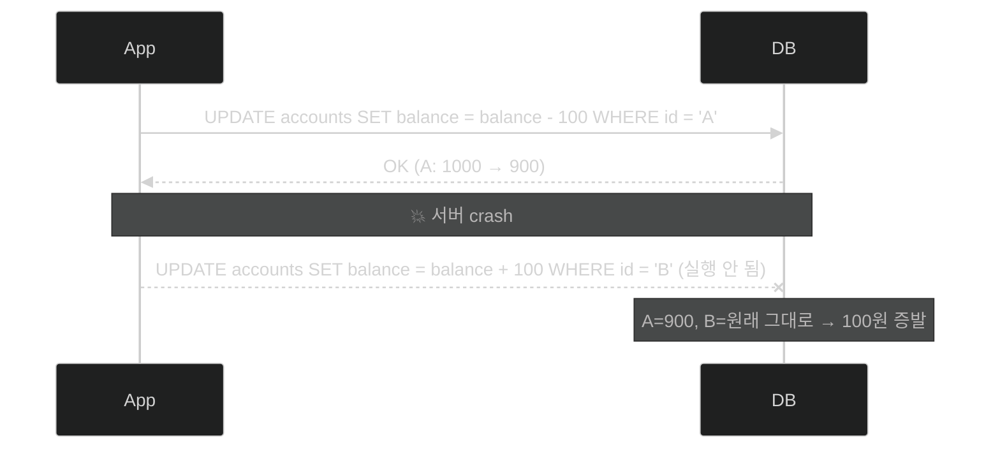
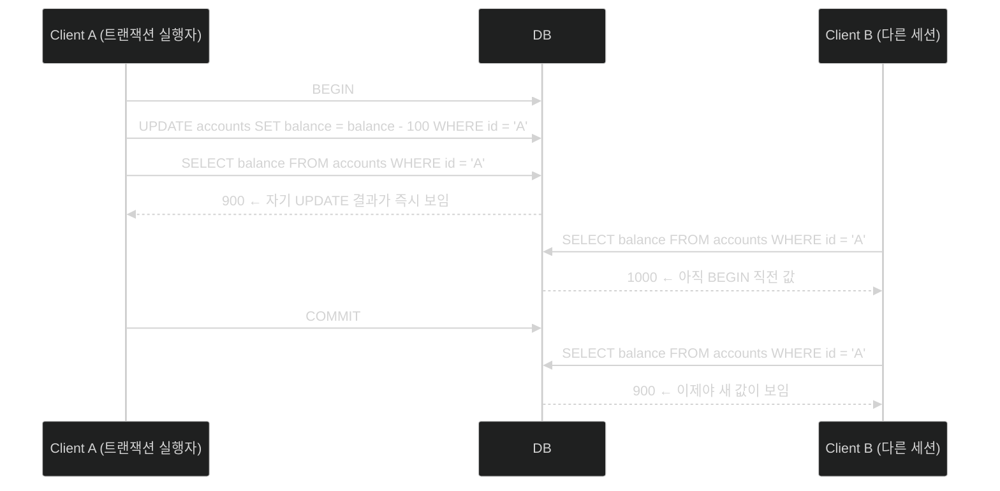
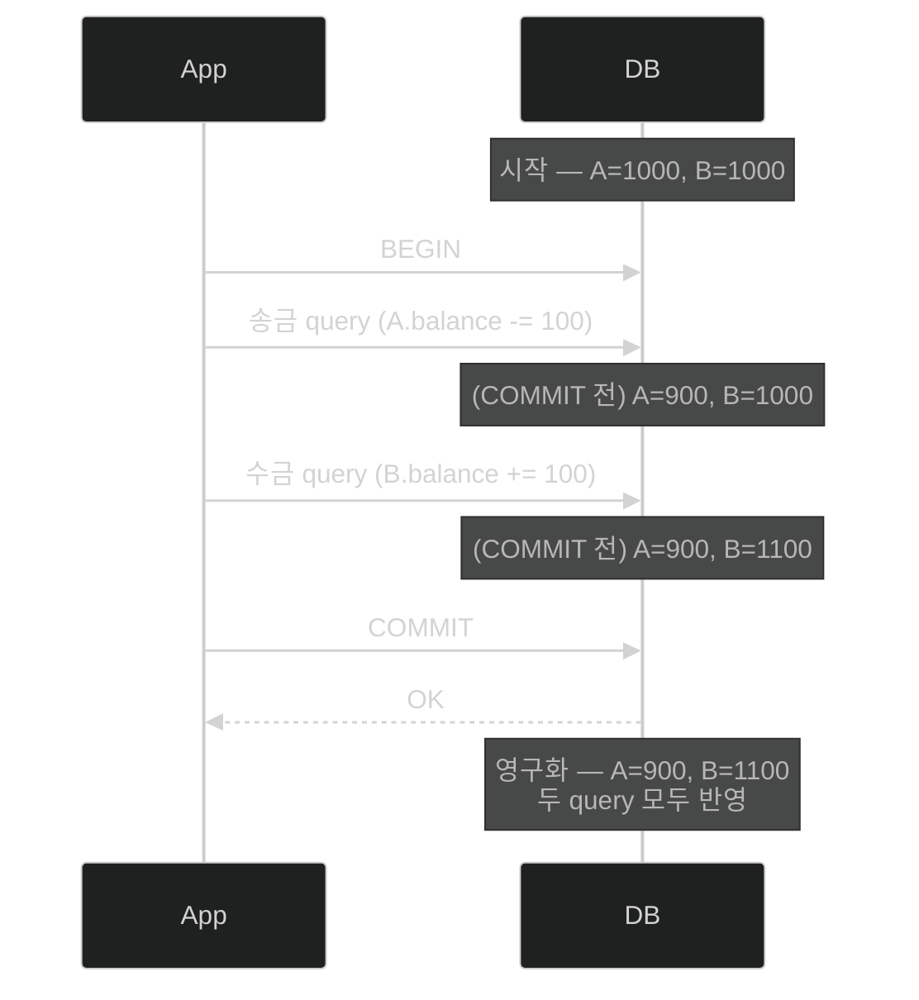
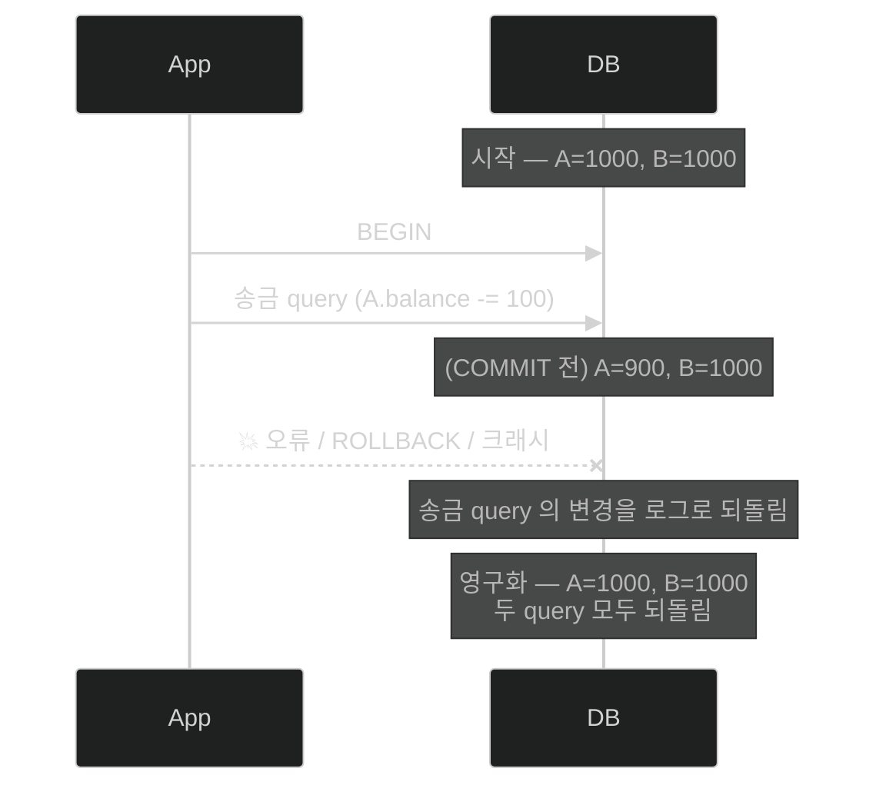
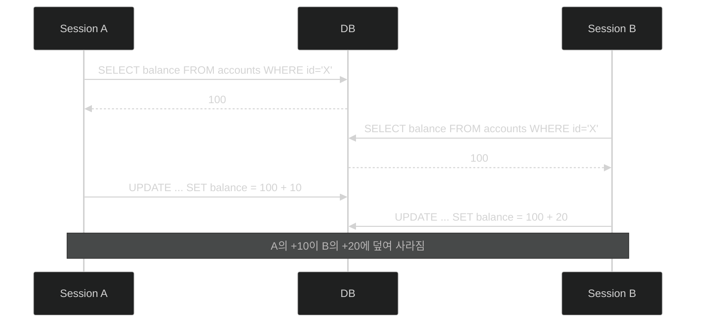
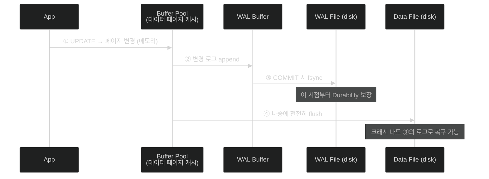
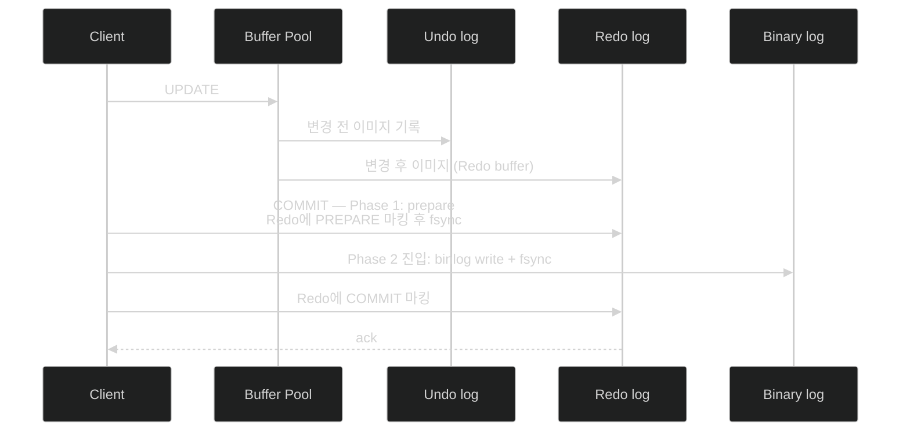
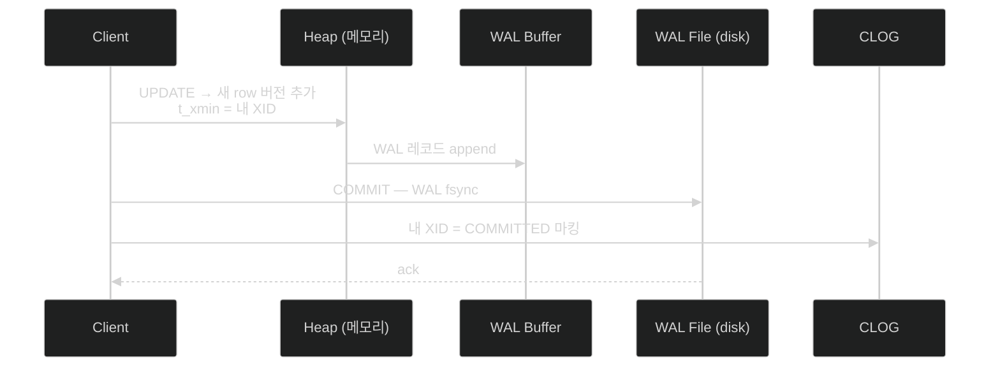

MySQL InnoDB와 PostgreSQL이 ACID 네 속성을 어떤 로그·자료구조로 구현하는지 비교해봅니다.

# 왜 트랜잭션이 필요한가

## 단순한 두 UPDATE의 함정

A 계좌에서 B 계좌로 100원을 이체하는 가장 단순한 코드를 떠올려보겠습니다.

```sql
UPDATE accounts SET balance = balance - 100 WHERE id = 'A';
UPDATE accounts SET balance = balance + 100 WHERE id = 'B';
```

두 줄이지만 이 사이에는 무시할 수 없는 시간적 간격이 있습니다. 첫 번째 UPDATE가 디스크에 기록된 직후 서버가 비정상 종료되면 어떻게 될까요.



A의 잔고는 100원이 줄었는데 B의 잔고는 그대로입니다. 100원이 그냥 사라진 셈이죠. 데이터베이스 입장에서 이 두 UPDATE는 **하나의 사건**이어야 하는데, 단순 SQL 실행만으로는 그것을 보장할 수 없습니다.

이 문제를 해결하기 위해 데이터베이스는 **트랜잭션(transaction)** 이라는 추상을 제공합니다. 트랜잭션은 여러 SQL 문을 하나의 논리적 단위로 묶고, 그 단위에 대해 네 가지 약속을 보장합니다.

## 트랜잭션이 보장해야 하는 네 가지 약속

| 속성              | 한 줄 정의                                      |
| ----------------- | ----------------------------------------------- |
| **A**tomicity     | 트랜잭션 안의 모든 작업이 전부 반영되거나, 하나도 반영되지 않거나 |
| **C**onsistency   | 트랜잭션이 끝난 시점에 DB 제약 조건은 항상 만족 상태 |
| **I**solation     | 동시에 실행되는 트랜잭션끼리 서로의 중간 상태를 보지 못함 |
| **D**urability    | 커밋된 결과는 장애가 나도 살아남음              |

이 네 글자를 이어 붙여 ACID라고 부릅니다. 이 글에서는 **A·C·D**를 본격적으로 다루고, **I**(격리성)는 동시성 이상 현상과 함께 다음 편으로 미룹니다.

# 트랜잭션의 두 시간대 — `BEGIN` 과 `COMMIT` 사이

ACID 네 속성을 하나씩 보기 전에, 본문 곳곳에 등장할 표현 하나만 먼저 정리하겠습니다.

`BEGIN` 으로 시작해 `COMMIT` 으로 끝나는 트랜잭션 블록 안에서, DB 는 같은 row 에 대해 **두 가지 다른 값을 동시에** 들고 있습니다.

- **(COMMIT 전) 잠정 값** — 트랜잭션을 실행 중인 클라이언트(=같은 세션) 가 보는 값. UPDATE 직후 같은 세션에서 SELECT 하면 변경된 값이 그대로 보입니다.
- **영구화된 값** — 다른 클라이언트(=다른 세션) 가 보는 값. COMMIT 이 끝나기 전까지는 BEGIN 직전의 값 그대로입니다.

같은 시점에 두 클라이언트가 같은 row 를 SELECT 했을 때 서로 다른 값을 본다는 뜻입니다.



Client A 는 자기 UPDATE 의 결과를 즉시 봅니다. 같은 시점의 Client B 는 BEGIN 직전 값을 봅니다. A 의 COMMIT 이 끝나는 순간 두 클라이언트가 보는 값이 비로소 일치합니다.

이 글에서 다이어그램에 `(COMMIT 전)` 이라고 적힌 노트는 위 그림의 **"A 가 본 잠정 값"** 을 가리킵니다. 그 값이 결국 영구화될지(COMMIT) 사라질지(ROLLBACK·크래시) 가 곧 다음에 다룰 Atomicity 의 주제입니다.

# ACID 네 속성을 하나씩

## A — Atomicity: 전부 아니면 전무

Atomicity는 가장 직관적인 속성입니다. 트랜잭션 내의 모든 SQL 문은 **all-or-nothing**으로 처리되어야 합니다. 위 계좌이체를 트랜잭션으로 감싸면, 두 UPDATE 가 하나의 단위가 됩니다.

```sql
BEGIN;
  -- 송금 query: A 계좌에서 100원 차감
  UPDATE accounts SET balance = balance - 100 WHERE id = 'A';
  -- 수금 query: B 계좌에 100원 추가
  UPDATE accounts SET balance = balance + 100 WHERE id = 'B';
COMMIT;
```

같은 두 query 라도 결과는 두 가지 중 하나로만 끝나야 합니다. **둘 다 반영되거나, 둘 다 사라지거나** — 한쪽만 적용된 중간 상태는 절대 영구화되지 않아야 합니다.

### ① 정상 흐름 — COMMIT 성공

송금·수금 query 가 모두 실행되고 COMMIT 까지 성공하면, 두 변경이 함께 영구화됩니다.



### ② 실패 흐름 — 오류 / ROLLBACK / 크래시

송금 query 만 실행된 채로 오류·ROLLBACK·크래시가 발생해도, **이미 디스크에 흔적이 남았을 송금 query 의 변경까지 함께 되돌려져야** 합니다.



두 흐름 모두 **영구화된 결과는 두 가지뿐**입니다. 시작 상태(A=1000/B=1000) 또는 완전 적용 상태(A=900/B=1100). 위험한 절반 상태(A=900/B=1000) 는 어떤 시점에도 영구화되지 않습니다. 이를 위해 DB 는 변경 내용을 **로그**에 기록해두고, 실패 시 그 로그를 이용해 변경을 되돌립니다 — 그 로그의 정체가 곧 뒤에서 비교할 InnoDB 의 Undo log 와 PostgreSQL 의 Heap 안 옛 row 버전입니다.

## C — Consistency: 제약 조건은 누구의 책임인가

Consistency 는 ACID 중 가장 오해받는 속성입니다. 흔히 "트랜잭션이 DB 를 한 일관된 상태에서 다른 일관된 상태로 옮긴다" 라고 정의되는데, 여기서 **"일관된 상태"** 가 사실은 **두 층의 합**이라는 점이 잘 드러나지 않기 때문입니다.

| 층 | 책임 주체 | 보장하는 것 | 예시 |
| --- | --- | --- | --- |
| **DB 제약** | DB 엔진 | 스키마에 선언된 규칙 | `CHECK (balance >= 0)`, `NOT NULL`, `FOREIGN KEY`, `UNIQUE` |
| **비즈니스 규칙** | 애플리케이션 | SQL 제약으로는 표현할 수 없는 도메인 규칙 | "송금 차감액 = 수금 입금액", "잔액 합계 = 거래 내역 합계" |

DB 단위의 일관성을 한 문장으로 줄이면, **"스키마에 선언된 모든 제약이 항상 만족되는 상태가 유지된다"** 는 불변식입니다. 트랜잭션이 이 불변식을 깨려는 변경을 시도하면 DB 는 그 시점에 거부합니다 — 다른 제약은 멀쩡한데 `CHECK (balance >= 0)` 하나만 위반해도 트랜잭션 전체가 실패합니다.

송금·수금 예시로 풀어보면 두 층의 차이가 분명해집니다.

```sql
CREATE TABLE accounts (
    id      VARCHAR(16) PRIMARY KEY,
    balance BIGINT NOT NULL,
    CHECK (balance >= 0)              -- ← DB 제약: 잔액은 음수가 될 수 없다
);
```

DB 가 책임지는 부분은 "어떤 row 의 balance 도 0 미만이 되지 않는다" 까지입니다. 트랜잭션이 시도한 UPDATE 가 음수 잔액을 만들면 DB 는 **그 자리에서** 트랜잭션을 거부합니다.

그러나 송금 query 가 차감한 금액과 수금 query 가 더한 금액이 **같은 100원** 이라는 사실은 DB 가 알 길이 없습니다. 다음 SQL 은 DB 입장에서 완벽히 합법입니다 — 어떤 CHECK 도 위반하지 않으니까요.

```sql
BEGIN;
  UPDATE accounts SET balance = balance - 100 WHERE id = 'A';   -- 차감 100
  UPDATE accounts SET balance = balance + 200 WHERE id = 'B';   -- 입금 200 (!)
COMMIT;
```

A 의 잔액이 0 이상이고 B 의 잔액이 0 이상이면 DB 는 "일관된 상태" 라고 판정합니다. 그러나 시스템 전체로 보면 **100원이 어디선가 새로 생겼다**는 비즈니스 관점의 위반이 일어났고, 이 층의 일관성은 오직 애플리케이션 코드(예: `transferAmount` 변수를 두 UPDATE 가 함께 사용하도록 강제하는 로직) 가 보장해야 합니다.

ACID 의 C 가 A·I·D 와 결이 다른 이유가 여기에 있습니다. **A·I·D 는 DB 엔진이 단독으로 보장하는 속성이지만, C 는 DB 와 애플리케이션의 공동 책임입니다.**
## I — Isolation: 동시성은 다음 편에서

Isolation은 동시에 실행되는 여러 트랜잭션이 서로의 중간 상태를 보지 못하도록 하는 속성입니다. 이 속성이 깨질 때 일어나는 가장 단순한 사고가 **Lost Update**입니다.



A의 입금 10원이 흔적도 없이 사라졌습니다. 격리 수준(Isolation Level)은 이 같은 동시성 이상 현상을 어디까지 막을지를 정의하는 다이얼이고, MySQL과 PostgreSQL이 같은 다이얼 위에서 전혀 다른 메커니즘을 쓴다는 점이 흥미롭습니다. 이 부분은 다음 편에서 본격적으로 다루겠습니다.

## D — Durability: 디스크에 닿았다는 것의 의미

Durability는 "COMMIT된 트랜잭션은 장애가 나도 살아 있어야 한다"는 약속입니다. 단순해 보이지만, 현대 OS·디스크 스택에서 "썼다"의 의미가 한 가지가 아니라는 점이 일을 복잡하게 만듭니다.


`write()` 시스템 콜은 데이터를 **OS 페이지 캐시**까지만 옮깁니다. 커널 메모리에 있는 동안 정전이 나면 데이터는 사라집니다. 데이터를 비휘발성 디스크 플래터까지 밀어내려면 `fsync()`가 필요합니다.

문제는 `fsync`가 비싸다는 것입니다. SSD에서도 수백 마이크로초, HDD에서는 수 밀리초 단위입니다. COMMIT마다 fsync를 부르면 전체 처리량이 그 비용에 묶입니다. 이 비싼 호출을 어떻게 다룰지가 곧 DB 엔진의 성격을 결정합니다.

# Atomicity와 Durability를 떠받치는 로그 구조

## Redo log vs Undo log — 역할 분리

A와 D를 동시에 보장하려면 변경에 대한 두 가지 정보가 필요합니다. **변경 후의 모습**(다시 적용하기 위해)과 **변경 전의 모습**(되돌리기 위해)입니다. 이 둘은 사실상 별개의 자료구조이고, 전통적으로 다음과 같이 구분해 부릅니다.

| 로그          | 저장 내용              | 방향          | 쓰임                            |
| ------------- | ---------------------- | ------------- | ------------------------------- |
| **Redo log**  | 변경 **후** 이미지     | 앞으로 재실행 | 크래시 복구 시 커밋된 변경 재적용 |
| **Undo log**  | 변경 **전** 이미지     | 뒤로 되돌리기 | ROLLBACK, MVCC 이전 버전 조회   |

이 분리가 실제 엔진에서 어떻게 다르게 구현되는지가 뒤에서 비교할 핵심 포인트입니다.

## WAL(Write-Ahead Logging)의 원칙

Atomicity와 Durability를 동시에 보장하는 표준 기법이 **Write-Ahead Logging**입니다. 원칙은 한 줄로 요약됩니다.

> 데이터 페이지를 디스크에 쓰기 **전에** 그 변경을 설명하는 로그를 먼저 디스크에 써라.

이 순서가 왜 중요한지는 시퀀스로 보면 분명합니다.



핵심은 ③과 ④의 순서가 자유롭다는 것입니다. ③이 끝난 시점에 클라이언트에게 COMMIT 성공을 알리면 됩니다. ④는 백그라운드에서 느긋하게 진행되어도 무방합니다. 만약 ④ 도중 크래시가 나도, 다음 기동 시 ③의 로그를 읽어 ④를 다시 수행할 수 있기 때문입니다.

### 그런데 로그도 디스크 쓰기 아닌가

여기서 자연스러운 질문이 하나 생깁니다. **"로그도 결국 fsync 로 디스크에 쓰는 건데, 그게 어떻게 데이터 페이지 쓰기보다 싸고 어떻게 Durability 를 보장한다는 건가?"**

맞습니다, 로그 쓰기도 분명 디스크 쓰기입니다. 그러나 디스크에 쓰는 **두 가지 대상의 성격이 완전히 다르다** 는 것이 WAL 이 통하는 이유입니다.

| 대상 | 쓰기 패턴 | 한 번 쓰는 크기 | 디스크 상 위치 |
| --- | --- | --- | --- |
| **WAL/Redo 로그** | append-only, 순차 | 수십~수백 바이트 | 단일 파일(들) 의 끝 |
| **데이터 페이지** | random write | 16 KB (InnoDB) / 8 KB (PG) 단위 | 테이블·인덱스 파일 곳곳 |

순차 쓰기는 SSD 에서도 random 쓰기보다 보통 수십 배 빠릅니다. 같은 트랜잭션의 결과를 디스크에 영구화하는 두 가지 방법을 비교하면 비용 차이가 큽니다.

- **로그만 fsync** → 한 파일의 끝에 작은 sequential write 한 번
- **데이터 페이지를 직접 fsync** → 흩어진 16KB 페이지 여러 개를 random 위치에 fsync (게다가 보통 한 트랜잭션이 여러 페이지를 건드림)

WAL 은 그래서 **"비싼 random write 는 미루고, 싼 sequential write 만 COMMIT 경로에 둔다"** 는 전략입니다. 데이터 페이지도 결국 디스크에 가야 하지만, **COMMIT 응답 지연에서 빠져나갈 수 있다** 는 것이 핵심입니다.

Durability 는 이렇게 보장됩니다. **로그가 디스크에 닿은 시점에 트랜잭션의 변경 의도 자체가 영구화** 됩니다. 데이터 페이지가 아직 디스크에 닿지 않았더라도, 크래시 후 재기동 시 로그를 처음부터 다시 적용(replay) 하면 메모리 상의 변경을 그대로 재현할 수 있기 때문입니다.

```
로그       = 디스크에 적용할 "작업 지시서"
데이터 페이지 = 그 지시를 받은 "결과물"
```

지시서가 디스크에 살아 있으면 결과물은 언제든 다시 만들 수 있습니다. 반대로 지시서 없이 결과물 일부만 디스크에 남아 있다면, 어떤 트랜잭션이 어디까지 진행됐는지 알 수 없어 복구 자체가 불가능합니다. 그래서 WAL 의 "**먼저** 로그를" 이라는 순서가 단순한 최적화가 아니라 **Durability 의 출발점** 입니다.

## Group commit과 fsync 비용

WAL의 다음 병목은 ③의 `fsync`입니다. 트랜잭션 하나가 끝날 때마다 fsync를 호출하면 처리량의 상한이 생깁니다.

$$throughput \le \frac{1}{fsync\_latency}$$

SSD의 fsync 지연을 200μs로 잡으면 단일 스레드 기준 초당 5000 트랜잭션이 한계입니다. 이 한계를 깨는 표준 기법이 **Group commit**입니다. 짧은 시간 동안 들어온 여러 트랜잭션의 로그를 한꺼번에 모아 단 한 번의 fsync로 디스크에 밀어 넣습니다. fsync 한 번이 N개 트랜잭션을 책임지므로, 처리량은 N배 가까이 늘어납니다.

이제 두 엔진이 같은 WAL 원칙 위에서 어떻게 다른 선택을 했는지 봅시다.

# MySQL InnoDB: Redo log + Undo log 이중 구조 (+ 서버 레벨 binlog)

InnoDB 는 변경 후 이미지와 변경 전 이미지를 **물리적으로 다른 두 자료구조** 에 저장합니다. 핵심 코드는 `storage/innobase/log/log0log.cc`(Redo) 와 `storage/innobase/trx/trx0undo.cc`(Undo) 에 있습니다. 그리고 InnoDB 위에 얹힌 MySQL 서버 레벨에는 **binlog** 라는 또 하나의 로그가 함께 동작합니다. COMMIT 시퀀스를 이해하려면 세 로그가 모두 필요하니, 먼저 자료구조부터 정리합니다.

## 자료구조: ib_logfile, rollback segment, binlog

```
data directory/
├── ib_logfile0          # [InnoDB 엔진] Redo log 1
├── ib_logfile1          # [InnoDB 엔진] Redo log 2 (순환 사용)
├── ibdata1              # [InnoDB 엔진] 시스템 테이블스페이스 (Undo 슬롯)
├── undo_001, undo_002   # [InnoDB 엔진] 분리된 Undo 테이블스페이스
└── mysql-bin.000001     # [MySQL 서버] Binary log (binlog)
```

- **Redo log** (`ib_logfile*`) — InnoDB 엔진 레벨. 두 개 이상의 파일을 **순환 버퍼** 처럼 사용. 변경 사항의 LSN(Log Sequence Number) 순서로 append 만 일어나며, 오래된 영역은 체크포인트 이후 재활용됩니다. **크래시 복구용** 입니다.
- **Undo log** (rollback segment) — InnoDB 엔진 레벨. 트랜잭션별로 변경 **전** 이미지를 저장. ROLLBACK 뿐 아니라, 다른 트랜잭션이 "이 row 의 더 오래된 버전" 을 보고 싶을 때(MVCC consistent read) 도 이 Undo 를 거꾸로 따라가 이전 버전을 재구성합니다.
- **Binary log** (`mysql-bin.*`) — MySQL **서버 레벨**. 각 트랜잭션이 어떤 row 를 어떻게 바꿨는지(또는 어떤 statement 를 실행했는지) 를 **커밋 단위로 append** 합니다. 두 가지 용도로 쓰입니다.
  - **복제(replication)**: 슬레이브가 마스터의 binlog 를 읽어 같은 순서로 변경을 재현 — binlog 가 곧 복제의 source of truth.
  - **Point-in-time recovery (PITR, 시점 복구)**: "어제 새벽 2시 27분, DELETE 직전 상태로 돌려놓고 싶다" 같은 임의 시점 복구. 절차는 ① 가장 최근 풀 백업(예: 매일 새벽 3시 스냅샷) 복원 → ② 그 이후의 binlog 를 원하는 시점까지 replay. 크래시 복구(redo log) 가 "마지막 커밋 직후" 까지만 복원하는 것과 달리, PITR 은 **임의로 더 앞 시점** 으로 시간을 되감을 수 있습니다.

  Redo log 와 binlog 는 비슷해 보이지만 **레이어가 다릅니다**. Redo 는 InnoDB 엔진의 **물리적 페이지 변경** 을 기록하고 크래시 복구에 쓰입니다. binlog 는 MySQL 서버의 **논리적 트랜잭션 결과** 를 기록하고 복제·PITR 에 쓰입니다. 같은 트랜잭션의 결과가 두 로그에 각각 적히기 때문에, COMMIT 경로에서 두 로그의 상태를 **반드시 일관되게** 묶어야 합니다 — 이것이 다음 섹션의 2-Phase Commit 동기입니다.

이 다층 구조가 InnoDB+MySQL 의 특징입니다. ROLLBACK 은 Undo 를 거꾸로 적용하는 작업이라 비용이 트랜잭션의 작업량에 비례하고, COMMIT 은 redo 와 binlog 의 일관성 보장 비용을 함께 떠안습니다.

## COMMIT 시퀀스: prepare → write → fsync → commit

InnoDB 의 COMMIT 은 단순한 "로그 한 번 쓰기" 가 아닙니다. 위에서 본 binlog 와 InnoDB redo log 가 **두 채널** 로 존재하기 때문에, 두 로그의 상태가 어긋나면 슬레이브와 마스터가 다른 결과를 보게 됩니다. 이 일관성을 보장하기 위해 COMMIT 이 **2-Phase Commit** 으로 묶입니다.



핵심은 두 번의 fsync입니다. **Redo의 PREPARE fsync** 후 **binlog fsync**가 끝나야 비로소 클라이언트에게 성공을 알립니다. 둘 사이에 크래시가 나면 복구 시 InnoDB는 binlog를 보고 PREPARE 상태의 트랜잭션을 commit할지 abort할지 결정합니다. 이 프로토콜이 있어야 복제 슬레이브가 마스터와 같은 변경 순서를 보장받을 수 있습니다.

## innodb_flush_log_at_trx_commit 트레이드오프

이 두 번의 fsync 비용을 어디까지 감수할지는 파라미터로 조절됩니다.

| 값 | 매 COMMIT 시 동작                            | Durability                        | 처리량 |
| -- | -------------------------------------------- | --------------------------------- | ------ |
| 1  | Redo buffer → file `write` + `fsync`         | 완전 (기본값)                     | 낮음   |
| 2  | Redo buffer → file `write`만 (fsync 없음)    | OS 크래시 시 최대 1초 손실 가능   | 중간   |
| 0  | Redo buffer는 1초마다 background flush       | DB 크래시 시 최대 1초 손실 가능   | 높음   |

값 2는 "DB 프로세스만 죽고 OS는 멀쩡한" 흔한 시나리오에서 데이터를 잃지 않는 절충안입니다. 값 0은 데이터 손실을 감수하고 처리량을 우선시할 때 쓰입니다.

# PostgreSQL: 단일 WAL + Heap-only Tuple

PostgreSQL은 정반대 방향의 선택을 했습니다. 별도의 Undo log를 두지 않습니다. 핵심 코드는 `src/backend/access/transam/xlog.c`(WAL)과 `src/backend/access/heap/heapam.c`(Heap)에 있습니다.

## 자료구조: pg_wal과 XID

```
data directory/
├── pg_wal/              # WAL 세그먼트 파일 (16MB 단위)
│   ├── 000000010000000000000001
│   └── ...
├── pg_xact/             # 트랜잭션 상태 (구 CLOG)
│   ├── 0000             # XID별 2비트: IN_PROGRESS / COMMITTED / ABORTED
│   └── ...
└── base/                # 데이터 파일 (Heap)
```

- **WAL**: 모든 변경에 대한 redo 정보를 한 곳에 모은 단일 로그. InnoDB의 Redo log와 같은 역할.
- **CLOG (`pg_xact`)**: 각 트랜잭션 ID(XID)의 최종 상태를 2비트로 기록. 이 파일이 PG에서 "트랜잭션이 커밋됐는지"를 가리는 단일 진실 공급원입니다.
- **Heap**: 한 row가 UPDATE될 때 기존 row를 덮어쓰지 않고, **새 row 버전을 옆에 추가**합니다. 각 row 버전에는 `t_xmin`(생성 XID)과 `t_xmax`(삭제 XID)가 붙습니다.

별도의 Undo가 없는 비결이 바로 이 Heap 구조입니다. 이전 버전이 사라지지 않고 그대로 남아 있기 때문에, "되돌리기"는 단지 **"이 트랜잭션의 결과를 무시하라"** 는 표시 한 번이면 끝납니다.

## COMMIT 시퀀스: WAL flush → CLOG 갱신



InnoDB와 비교하면 두 가지가 두드러집니다.

첫째, fsync 대상이 **WAL 한 곳**입니다. binlog 같은 별도 채널이 없습니다. 복제는 WAL 자체를 그대로 슬레이브로 흘려보내는 방식입니다.

둘째, **ROLLBACK이 거의 무비용**입니다. 트랜잭션 도중 작업한 row 버전들을 되돌리는 작업이 없습니다. CLOG에 "이 XID는 ABORTED" 한 줄만 적으면 끝이고, 다른 트랜잭션이 그 row 버전을 조회할 때 "ABORTED 트랜잭션의 결과는 보이지 않음"이라는 가시성 규칙으로 자연스럽게 걸러집니다.

대신 청구서는 다른 곳에서 옵니다. ABORTED 트랜잭션이 남긴 row 버전, COMMIT됐지만 더 이상 어떤 트랜잭션도 보지 않는 옛 버전들은 디스크 공간을 차지한 채 남습니다. 이를 회수하는 별도 프로세스가 **VACUUM**입니다.

## synchronous_commit 트레이드오프

`synchronous_commit` 은 InnoDB 의 `innodb_flush_log_at_trx_commit` 과 **같은 역할** 의 PG 파라미터입니다. 즉 **"COMMIT 성공 ack 을 클라이언트에게 주기 전까지, WAL 이 어디까지 닿아야 하는가"** 를 정하는 다이얼입니다. 다만 PG 는 복제 슬레이브 ack 까지 같은 파라미터로 통합 통제하기 때문에, InnoDB(0/1/2 세 값) 보다 값 폭이 더 넓습니다.

표를 읽기 전에 두 용어만 짚어둡니다.

- **스탠바이(standby)**: PostgreSQL 의 **복제본 서버**. MySQL 의 슬레이브/리플리카에 해당합니다.
- **WAL stream**: primary 가 자기 WAL 을 그대로 standby 로 흘려보내는 PG 의 복제 방식. standby 는 받은 WAL 을 ① OS write → ② fsync → ③ 데이터 페이지에 적용 순서로 처리합니다.

```
Primary                                Standby
  │ UPDATE foo SET x = 1
  │ WAL append
  │
  ├── WAL stream ──►   ① OS write  (커널 페이지 캐시)
                       ② fsync     (디스크)
                       ③ apply     (데이터 페이지 갱신)
```

`synchronous_commit` 의 `remote_*` 값은 **primary 의 COMMIT ack 을 standby 의 어느 단계까지 진행됐을 때 줄지** 를 정합니다.

| 값              | 의미                                                |
| --------------- | --------------------------------------------------- |
| `on`            | 로컬 WAL fsync 완료 후 ack (기본값)                 |
| `local`         | 로컬 fsync만, standby ack 기다리지 않음 (동기 복제 무시) |
| `remote_write`  | standby 가 WAL 을 ① OS write 까지 한 시점에 ack    |
| `remote_apply`  | standby 가 WAL 을 ③ 적용까지 한 시점에 ack         |
| `off`           | fsync 없이 즉시 ack (커밋 직후 크래시 시 손실 가능) |

InnoDB 의 `innodb_flush_log_at_trx_commit` 이 단일 노드 관점에서 redo log 가 디스크에 닿는 시점까지만 통제한다면 (복제 관련 보장은 `sync_binlog`, semi-sync replication 같은 별도 옵션으로 따로 다룸), PG 의 `synchronous_commit` 은 **복제 토폴로지 전체에서 어디까지 WAL 이 닿아야 ack 을 줄지** 를 한 파라미터로 정합니다. 두 엔진의 복제 설계 차이(InnoDB 는 binlog 별도 채널, PG 는 WAL 스트림 단일 채널) 가 그대로 파라미터 설계에 드러나는 지점입니다.

# 비교

| 항목                  | InnoDB                                  | PostgreSQL                          |
| --------------------- | --------------------------------------- | ----------------------------------- |
| 변경 전 이미지 저장   | Undo log (rollback segment)             | Heap의 이전 row 버전 (별도 undo 없음) |
| 변경 후 이미지 저장   | Redo log (`ib_logfile*`)                | WAL (`pg_wal`)                      |
| 트랜잭션 상태 추적    | Undo log header + transaction system    | CLOG (`pg_xact`) — XID별 2비트      |
| ROLLBACK 비용         | Undo 적용 (작업량 비례)                 | 사실상 무비용 — CLOG에 ABORTED 마킹 |
| COMMIT 시 fsync 대상  | Redo log + (옵션) binlog                | WAL 한 곳                           |
| Crash recovery        | last checkpoint LSN의 Redo replay → Undo 적용 | last checkpoint의 WAL replay   |
| 핵심 튜닝 파라미터    | `innodb_flush_log_at_trx_commit`        | `synchronous_commit`                |
| 죽은 row 회수         | Undo는 트랜잭션 종료 시 정리, purge thread | VACUUM (별도 프로세스)            |

# 마무리

두 엔진은 동일한 ACID 의미를 보장하지만, 그것을 떠받치는 자료구조 선택이 정반대입니다.

- **InnoDB**는 Redo와 Undo를 분리한 이중 채널 위에 서 있습니다. ROLLBACK은 Undo를 되감는 작업으로 명확히 정의되고, MVCC consistent read도 같은 Undo를 거슬러 올라가 이전 버전을 재구성합니다. 대신 binlog와의 2-Phase Commit이 더해져 COMMIT 경로는 길어집니다.
- **PostgreSQL**은 Heap에 모든 row 버전을 남기는 No-Undo 설계로, "이전 버전 보기"와 "ROLLBACK"을 자료구조 자체로 흡수합니다. COMMIT 경로는 짧지만, 그 대가로 VACUUM이라는 별도 회수 메커니즘을 운영해야 합니다.

같은 알고리즘 문제를 두고 자료구조 선택이 달라졌던 [DAG 사이클 검증](/dag-cycle-detection/)과 비슷하게, 같은 ACID 의미를 두고도 두 엔진이 다른 자료구조를 선택했습니다. 이 차이는 단순한 구현 디테일이 아니라, **다음 편에서 다룰 격리 수준 구현의 출발점**이 됩니다. InnoDB의 Undo는 곧 MVCC consistent read의 재료가 되고, PG의 Heap에 남은 row 버전들은 그대로 Snapshot Isolation의 토대가 되기 때문입니다.

# 참고

- [MySQL Reference Manual — InnoDB Redo Log](https://dev.mysql.com/doc/refman/8.0/en/innodb-redo-log.html)
- [MySQL Reference Manual — InnoDB Undo Logs](https://dev.mysql.com/doc/refman/8.0/en/innodb-undo-logs.html)
- [`mysql/mysql-server` — `storage/innobase/log/log0log.cc`](https://github.com/mysql/mysql-server/blob/trunk/storage/innobase/log/log0log.cc)
- [PostgreSQL Documentation — Reliability and the Write-Ahead Log](https://www.postgresql.org/docs/current/wal.html)
- [PostgreSQL Documentation — `synchronous_commit`](https://www.postgresql.org/docs/current/runtime-config-wal.html#GUC-SYNCHRONOUS-COMMIT)
- [`postgres/postgres` — `src/backend/access/transam/xlog.c`](https://github.com/postgres/postgres/blob/master/src/backend/access/transam/xlog.c)
- Theo Härder, Andreas Reuter, "Principles of Transaction-Oriented Database Recovery" (1983)
- Jim Gray, *Transaction Processing: Concepts and Techniques* (Morgan Kaufmann, 1992)
