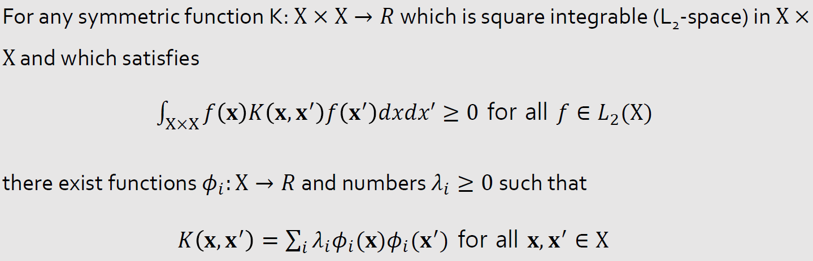
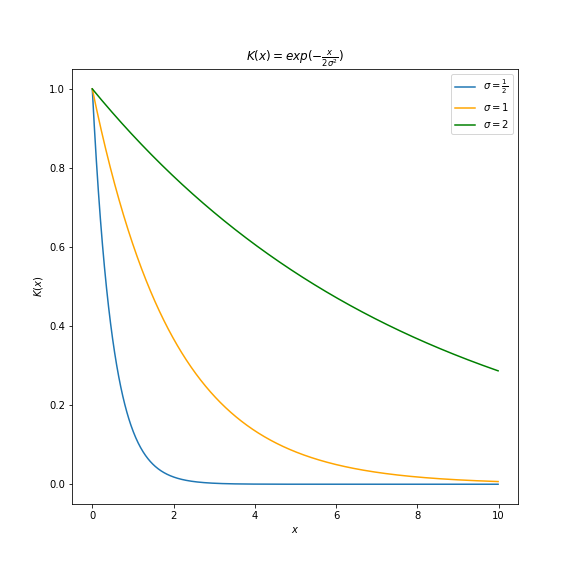
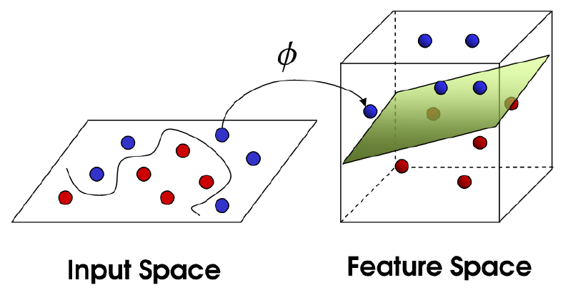

Gaussian Kernel(RBF) 기본 개념에 대하여

# Gaussian Kernel ?

Gaussian Kernel, 혹은 RBF(Radial Basis Function)라고도 불리우는 이 기법은 커널 함수(Kernel Function) 중 저차원에서 고차원으로 매핑시키는 기법(mapping function) 중 하나입니다. 특히, Gaussian Kernel은 데이터 사이의 거리를 무한차원 벡터공간에서 측정합니다.

# What is Kernel ?

먼저, 저차원에서 고차원으로 mapping하기 위해서는 사용되는 function은 매핑 이후 고차원에서 데이터의 위치를 확인하는 것이 목적이 아닙니다. 결과적으로 확인하고 싶은 값은 고차원으로 매핑된 이후 두 데이터의 내적값(inner product)입니다. 내적값은 스칼라값으로 반환되고 이를 통해 고차원에 매핑된 두 벡터 사이의 거리를 측정할수 있습니다.

그러나 고차원 매핑 이후 내적(inner product)를 계산하여 두 벡터 간의 거리를 측정하는 방법은 계산량이 매우 높아 비효율적입니다. 

이러한 문제를 해결하기 위해 Kernel Trick이 이용됩니다. Kernel Trick은 고차원 매핑과 내적 계산을 한번에 수행합니다. 그리고 이러한 동시 연산을 가능하게 하는 것이 Kernel입니다.

저차원(m)에서 고차원(n)으로 매핑시켜주는 함수를 다음과 같이 정의합니다.

$$
\phi(x) = Ax \\
A : n * m (n>m)\\
x : m * 1
$$

위 함수는  m차원 벡터를 n차원으로 매핑시켜줍니다. 이 때, Φ는 선형변환(Linear Transformation)이고, 행렬 𝐴(n x m)는 선형변환에 사용되는 표준행렬입니다.

위에서 말했듯이, 이러한 매핑이후 우리가 계산하고 하는 것은 두 벡터의 변환 이후 내적값입니다. 아래와 같은 수식으로 𝐾(Kernel)을 정의할 수 있습니다.

$$
K(x_{i}, x_{j}) = \phi(x_{i})^T \phi(x_{j})
							  =  (Ax_{i})^T (Ax_{j})
							  = x_{i}^TA^TAx_{j}
$$

이 때, 위 식에서 사용되는 변수들의 차원은 아래와 같습니다.

$$
x_{i}^T : 1 * m \\
A^T : m * n\\
A : n * m \\
x_{j} : m * 1
$$

결과적으로 𝐾는 스칼라값을 반환하게 됨을 알 수 있습니다. 𝐾가 두 벡터간의 거리(유사도)를 측정한다는 점에서 아래 두 가지 조건을 만족해야합니다.

$$
i) K(x_{i}, x_{j}) = K(x_{j}, x_{i}) \\
ii) K(x_i, x_i) >= 0
$$

즉, 교환법칙이 성립해야하고 자기자신과의 거리를 계산했을 때에는 음수값이 나와서는 안된다는 조건입니다.

이러한 조건을 만족하기 위한 조건을 계산해보면, 𝐾를 이루는 행렬들이

​	𝐢) 대칭행렬(symetric matrix) 

​	𝐢𝐢) positive semi-definite matrix

를 동시에 만족해야합니다. 그리고 이와 관련된 조건은 **Mercer's Theorem**으로 확인할 수 있습니다.

이러한 조건을 만족하는 커널에는 *Linear, polynomial, sigmoid* 그리고 지금 우리가 살펴보고 있는 ***gaussian***이 있습니다.

## Gaussian Kernel - Infinite-dimensional vector

Gaussian Kernel의 가장 큰 특징은 무한차원으로 매핑시킨다는 점입니다. 아래 식을 통해 간단한 예를 확인할 수 있습니다. 계산 편의성을 위해 $$\sigma^2=\dfrac {1}{2}$$인 경우를 예시로 선택했습니다.

$$
K(x_{i}, x_{j}) = exp(-\dfrac {||x_i - x_j||^2}{2\sigma^2})\\
K(x_{i}, x_{j}) = exp(-{||x_i - x_j||^2}) \text{ (when } \sigma^2=\dfrac {1}{2} \text{)}\\
=exp(-x_i^2)exp(-x_j^2)exp(2x_ix_j)\\
\text {By Taylor's theorem,  } exp(2x_ix_j) = \Sigma_{k=0}^{\infty}(\dfrac {2^kx_i^kx_j^k}{k!})
$$

## Gaussian Kernel - Purpose of 𝛔

𝛔는 무한차원으로 확장된 벡터 사이의 거리 계산 시 얼마나 민감하게 반응하는지 결정하는 매개변수입니다.

위 그림처럼, $$K(x)$$ 즉 Gaussian Kernel의 계산 결과는 𝛔가 클수록 벡터 간 거리 $$x$$의 차이에 둔감해집니다. 반대로 𝛔가 작아지면, 벡터 간 거리 $$x$$에 민감하게 반응합니다.

# How to Use ?

Kernel SVM, Kernel Regression에서 사용됩니다. 각각 예를 살펴보겠습니다.

## Kernel SVM

SVM Classification은 비선형 분류를 만들 수 없다는 한계를 가지고 있습니다. 이를 극복하기 위해 저차원 공간의 데이터를 고차원 공간으로 매핑시켜 초평면을 찾아 SVM의 한계를 극복하고자 합니다.

## Kernel Regression 

[업데이트 예정]

[참고]

[Kernel-SVM](https://ratsgo.github.io/machine%20learning/2017/05/30/SVM3/)

[h2.3.7 커널 서포트 벡터 머신](https://tensorflow.blog/%ED%8C%8C%EC%9D%B4%EC%8D%AC-%EB%A8%B8%EC%8B%A0%EB%9F%AC%EB%8B%9D/2-3-7-%EC%BB%A4%EB%84%90-%EC%84%9C%ED%8F%AC%ED%8A%B8-%EB%B2%A1%ED%84%B0-%EB%A8%B8%EC%8B%A0/)