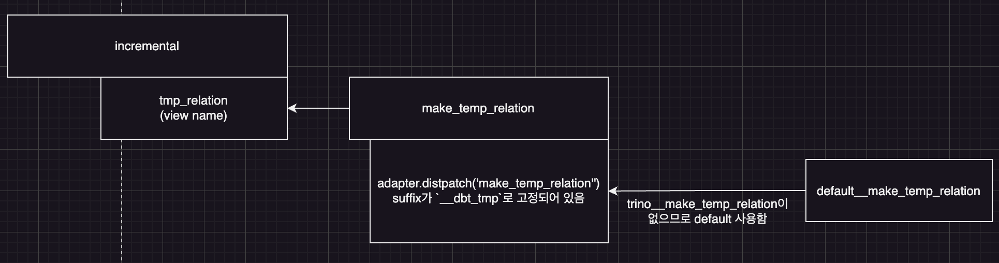

dbt trino에서 파티션이 있는 모델을 병렬 실행하기 위한 매크로 수정 방법


### dbt-trino

dbt-trino를 이용하면, dbt를 통해 trino 쿼리를 실행할 수 있습니다.

### 파티션 단위 모델링

일반적으로 dbt-trino를 사용할 때, 모델 작성을 파티션 단위로 하게 됩니다. 예를 들면 아래와 같습니다. 

```sql

-- models/model_A
SELECT column_a
    , column_b
    , column_c
    , date '{{ var("date") }}' AS partition_date
FROM {{ ref("model_B" )}}
WHERE partition_date = date '{{ var("date") }}'

```

위 model_A는 model_B로부터 특정 파티션(logical_date)만을 참조하여 model_A에 적재합니다. 
1개 파티션만을 참조하고, 1개 파티션에만 적재합니다.


### 동시 실행 불가능

dbt-trino에서는 위와 같이 파티션 단위의 모델을 작성한 경우 여러 개의 파티션에 대해서 동시에 모델 적재(dbt run/build)를 실행할 수 없습니다. 
이는 dbt-trino가 view를 이용하여 insert를 실행하기 때문입니다. 

```sql
-- dbt를 실행하면, dbt-trino는 먼저 적재하려는 데이터에 대응하는 view를 생성한다
create or replace view
    "hive"."default"."model_A_dbt_tmp"
  security definer
  as
SELECT column_a
    , column_b
    , column_c
    , date '2024-06-01' AS partition_date
FROM "hive"."default"."model_B"
WHERE partition_date = date '2024-06-01'
;

-- 위에서 생성된 view를 적재 대상 테이블에 insert한다
insert into "hive"."default"."model_A" ("column_a", "column_b", "column_c", "partition_date")
    (
        select "column_a", "column_b", "column_c", "partition_date"
        from "hive"."default"."model_A_dbt_tmp"
    )
```

dbt-trino는 적재 대상 테이블(`model_A`)에 적재하기 위한 데이터를 view(`model_A_dbt_tmp`)로 먼저 생성하고, 
해당 view를 테이블에 insert into로 적재합니다.

이 과정에서 중간에 사용되는 view의 이름이 `{table_name}_dbt_tmp`로 고정되어있습니다. 이 부분이 문제가 됩니다. 

만약 아래처럼 3개 모델을 동시에 실행한다고 가정해보겠습니다. 

```
dbt run -m model_A --vars "{'date': '2024-06-01'}"
dbt run -m model_A --vars "{'date': '2024-06-02'}"
dbt run -m model_A --vars "{'date': '2024-06-03'}"

# 3개의 커맨드가 모두 동일한 view_name을 사용함 ("hive"."default"."model_A__dbt_tmp")
```

동시에 위 3개 명령을 실행하게 되면, `model_A_dbt_tmp` view는 `create or replace`에 의해 마지막 실행에 해당하는 데이터(`2024-06-03`)만 담고 있게 됩니다.   
따라서 `insert into`가 실행되어도, `2024-06-01, 2024-06-02`에 해당하는 데이터에 대응하는 view가 없기 때문에 해당 파티션은 적재할 수 없습니다. 


### 해결책: temp view 이름을 변경하자
중간에 생성하는 temp view를 파티션 의존적으로 변경하면 이를 해결할 수 있습니다. 

dbt-core v1.7.5 기준으로, temp view 이름을 생성하는 부분은 아래와 같습니다.([incremental(dbt-core)](https://github.com/dbt-labs/dbt-core/blob/v1.7.5/core/dbt/include/global_project/macros/materializations/models/incremental/incremental.sql#L2))

```jinja
macros/materializations/incremental.sql



  -- relations
  
  
  
  
  
  

```

dbt-trino v1.7.0에서는 아래와 같은 매크로로 오버라이딩되어있습니다.([incremental(dbt-trino)](https://github.com/starburstdata/dbt-trino/blob/v1.7.1/dbt/include/trino/macros/materializations/incremental.sql#L21))

```jinja


  {#-- Set vars --#}
  
  
  
  

  {#-- The temp relation will be a view (faster) or temp table, depending on upsert/merge strategy --#}
  
  
  
  

```

`tmp_relation`이 view name으로 사용되는데, `make_temp_relation`은 아래와 같습니다.([make_temp_relation](https://github.com/dbt-labs/dbt-core/blob/5f5ddd27ac9864b820d985ea7553d26db8f52fd4/core/dbt/include/global_project/macros/adapters/relation.sql#L9))

```jinja
-- dbt-core


  {{ return(adapter.dispatch('make_temp_relation', 'dbt')(base_relation, suffix)) }}



```

`adapter`라는 처음보는 객체가 등장했습니다. [adapter에 대한 설명](https://docs.getdbt.com/reference/dbt-jinja-functions/adapter)을 읽어보면, 
adapter는 dbt가 접근하는 데이터베이스에 따라 동작을 다르게 하기 위해 만들어진 인터페이스입니다. 
여기서 `adapter.disaptch`는 입력받은 macro_name(`make_temp_relation`)을 실행할 때, 현재 dbt가 접근 중인 데이터베이스에 해당하는 매크로를 반환해줍니다.
trino용 매크로는 `trino__make_temp_relation`으로 작성되어 있어야하고, 만약 작성된 매크로가 없다면 `default__make_temp_relation`를 반환합니다.

trino__make_temp_relation는 존재하지 않으므로, default__make_temp_relation를 사용합니다.([default__make_temp_relation](https://github.com/dbt-labs/dbt-core/blob/v1.7.5/core/dbt/include/global_project/macros/adapters/relation.sql#L13))

```jinja


    
    

    {{ return(temp_relation) }}


```

결론적으로, 적재를 위해 생성되는 view name을 결정하는 부분은 make_temp_relation의 suffix입니다. 
suffix가 기본값이 `__dbt_tmp`이기 때문에 항상 같은 view name을 생성합니다. 
그렇다면 `make_temp_realtion`를 오버라이딩해보겠습니다. dispatch에 의해 default 매크로를 호출할 때 사용하는 suffix를 수정합니다.

```jinja


     {# date에서 -를 제거함 #}
     {# 기존 suffix에 ymd를 붙임 #}
  {{ return(adapter.dispatch('make_temp_relation', 'dbt')(base_relation, suffix)) }}


```

`make_temp_relation`에서 suffix로 전달되는 값을 변경했습니다. 기존에는 `__dbt_tmp`로 고정되어있었으나, 위 매크로에서는 dbt 실행 시마다 입력되는 `var('date')`에 따라 suffix 값이 변경됩니다.

따라서 입력받은 vars 값에 따라 각기 다른 temp view를 생성하게 됩니다.

```
dbt run -m model_A --vars "{'date': '2024-06-01'}"
# view_name: "hive"."default"."model_A__dbt_tmp_20240601"
---
dbt run -m model_A --vars "{'date': '2024-06-02'}"
# view_name: "hive"."default"."model_A__dbt_tmp_20240602"
---
dbt run -m model_A --vars "{'date': '2024-06-03'}"
# view_name: "hive"."default"."model_A__dbt_tmp_20240603"
```

1개 모델 테이블에 대해서 여러개의 dbt run을 실행해도 각각 서로 다른 view를 생성하므로 병렬 실행이 가능해집니다.

위에서 정리한 macro들간의 관계를 정리하면 아래 그림과 같습니다.



[참고]
