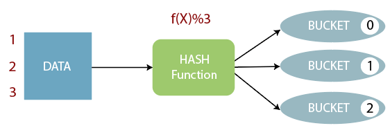
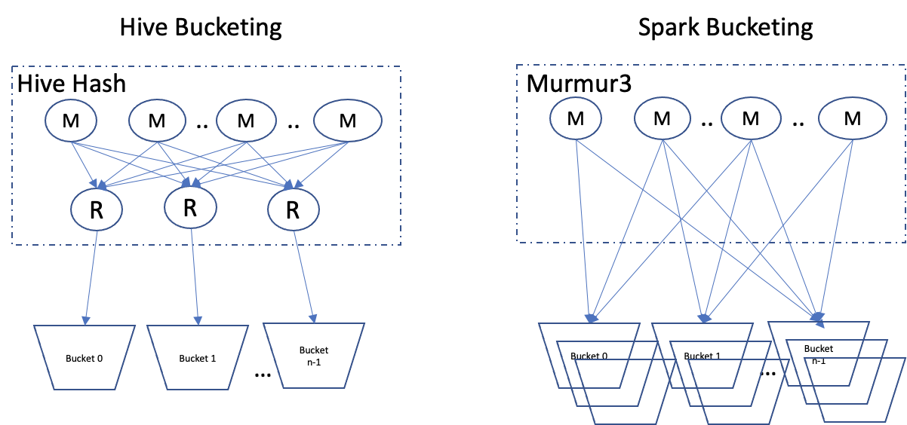

# Bucketting

Bucket은 쿼리 성능 향상을 위해 사용됩니다. 특히 Join에서 사용되는 key column을 기준으로 bucketting 할 경우 큰 성능 향상을 얻을 수 있습니다.

Bucket의 기본 아이디어는 지정된 칼럼을 기준으로 hash function을 통해 만들어진 값에 해당하는 bucket file에 데이터를 저장하는 것입니다.




# Bucket in Hive

HiveQL로 Partition, Bucket이 선언된 테이블을 선언하는 쿼리는 아래와 같습니다.

```sql
CREATE EXTERNAL TABLE bucketed_tbl -- EXTERNAL TABLE로 생성
(name string, birthday timestamp) -- COLUMN을 선언, PARTITION으로 사용되는 COLUMN은 제외함
PARTITIONED BY (p_date string) -- PARTITION 기준 선언
CLUSTERED BY (name) -- HASH FUNCTION에 사용할 기준 선언
	SORTED BY (birthday) -- BUCKET 내에서 정렬 기준 선언
	INTO 32 BUEKCTS -- BUCKET FILE 개수 선언
STORED AS 'parquet'
LOCATION '/user/hive/warehouse/default.db/bucketed_tbl' -- EXTERNAL TABLE의 저장 위치
;
```

해당 테이블에 INSERT는 아래와 같은 쿼리로 실행합니다(STATIC PARTITION).

```sql
INSERT INTO TABLE buckted_tbl PARTITION (p_date='20211010')
SELECT 
	name, birthday
FROM 20211010_source
```

INSERT 이후 LOCATION에는 아래처럼 파일이 저장됩니다.

```sh
hdfs dfs -ls /user/hive/warehouse/default.db/bucketed_tbl
/user/hive/warehouse/default.db/bucketed_tbl/p_date=20211010/000000_0
/user/hive/warehouse/default.db/bucketed_tbl/p_date=20211010/000000_1
/user/hive/warehouse/default.db/bucketed_tbl/p_date=20211010/000000_2
...
/user/hive/warehouse/default.db/bucketed_tbl/p_date=20211010/000000_31
```

`p_date=20211010` partition을 한번 더 INSERT하면, `_copy1`이 붙은 bucket file들이 저장됩니다.

```sh
hdfs dfs -ls /user/hive/warehouse/default.db/bucketed_tbl
/user/hive/warehouse/default.db/bucketed_tbl/p_date=20211010/000000_0
/user/hive/warehouse/default.db/bucketed_tbl/p_date=20211010/000000_0_copy_1
/user/hive/warehouse/default.db/bucketed_tbl/p_date=20211010/000000_1
/user/hive/warehouse/default.db/bucketed_tbl/p_date=20211010/000000_1_copy_1
...
/user/hive/warehouse/default.db/bucketed_tbl/p_date=20211010/000000_31
/user/hive/warehouse/default.db/bucketed_tbl/p_date=20211010/000000_31_copy_1
```


# Bucket in Spark(pyspark)

Spark에서도 partition, bucket 기능을 제공합니다. 위 쿼리는 아래와 같은 의미를 지닙니다.

```python
source = spark.sql("SELECT * FROM 20211010_soucre")
source.write\
		  .format('parquet')\
		  .partitionBy('p_date')\
		  .bucketBy(32, 'name')\
		  .sortBy('birthday')\
		  .mode('append')\
		  .option('path', '/user/hive/warehouse/default.db/buckted_tbl')\
		  .saveAsTable('default.bucketed_tbl')
```

32개의 bucket 파일이 생성될 것 같지만, 이렇게 저장한 경우에 매우 많은 parquet file이 생성된다는 겁니다.

```shell
# Bucket in Hive에서 저장된 파일들은 모두 삭제했다고 가정하고 조회
hdfs dfs -ls /user/hive/warehouse/default.db/bucketed_tbl
/user/hive/warehouse/default.db/bucketed_tbl/p_date=20211010/part-000000-xxxx-xxxx.parquet
/user/hive/warehouse/default.db/bucketed_tbl/p_date=20211010/part-000001-xxxx-xxxx.parquet
...
/user/hive/warehouse/default.db/bucketed_tbl/p_date=20211010/part-012415-xxxx-xxxx.parquet
# 12416개의 bucket file
```

왜 이렇게 많은 bucket들이 생성되는 것일까요? 

이는 spark에서 bucketting을 할 경우 각 MAP 별로 bucekt file을 만들기 때문입니다.



위 그림처럼, Hive에서는 Reducer 하나가 하나의 bucket을 만드는데 비해, Spark에서는 각 task가 자신의 bucket을 만들고 이를 hdfs 상에 저장합니다.

계산해보면 $$32 * 388 = 12416$$입니다. 즉, 388개의 task가 각각 bucket file을 생성하였기 때문에 위와 같이 12416개의 bucket file이 저장된 것입니다. 따라서 Spark를 통해 bucketting을 할 때는 이러한 부분에 주의해야합니다.


#  Hive Bucket vs. Spark Bucket

더 큰 문제는 Hive Bucket과 Spark Bucket이 양립할 수 없다는 것입니다.

## Spark를 통해 Bucketting된 테이블은 Hive에서 조회 불가능하다

```python
source = spark.sql("SELECT * FROM 20211010_soucre")
source.write\
		  .format('parquet')\
		  .partitionBy('p_date')\
		  .bucketBy(32, 'name')\
		  .sortBy('birthday')\
		  .mode('append')\
		  .option('path', '/user/hive/warehouse/default.db/buckted_tbl')\
		  .saveAsTable('default.bucketed_tbl')
```

pyspark로 위와 같이 적재에 성공하더라도, 테이블을 조회하는 쿼리를 실행할 경우 에러를 발생시킵니다.

```shell
hive -e "SELECT * FROM default.bucketed_tbl"
# Error
```


## HiveQL로 생성된 Bucketed Table에는 Spark를 통해 INSERT할 수 없다

1. 먼저 Bucketed Table을 생성하는 아래 쿼리를 실행합니다.

   

   ```sql
   CREATE EXTERNAL TABLE bucketed_tbl -- EXTERNAL TABLE로 생성
   (name string, birthday timestamp) -- COLUMN을 선언, PARTITION으로 사용되는 COLUMN은 제외함
   PARTITIONED BY (p_date string) -- PARTITION 기준 선언
   CLUSTERED BY (name) -- HASH FUNCTION에 사용할 기준 선언
   	SORTED BY (birthday) -- BUCKET 내에서 정렬 기준 선언
   	INTO 32 BUEKCTS -- BUCKET FILE 개수 선언
   STORED AS 'parquet'
   LOCATION '/user/hive/warehouse/default.db/bucketed_tbl' -- EXTERNAL TABLE의 저장 위치
   ;
   ```

2. pyspark를 이용하여 Bucketed Table에 데이터를 적재합니다.

   ```python
   source = spark.sql("SELECT * FROM 20211010_soucre")
   source.write\
   		  .format('parquet')\
   		  .partitionBy('p_date')\
   		  .bucketBy(32, 'name')\
   		  .sortBy('birthday')\
   		  .mode('append')\
   		  .option('path', '/user/hive/warehouse/default.db/buckted_tbl')\
   		  .saveAsTable('default.bucketed_tbl')
   ```

   아래와 같은 에러 메시지를 확인할 수 있습니다.

   ```
   The format of the existing table default.bucketed_tbl is 'HiveFormat'.
   It doesn't match the specified format 'ParquetFileFormat'.
   ```

   HiveQL로 생성한 Buckted Table은 HiveFormat으로 저장되어 있어 ParquetFileFormat은 사용할 수 없다고 합닌다.

3. 이번에는 HiveFormat으로 적재해보았습니다.

   ```python
   source = spark.sql("SELECT * FROM 20211010_soucre")
   source.write\
   		  .format('hive')\
   		  .partitionBy('p_date')\
   		  .bucketBy(32, 'name')\
   		  .sortBy('birthday')\
   		  .mode('append')\
   		  .option('path', '/user/hive/warehouse/default.db/buckted_tbl')\
   		  .saveAsTable('default.bucketed_tbl')
   ```

   이번에는 다른 에러 메시지가 확인됩니다.

   ```
   Creating buckted Hive Serde table is not supported yet.
   ```

   Spark가 아직 Bucketed Hive Serde를 생성하는 기능을 지원하지 않고 있다는 내용입니다. 제가 테스트에 사용했던 spark 버전은 2.3입니다.

   현재는 3.0 이상의 버전이 릴리즈된 것으로 알고 있는데 현재 이 기능이 구현되었는지는 확인해보아야할 것 같습니다.

[참고]

[https://medium.com/analytics-vidhya/spark-bucketing-is-not-as-simple-as-it-looks-c74f105f4af0](https://medium.com/analytics-vidhya/spark-bucketing-is-not-as-simple-as-it-looks-c74f105f4af0)