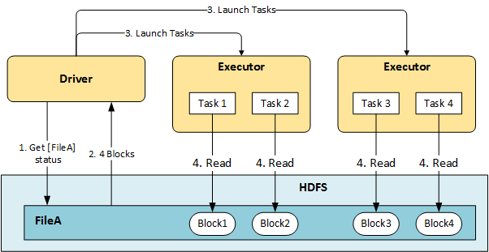

Hive에서 작은 용량의 파일들을 하나의 파일로 합치기

# Blocks in HDFS

데이터는 HDFS 상에서 Block이라는 단위로 저장됩니다. 일반적으로 하나의 Block에 128MB를 저장합니다. 따라서 Block Size, 128MB를 넘는 데이터는 여러 개의 Block으로 쪼개서 저장하게 됩니다. 아래는 518MB 파일이 Block으로 쪼개져서 저장되는 예시입니다.

각  Block은 안정성을 위해 서로 다른 노드에 Block replication을 저장하고, Name Node에는 해당 File의 block location과 같은 meta data를 저장합니다. 이를 통해 한 Data Node가 작동하지 않더라도, 원본 데이터를 복구할 수 있습니다. 포스팅에서 다루고자하는 내용은 아니니 간단히 이미지로 대체하고 넘어가겠습니다. 

# Read File = Read Blocks = HDFS I/O

HDFS에서 하나의 File을 읽을 때, 해당 File에 해당하는 Block들을 읽어들여옵니다. 

아래 그림처럼 File A를 읽고자 한다면, File A가 쪼개어 저장되어있는 Block1, Block2, Block3, Block4를 읽어들여오는 작업을 수행합니다.

만약 File A에 해당하는 Block이 많다면 더 많은 Block을 읽어와야하고 이는 더 많은 HDFS I/O가 발생함을 의미합니다.

# Bad Case : File Size is Less than Block Size

HDFS에 저장하고자 하는 File이 Block Size(128MB)보다 작으면 이러한 HDFS I/O는 더 많이 발생하게됩니다. 

예를 들어, 우리는 500MB 짜리 데이터를 저장한다고 가정해봅시다. 

해당 파일은 500MB 짜리 파일 **하나**로 저장할 수도 있고, 50MB짜리 파일 **10개**로 저장할 수도 있습니다. 어떻게 저장하는 것이 더 효율적일까요?

각 Block들이 모두 다른 DataNode에 저장되었다고 가정하고 비교해보겠습니다.

## Case1 : only 1 File, Size is 500MB 

500MB 짜리 파일 하나로 HDFS에 저장할 경우, File A는 위 그림처럼 4개의 block으로 쪼개집니다. 또한, NameNode는 File A의 메타 데이터를 하나 저장합니다. 이때 HDFS I/O는 4번 발생합니다.

## Case2 : 10 Files, each Size is 50MB

  

File A를 Block Size인 128MB보다 작은 50MB 파일 10개로 쪼개서 저장할 경우, 위 그림처럼 각 10개 File은 각각 50MB 크기의 Block에 저장됩니다. 따라서, HDFS I/O 는 10번 발생하게됩니다. 또한, NameNode는 File A-1부터 File A-10까지 10개 파일에 대한 메타 데이터를 저장하게 됩니다.

위 그림을 간단하게 비교해보면 아래와 같습니다.

|       | # HDFS I/O | # MetaData in NameNode |
| ----- | ---------- | ---------------------- |
| Case1 | 4          | 1                      |
| Case2 | 10         | 10                     |

실제 경우에는, Case1의 경우 Block1과 Block2~Block4가 같은 DataNode에 저장되어 HDFS I/O가 더 낮아질 수 있습니다. 그런 효율성을 제외하더라도 HDFS I/O, meata data 저장의 측면에서 비교해 보았을 때 File을 Block Size보다 큰 용량으로 저장하는 Case1이 더 효율적인 것으로 보입니다.

반대로, 우리는 Block Size보다 작은 파일이 저장되는 것을 지양해야함을 알 수 있습니다.

# When is File size Less than Block size ?

[참고]

[https://faqreviews.net/question/what-is-hdfs-data-block/](https://faqreviews.net/question/what-is-hdfs-data-block/)

[https://www.hdfstutorial.com/hdfs-architecture/block-replication-in-hadoop/](https://www.hdfstutorial.com/hdfs-architecture/block-replication-in-hadoop/)

[https://forum.huawei.com/enterprise/en/fi-components-relationship-between-spark-and-hdfs/thread/606704-893](https://forum.huawei.com/enterprise/en/fi-components-relationship-between-spark-and-hdfs/thread/606704-893)