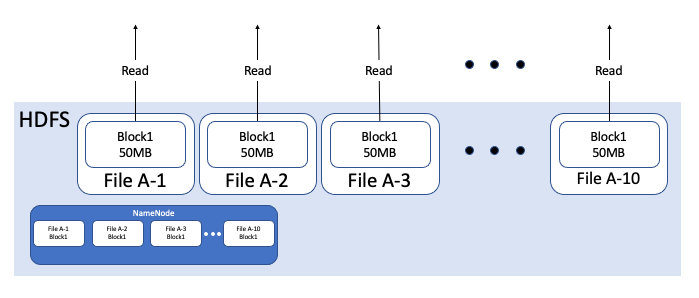

HDFS에서 작은 용량의 파일들을 하나의 파일로 합치기

# Blocks in HDFS

데이터는 HDFS 상에서 Block이라는 단위로 저장됩니다. 일반적으로 하나의 Block에 128MB를 저장합니다. 따라서 Block Size, 128MB를 넘는 데이터는 여러 개의 Block으로 쪼개서 저장하게 됩니다. 아래는 518MB 파일이 Block으로 쪼개져서 저장되는 예시입니다.


각  Block은 안정성을 위해 서로 다른 노드에 Block replication을 저장하고, Name Node에는 해당 File의 block location과 같은 meta data를 저장합니다. 이를 통해 한 Data Node가 작동하지 않더라도, 원본 데이터를 복구할 수 있습니다. 포스팅에서 다루고자하는 내용은 아니니 간단히 이미지로 대체하고 넘어가겠습니다. 


# Read File = Read Blocks = HDFS I/O

HDFS에서 하나의 File을 읽을 때, 해당 File에 해당하는 Block들을 읽어들여옵니다. 

아래 그림처럼 File A를 읽고자 한다면, File A가 쪼개어 저장되어있는 Block1, Block2, Block3, Block4를 읽어들여오는 작업을 수행합니다.


만약 File A에 해당하는 Block이 많다면 더 많은 Block을 읽어와야하고 이는 더 많은 HDFS I/O가 발생함을 의미합니다.

# Bad Case : File Size is Less than Block Size

HDFS에 저장하고자 하는 File이 Block Size(128MB)보다 작으면 이러한 HDFS I/O는 더 많이 발생하게됩니다. 

예를 들어, 우리는 500MB 짜리 데이터를 저장한다고 가정해봅시다. 

해당 파일은 500MB 짜리 파일 **하나**로 저장할 수도 있고, 50MB짜리 파일 **10개**로 저장할 수도 있습니다. 어떻게 저장하는 것이 더 효율적일까요?

비교 편의를 위해 각 Block들이 모두 다른 DataNode에 저장되었다고 가정하고 비교해보겠습니다.

## Case1 : only 1 File, Size is 500MB 

500MB 짜리 파일 하나로 HDFS에 저장할 경우, File A는 위 그림처럼 4개의 block으로 쪼개집니다. 또한, NameNode는 File A의 메타 데이터를 하나 저장합니다. 이때 HDFS I/O는 4번 발생합니다.

## Case2 : 10 Files, each Size is 50MB



File A를 Block Size인 128MB보다 작은 50MB 파일 10개로 쪼개서 저장할 경우, 위 그림처럼 각 10개 File은 각각 50MB 크기의 Block에 저장됩니다. 따라서, HDFS I/O 는 10번 발생하게됩니다. 또한, NameNode는 File A-1부터 File A-10까지 10개 파일에 대한 메타 데이터를 저장하게 됩니다.


위 그림을 간단하게 비교해보면 아래와 같습니다.

|       | # HDFS I/O(Data Node) | # MetaData in NameNode |
| ----- | --------------------- | ---------------------- |
| Case1 | 4                     | 1                      |
| Case2 | 10                    | 10                     |

비교를 위해 모든 Block이 다른  Data Node에 저장되어 있다고 가정했지만, 실제 상황에서는 하나의 Data Node에 여러 Block이 저장될 수 있기 때문에  HDFS I/O는 위 수치보다 낮을 것입니다. 즉, 위 상황처럼 모든 Block이 각기 다른 Data Node에 저장된 상황은 최악의 경우라고 생각하시면 됩니다. 그러나 이러한 가정을 제거하더라도 Block Access는 Case1과 Case2가 각각 4,10으로 변함 없을 것입니다. 따라서 우리는 Block Size보다 작은 파일이 저장되는 것을 지양해야함을 알 수 있습니다.

# When is File size Less than Block size ?

그러면 File Size가 128MB보다 작게 저장되는 경우(small file issue)는 왜 그리고 언제 발생하는 것일까요? 이는 Tez, Yarn 스케쥴러의 동작 원리와 관련 있습니다.

```sql
-- HiveQL 예시 
SELECT a.vendor,
       COUNT(*),
       AVG(c.cost) 
FROM a JOIN b 
ON (a.id = b.id) 
	     JOIN c 
ON (a.itemid = c.itemid) 
GROUP BY a.vendor
;
-- 위 쿼리는 아래 Tez DAG에 따라 수행됩니다
```


Tez engine은 Map-Reduce 이후 작업을 HDFS에 저장하지 않고(HDFS I/O를 발생시키지 않고), in-memory 상에서 다음 작업을 진행한다는 점입니다. 이를 위해 DAG를 미리 생성하는 등의 선행 작업을 실행합니다. 위 그림은 Tez가 이러한 작업을 위해 DAG를 생성하고, HDFS IO없이 Reducer를 통해 쿼리를 실행하는 과정을 설명해줍니다. 

위 도식 대로 INSERT 쿼리가 수행된다면, small file은 등장하지 않아야 하는 것 아닐까요? 

하지만, INSERT는 Mapper만 동작하는 작업입니다(mapper-only).

```sql
INSERT INTO outputtable -- 아래 쿼리 실행 결과에 대해서 Mapper만 동작하여 file write
SELECT a.vendor,
       COUNT(*),
       AVG(c.cost) 
FROM a JOIN b 
ON (a.id = b.id) 
	     JOIN c 
ON (a.itemid = c.itemid) 
GROUP BY a.vendor
;
```

위 INSERT문은 Reducer를 거치지 않기 때문에 읽어들여온 파일 개수만큼 디렉토리에 그대로 저장하게 되고, 이는 file number가 급격하게 늘어나는 결과를 초래하게 됩니다. 

Spark는 file write 작업을 partition 단위로 수행하게 됩니다. 따라서, Spark를 저장된 ouput file 개수는 기본적으로 다른 옵션(아래서 다루게 될 `repartition, coalesce`)을 지정하지 않는다면 partition 개수를 결정하는 `spark.default.parallelism` 에 의해 결정됩니다.

> [default] For distributed shuffle operations like `reduceByKey`and `join`, the largest number of partitions in a parent RDD. For operations like `parallelize`with no parent RDDs, it depends on the cluster manager:
>
> - Local mode: number of cores on the local machine
> - Mesos fine grained mode: 8
> - **Others: total number of cores on all executor nodes or 2, whichever is larger**
>
> [meaning] **Default number of partitions** in RDDs returned by transformations like `join`, `reduceByKey`, and `parallelize` when not set by user.


# How to Merge?

그렇다면 이처럼 비효율적으로 저장된 File을 하나의 Block으로 저장하는 방법을 알아보겠습니다.

##  HiveQL case

널리 알려져있고 간단한 방법은 `hive.merge` 조건을 설정하여 file write 단계에서 small file들을 병합시키도록 강제할 수 있습니다. 

```sql
-- hive.merge 옵션 부여
set hive.merge.mapfiles=true; -- Map 결과 파일에 대해 merge를 허용
set hive.merge.mapredfiles=true; -- MapReducer 결과 파일에 대해 merge를 허용
set hive.merge.size.per.task=128000000; -- 128MB의 file로  merge
set hive.merge.smallfiles.avgsize=128000000; -- 128MB 이하의 small file들을 merge 대상으로 지정
```

INSERT가 Mapper-Only Task라는 점에 착안한다면, Reducer 작업을 추가해줌으로써 small file 문제를 해결할 수도 있습니다.

```sql
INSERT INTO outputtable -- 아래 쿼리 실행 결과에 대해서 Mapper만 동작하여 file write
SELECT a.vendor,
       COUNT(*),
       AVG(c.cost) 
FROM a JOIN b 
ON (a.id = b.id) 
	     JOIN c 
ON (a.itemid = c.itemid) 
GROUP BY a.vendor
SORT BY a.vendor -- SORT BY가 추가됨으로써 해당 쿼리는 Reducer가 추가됩니다.
;
```

두 방법을 동시에 사용한다면 더 높은 효율을 보이게 됩니다. Reducer를 거친 결과를 merge하는 것이 file read만 수행한 mapper-only에 비해 merge해야할 파일 개수가 적기 때문입니다. (다른 말로 하면 이미 어느 정도 수준의 merge를 거쳤다는 의미입니다)

```sql
set hive.merge.mapfiles=true; -- Map 결과 파일에 대해 merge를 허용
set hive.merge.mapredfiles=true; -- MapReducer 결과 파일에 대해 merge를 허용
set hive.merge.size.per.task=128000000; -- 128MB의 file로  merge
set hive.merge.smallfiles.avgsize=128000000; -- 128MB 이하의 small file들을 merge 대상으로 지정

INSERT INTO outputtable -- 아래 쿼리 실행 결과에 대해서 Mapper만 동작하여 file write
SELECT a.vendor,
       COUNT(*),
       AVG(c.cost) 
FROM a JOIN b 
ON (a.id = b.id) 
       JOIN c 
ON (a.itemid = c.itemid) 
GROUP BY a.vendor
SORT BY a.vendor -- SORT BY가 추가됨으로써 해당 쿼리는 Reducer가 추가됩니다.
;
-- 1) SORT BY에 의해 먼저 Reducer 작업을 한번 수행한 다음
-- 2) hive.merge가 동작하게 됩니다
```


## Spark case

`repartition`, `coalesce`  를 통해 output file의 개수를 조정할 수 있습니다.

`repartition` 은 shuffle을 수행하여 RDD를 재조정해주는데 비해,  `coalesce` 는 shuffle을 수행하지 않고 지정된 개수의 `partition`으로 조정합니다.

그럼  `partition`이 무엇인지를 알아야 이 원리를 이해할 수 있을 것 같습니다.

`partition` 이란 spark 내에서 task가 처리하는 데이터의 단위를 의미합니다. `RDD`(혹은 이들로 이루어진 `DataFrame`)는 여러 개의 `partition`으로 이루어져있고, 하나의 task가 하나의 `partition`을 담당하여 작업을 수행합니다.

이러한 `partition`은 3개로 분류됩니다.

| partition         | configuration                     |
| ----------------- | --------------------------------- |
| Input Partition   | spark.sql.files.maxPartitionBytes |
| Output Partition  | repartition, coalesce             |
| Shuffle Partition | spark.sql.shuffle.partitions      |

이 중에 Output Partition을 조정하여, 파일 개수를 적절히 조절해줍니다.  `repartition` 은   RDD, DataSet, DataFrame과 같은 객체 내부의 partition에 저장될 데이터를 재조정해주는 역할을 합니다. 이때 **shuffle**을 통해, 해당 객체 내부의 데이터들을 재분배하게 됩니다. 이에 비해  `coalesce`는 현재  partition 개수보다 적게 만드는 것이 목적이므로, 재조정하지 않고(**shuffle 하지 않고**), partition에 존재하는 데이터를 단순히 다른 partition에 욱여 넣는 작업입니다.

따라서 Output Partition을 적절히 사용하여, output file size가 128MB 이하가 되지 않도록 조정하여 저장하면 됩니다. 아래 예시 코드를 남기며 글을 마치겠습니다.

```python
df = spark.sql("SELECT id, grade FROM student")

df.coalesce(1)\
.write.mode("append")\
.saveAsTable("test_table")
```


[참고]

[what is HDFS Data Block](https://faqreviews.net/question/what-is-hdfs-data-block/)

[Block Replication in Hadoop](https://www.hdfstutorial.com/hdfs-architecture/block-replication-in-hadoop/)

[Relationship between Spark and HDFS](https://forum.huawei.com/enterprise/en/fi-components-relationship-between-spark-and-hdfs/thread/606704-893)

[Spark Shuffle Partition과 최적화](https://tech.kakao.com/2021/10/08/spark-shuffle-partition/)

[Avoiding small files](https://docs.cloudera.com/best-practices/latest/impala-performance/topics/bp-impala-avoiding-small-files.html)

[[hive] 작은 사이즈의 파일 머지 설정과 그로 인한 오버헤드](https://118k.tistory.com/750)

[하둡과 응용 프레임워크 2) 하둡 실행 환경 (YARN, Tez, Spark)](https://3months.tistory.com/536)