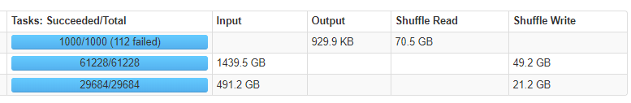
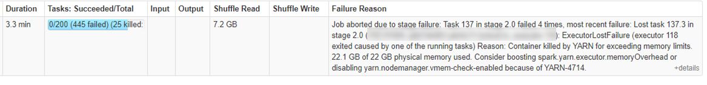
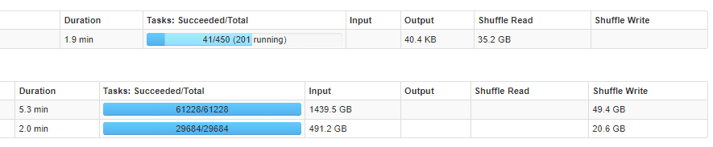
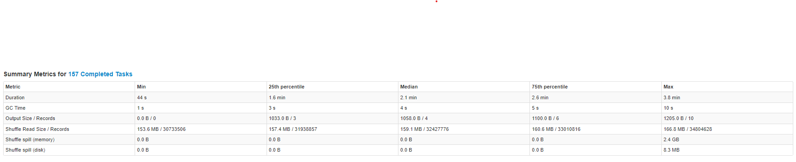
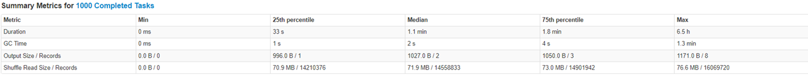

Partition, Spill in Spark 

## Spark Needs Performance Tuning

Spark로 작성된 Application은 실행을 넘어, 최적화가 필요합니다. 이는 Partition 단위로 작업을 실행하는 Spark 특성 때문입니다. 특히, Partition 간 shuffle이 발생하는 경우에 많은 자원과 시간을 소모하게 됩니다. 따라서, Spark Tuning(Optimization)이란 Shuffle 작업 속도를 빠르게 만드는 것과 다름 없습니다.

Shuffle 속도를 향상시키기 위해서는 partition 개수를 적절하게 조절해주어야합니다.

#### Input, Shuffle Read, Shuffle Write, Output

Spark Job은 여러 Stage로 나뉘게 되고, 각 Stage는 Input, Shuffle Read, Shuffle Write, Ouput로 구성됩니다. 모든 Stage는 partition을 처리하는 과정이며, 아래와 같이 설명됩니다.

> Shuffling means the reallocation of data between multiple Spark stages. "Shuffle Write" is the sum of all written serialized data on all executors before transmitting (normally at the end of a stage) and "Shuffle Read" means the sum of read serialized data on all executors at the beginning of a stage. ([What is shuffle read & shuffle write in Apache Spark](https://stackoverflow.com/questions/27276884/what-is-shuffle-read-shuffle-write-in-apache-spark))

| Stage         | 설명                                                         | 구분            |
| ------------- | ------------------------------------------------------------ | --------------- |
| Input         | Task 수행을 위해 외부 데이터를 SparkSession, SparkContext로 로드함 | Partition Read  |
| Shuffle Read  | Task 수행을 위해 SparkSession, SparkContext 내부(executors)의 Serialized Data를 읽어들임 | Partition Read  |
| Shuffle Write | Task 수행 결과를 SparkSession, SparkContext 내부(executors)의 Serialzied Data로 내보냄 | Partition Write |
| Output        | Task 수행 결과를 SparkSession, SparkContext 외부에 작성함    | Partition Write |

하나의 Stage는 Partiton Read와 Partition Write로 이루어져있습니다. Partition을 읽고, 읽어들여온 Partition에 대해 Task를 수행하고(Shuffle) 그 결과를 다시 Partition으로 작성합니다.

```python
df1=spark.sql("SELECT * FROM default.table_1")
df2=spark.sql("SELECT * FROM default.table_2")

joined = df1.alias("df1").join(df2, on=[df1.col1==df2.col1, df1.col2==df2.col2])
joined = joined.select("df1.col1", "df1.col2", "df1.col3")
joined_agg = joined.groupBy("col1", "col2").agg(F.count("col3").alias("cnt"))
schema, table = "default.joined".split(".")
joined_agg.write.mode('overwrite')\
    .option("path", f'/user/hive/warehouse/{schema}.db/{table}')\
    .saveAsTable(f"{schema}.{table}")
```


예를 들어 위 코드는 아래와 같은 stages를 구성하고, 실행됩니다. Input이 2번 있었고, Input하여 shuffle write된 DataFrame(`df1`, `df2`)에 대해 `join`과 `saveAsTable`이 실행되었습니다.




왼쪽의 **Task: Succeeded/Total**은 Stage 내에서 Task 수행 시 몇 개의 Task가 수행되었는지 표시합니다. 

`spark.sql`을 사용하여 `DataFrame` 객체를 만드는 경우에는 해당 테이블의 파일 개수만큼(61228, 29684) Task를 실행했습니다. 따라서 `df1`, `df2`의 파티션 개수도 각각 61228, 29684개 입니다.

맨 위에 **1000/1000 (112 failed)**는 1000개 작업 중에 중간에 112개 task를 실패했었음을 의미합니다. 1000개 task가 실행된 이유는 `spark.sql.shuffle.partitions`를 1000으로 설정했기 때문입니다. 

해당 값은 `spark.default.parallelism`, `spark.sql.shuffle.partitions`를 통해 변경할수 있습니다.

#### Spark Partition(spark.default.parallelism, spark.sql.shuffle.partitions)

> `spark.default.parallelism` – Default number of partitions in resilient distributed datasets (RDDs) returned by transformations like `join`, `reduceByKey`, and `parallelize` when no partition number is set by the user.
>
> `spark.sql.shuffle.partitions` – Sets the number of partitions for joins and aggregations.

Spark에서 사용하는 `RDD`, `DataFrame`, `Dataset`은 모두 Partition을 가장 작은 단위(객체)로 갖습니다. 이 Partition을 단위로 각 Executor의 Core는 작업(Task)를 적용합니다. 이중에 `RDD`는 `spark.default.parallelism`에 의해서 partition 값이 결정됩니다. `DataFrame`, `Dataset`의 경우에는 `spark.sql.shuffle.partitions`에 의해 partition 개수가 결정됩니다. 

```python
from pyspark.sql import SparkSession
from pyspark import SparkConf

conf = SparkConf().setAppName('spark_partition_test').setMaster("yarn")

## 5 cores per executor
conf.set("spark.executor.cores","5") 
conf.set("spark.driver.cores", "5")
## 30 executors
conf.set("spark.executor.instances", "30")
## 10 GB per executor -> 2GB per core
conf.set("spark.driver.memory","10G")
conf.set("spark.executor.memory","10G")
## SparkSession has 30 * 5 cores, which each core has 2GB mem.
## So, spark.default.parallelism is 150(# of cores), and spark.sql.shuffle.partitions is 200(default)
spark = SparkSession.builder.enableHiveSupport().config(conf=conf).getOrCreate()

df1=spark.sql("SELECT * FROM default.table_1")
df2=spark.sql("SELECT * FROM default.table_2")

joined = df1.alias("df1").join(df2, on=[df1.col1==df2.col1, df1.col2==df2.col2])
joined = joined.select("df1.col1", "df1.col2", "df1.col3")
joined_agg = joined.groupBy("col1", "col2").agg(F.count("col3").alias("cnt"))
schema, table = "default.joined".split(".")
joined_agg.write.mode('overwrite')\
    .option("path", f'/user/hive/warehouse/{schema}.db/{table}')\
    .saveAsTable(f"{schema}.{table}")
```

따로 `spark.default.parallelism`을 지정하지 않으면 core 개수만큼으로 partition 개수를 지정합니다. 따라서, 기본적으로 `RDD`는 150(5 cores * 30 executors)개의 partition으로 분할처리될 것입니다. core 개수와 partiton 개수가 같으므로 1 task per 1 core로 분산 처리하게 될 것입니다. 한편, `spark.sql.shuffle.partitions`는 기본값이 200이기 때문에 `DataFrame`, `Dataset`은 200개의 partition으로 분할처리 될 것입니다. 



그러나, 200 partitions로 설정하여 코드를 실행하는 경우 계속해서 fail task가 발생하고 결과적으로 App이 중간에 종료되어버렸습니다. Fail 발생을 줄이고 app이 성공적으로 실행을 완료하기 위해서는 튜닝이 필요합니다.

일반적으로 전체 core 개수의 2배~3배 정도까지 `spark.default.parallelism`을 설정해줄 것을 권장합니다. 따라서 위의 conf setting은 아래 항목을 추가해주어야합니다.

```python
...
## SparkSession has 30 * 5 cores, So proper number of partitions is 150 * 2 or 150 * 3.
conf.set("spark.sql.shuffle.partitions","450")
spark = SparkSession.builder.enableHiveSupport().config(conf=conf).getOrCreate()
...
```



450 tasks가 수행됩니다. 그러나 어젼히 Shuffle Spill이 발생하고 있습니다. 



## What makes Spark Slower?

가장 큰 이유는 **Shuffle Spill** 때문입니다. partition이 너무 커서 하나의 core(RAM)에 모두 담을 수 없는 경우에 Spill이 발생합니다. 이 때 발생한 Spill은 Disk에 저장되었다가, 연산 필요 시 다시 RAM으로 전달됩니다. 이러한 과정에서 직렬화(serialize)와 역직렬화(deserialize) 과정을 거치기 때문에 Spill이 발생한 Task(즉 partition)은 수행 시간이 늘어나고 Fail이 발생할 확률이 늘어납니다. 

> *Spill is the term used to refer to the act of moving an RDD from RAM to disk, and later back into RAM again.*

Shuffle Spill(Disk) 와  Shuffle Spill(Memory)가 있습니다.

> "Shuffle spill (memory) is the size of the deserialized form of the data in memory at the time when we spill it, whereas shuffle spill (disk) is the size of the serialized form of the data on disk after we spill it. This is why the latter tends to be much smaller than the former. Note that both metrics are aggregated over the entire duration of the task (i.e. within each task you can spill multiple times)."

RAM(=memory)에서 Spill이 발생하게 되면 이를 직렬화(serialize)하여 disk에 임시로 저장해둡니다. 직렬화하는 과정에서 데이터 사이즈는 줄어들게 되므로 일반적으로 Shuffle Spill(Disk)가 Shuffle Spill(Memory)보다 작은 값을 갖습니다.

이후에, Task에서 Disk로 Spill한 데이터를 연산에 사용하기 위해서는 역직렬화(deserialize)하여 RAM으로 로드합니다. 따라서 I/O의 증가, 직렬화/역직렬화 과정이 추가되면서 Task 수행 시간은 늘어나게 됩니다.


​							       컵이 물을 모두 담아내지 못하는 것처럼 memory가 partition을 담아내지 못하고 흘려버리는 것과 같습니다


#### How to remove Spill?

- Memory Size를 늘린다

Task 수행에 사용되는 Core에게 더 큰 RAM을 할당해주면, Shuffle Spill이 발생하지 않을 수 있습니다. 이는 물과 컵에 비유하자면 컵의 크기를 늘리는 방법입니다. 

```python
## 5 cores per executor
conf.set("spark.executor.cores","5") 
conf.set("spark.driver.cores", "5")
## 30 executors
conf.set("spark.executor.instances", "30")
## 15 GB per executor -> 3GB per core
conf.set("spark.driver.memory","15G")
conf.set("spark.executor.memory","15G")
## SparkSession has 30 * 5 cores, which each core has 2GB mem.
## So, spark.default.parallelism is 150(# of cores), and spark.sql.shuffle.partitions is 200(default)
spark = SparkSession.builder.enableHiveSupport().config(conf=conf).getOrCreate()
```

기존에 Core에 2GB를 할당했었지만, 3GB로 증가시켰습니다. 일반적으로 Shuffle Read가 600GB 이상인 경우에는 core size가 4GB 이상으로 설정할 것을 권장합니다.

Shuffle Read가 600GB가 넘지 않는 경우에는 core size를 늘리는 것보다 아래의 방법을 사용합니다.

- partition size를 줄인다 ( # partition을 늘린다 )

Core에게 전달되는 partition size를 줄여서 Shuffle Spill을 방지할 수 있습니다. 물을 조금씩(smaller partition size) 자주 컵에 담는다면 물이 넘치지않겠죠. Shuffle Read는 데이터가 변하지 않는다면 고정되어있으므로 partition size를 줄인다는 것은 partition 개수를 늘리는 것과 동일합니다. Shuffle Partition의 크기를 100MB~200MB로 설정하는 것이 최적으로 알려져있습니다.

`spark.default.paralleism`, `spark.sql.shuffle.partitions`와 같은 conf option이 사용될 수 있습니다. 혹은 `df.repartition()`처럼 명시적으로 partition 개수를 늘려주는 방법도 있습니다.

```python
...
conf.set("spark.sql.shuffle.partitions","1000")
spark = SparkSession.builder.enableHiveSupport().config(conf=conf).getOrCreate()
...
```

Shuffle Spill이 발생하지 않고 수행 시간도 줄어들었음을 확인할 수 있습니다.




## 마치며

애매하게 알고 있었던 partition, shuffle, spill의 개념을 정리할 수 있었습니다. 다만, 위에서 가정한 상황은 모든 partition에 데이터가 고루 분배되는 이상적인 상황입니다. 실제 상황에서는 skewed dataset 때문에 straggler task가 발생하기도 합니다. 이러한 경우에는 먼저 필터링하거나, partition 개수를 더욱 늘리는 방법(partition size가 100MB보다 작도록)으로 대처해야합니다.


[참고]

[Resilient Distributed Datasets: A Fault-Tolerant Abstraction for In-Memory Cluster Computing](http://people.csail.mit.edu/matei/papers/2012/nsdi_spark.pdf)

[Spark Shuffle Partition과 최적화](https://tech.kakao.com/2021/10/08/spark-shuffle-partition/)

[Spark Partitions](https://luminousmen.com/post/spark-partitions)

[[Apache Spark] Partition 개수와 크기 정하기](https://jaemunbro.medium.com/apache-spark-partition-%EA%B0%9C%EC%88%98%EC%99%80-%ED%81%AC%EA%B8%B0-%EC%A0%95%ED%95%98%EA%B8%B0-3a790bd4675d)

[Best practices for successfully managing memory for Apache Spark applications on Amazon EMR](https://aws.amazon.com/ko/blogs/big-data/best-practices-for-successfully-managing-memory-for-apache-spark-applications-on-amazon-emr/)

[Spark shuffle spill (Memory)](https://community.cloudera.com/t5/Support-Questions/Spark-shuffle-spill-Memory/td-p/186859)

[Spark Performance Optimization Series: #2. Spill](https://medium.com/road-to-data-engineering/spark-performance-optimization-series-2-spill-685126e9d21f)
