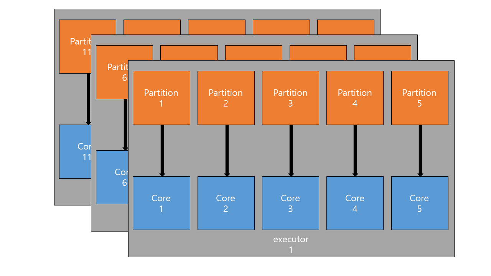

Partition, Spill in Spark 

## Spark Needs Performance Tuning

Spark로 작성된 Application은 실행을 넘어, 최적화가 필요합니다. 이는 Partition 단위로 작업을 실행하는 Spark 특성 때문입니다. 특히, Partition 간 shuffle이 발생하는 경우에 많은 자원과 시간을 소모하게 됩니다. 따라서, Spark Tuning(Optimization)이란 Shuffle 작업 속도를 빠르게 만드는 것과 다름 없습니다.

Shuffle 속도를 향상시키기 위해서는 partition 개수를 적절하게 조절해주어야합니다.

#### Spark Partition(spark.default.parallelism)

> `spark.default.parallelism` – Default number of partitions in resilient distributed datasets (RDDs) returned by transformations like `join`, `reduceByKey`, and `parallelize` when no partition number is set by the user.

Spark에서 사용하는 `RDD`, `DataFrame`, `Dataset`은 모두 Partition을 가장 작은 단위로 갖습니다. 이 Partition을 단위로 각 Executor의 Core는 작업(Task)를 적용합니다. 이중에 `RDD`는 `spark.default.parallelism`에 의해서 partition 값이 결정됩니다.

```python
from pyspark.sql import SparkSession
from pyspark import SparkConf

conf = SparkConf().setAppName('spark_partition_test').setMaster("yarn")

## 5 cores per executor
conf.set("spark.executor.cores","5") 
conf.set("spark.driver.cores", "5")
## 30 executors
conf.set("spark.executor.instances", "30")
## 10 GB per executor -> 2GB per core
conf.set("spark.driver.memory","10G")
conf.set("spark.executor.memory","10G")
## SparkSession has 30 * 5 cores, which each core has 2GB mem.
## So, spark.default.parallelism is 150(# of cores), and spark.sql.shuffle.partitions is 200(default)
spark = SparkSession.builder.enableHiveSupport().config(conf=conf).getOrCreate()
```

따로 `spark.default.parallelism`을 지정하지 않으면 core 개수만큼으로 partition 개수를 지정합니다. 따라서,  기본적으로 `RDD`는 150개의 partition으로 분할처리될 것입니다. 이는 core 개수와 같으므로 각 core가 task 1개를 처리하게 될 것입니다. 1개 executor가 5개 core를 가지고 있으므로 아래와 같은 매핑이 총 30개 발생할 것입니다(executor1 ~ executor30).



이 때, 1개 Core는 2GB나 되는 memory size를 할당받았고 Partition 1개에 대해서 1개 작업(Task)만 실행합니다. 만약 `RDD`가 300GB가 넘는 데이터이고, 각 partition에 균등하게 분할(distribution)되었다면 1개 Partition은 2GB 이상의 크기일 것입니다. 이 경우에 1개 Core가 처리할 수 있는 사이즈(2GB)를 초과하기 때문에 작업 수행 시간은 길어지게 됩니다. 

일반적으로 전체 core 개수의 2배~3배 정도까지 `spark.default.parallelism`을 설정해줄 것을 권장합니다. 따라서 위의 conf setting은 아래 항목을 추가해주어야합니다.

```python
...
## SparkSession has 30 * 5 cores, So proper number of partitions is 150 * 2 or 150 * 3.
conf.set("spark.defualt.parallelism","450")
spark = SparkSession.builder.enableHiveSupport().config(conf=conf).getOrCreate()
```

이처럼 `spark.default.parallelism`을 450으로 설정해도 Read Size가 900GB가 넘는다면(!!) partition은 여전히 2GB 이상이 분배됩니다. 따라서 **Cores 수 X 3**이라는 규칙은 참조만 하고, Read Size에 따라 유동적으로 해당 값을 결정해야합니다.

#### Spark Shuffle Partitions (spark.sql.shuffle.partitions)

`DataFrame`, `Dataset`의 경우에는 `spark.sql.shuffle.partitions`에 의해 partition 개수가 결정됩니다. 

> `spark.sql.shuffle.partitions` – Sets the number of partitions for joins and aggregations.

기본적인 개념은 위와 같고, `RDD`가 아닌 `DataFrame`, `Dataset`에 적용되는 옵션이라는 사실만 다릅니다.

## What makes Spark Slower?

가장 큰 이유는 **Shuffle Spill** 때문입니다. partition이 너무 커서 하나의 core(RAM)에 모두 담을 수 없는 경우에 Spill이 발생합니다. 이 때 발생한 Spill은 Disk에 저장되었다가, 연산 필요 시 다시 RAM으로 전달됩니다. 이러한 과정에서 직렬화(serialize)와 역직렬화(deserialize) 과정을 거치기 때문에 Spill이 발생한 Task(즉 partition)은 수행 시간이 늘어나고 Fail이 발생할 확률이 늘어납니다. 

> *Spill is the term used to refer to the act of moving an RDD from RAM to disk, and later back into RAM again.*

Shuffle Spill(Disk) 와  Shuffle Spill(Memory)가 있습니다.

> "Shuffle spill (memory) is the size of the deserialized form of the data in memory at the time when we spill it, whereas shuffle spill (disk) is the size of the serialized form of the data on disk after we spill it. This is why the latter tends to be much smaller than the former. Note that both metrics are aggregated over the entire duration of the task (i.e. within each task you can spill multiple times)."

RAM(=memory)에서 Spill이 발생하게 되면 이를 직렬화(serialize)하여 disk에 임시로 저장해둡니다. 직렬화하는 과정에서 메모리는 줄어들게 되므로 일반적으로 Shuffle Spill(Disk)가 Shuffle Spill(Memory)보다 작은 값을 갖습니다.

이후에, Task에서 Disk로 Spill한 데이터를 연산에 사용하기 위해서는 역직렬화(deserialize)하여 RAM으로 로드합니다. 따라서 I/O의 증가, 직렬화/역직렬화 과정이 추가되면서 Task 수행 시간은 늘어나게 됩니다.


​							       컵이 물을 모두 담아내지 못하는 것처럼 memory가 partition을 담아내지 못하고 흘려버리는 것과 같습니다


#### How to remove Spill?

- Memory Size를 늘린다

Task 수행에 사용되는 Core에게 더 큰 RAM을 할당해주면, Shuffle Spill이 발생하지 않을 수 있습니다. 이는 물과 컵에 비유하자면 컵의 크기를 늘리는 방법입니다. 다만 한정된 자원을 공유하며 사용해야하는 다수의 엔지니어들에게는 쉽지 않은 선택일 것입니다. 따라서 보통 아래의 방법을 사용합니다.

- partition size를 줄인다 ( # partition을 늘린다 )

Core에게 전달되는 partition size를 줄여서 Shuffle Spill을 방지할 수 있습니다. 물을 조금씩(smaller partition size) 자주 컵에 담는다면 물이 넘치지않겠죠. Shuffle Read는 데이터가 변하지 않는다면 고정되어있으므로 partition size를 줄인다는 것은 partition 개수를 늘리는 것과 동일합니다. 

이를 위해 앞서 살펴보았던 `spark.default.paralleism`, `spark.sql.shuffle.partitions`와 같은 conf option이 사용될 수 있습니다. 혹은 `df.repartition()`처럼 명시적으로 partition 개수를 늘려주는 방법도 있습니다.

## 마치며

실제 일하며 애매하게 알고 있었던 partition, shuffle, spill의 개념을 정리할 수 있었습니다. 적당한 테스트를 만들어서 실제로 수행 시간이 줄어드는 것을 확인해보는 것도 괜찮을 것 같습니다. 읽어주셔서 감사합니다.

[참고]

[Spark Shuffle Partition과 최적화](https://tech.kakao.com/2021/10/08/spark-shuffle-partition/)

[Spark Partitions](https://luminousmen.com/post/spark-partitions)

[[Apache Spark] Partition 개수와 크기 정하기](https://jaemunbro.medium.com/apache-spark-partition-%EA%B0%9C%EC%88%98%EC%99%80-%ED%81%AC%EA%B8%B0-%EC%A0%95%ED%95%98%EA%B8%B0-3a790bd4675d)

[Best practices for successfully managing memory for Apache Spark applications on Amazon EMR](https://aws.amazon.com/ko/blogs/big-data/best-practices-for-successfully-managing-memory-for-apache-spark-applications-on-amazon-emr/)

[Spark shuffle spill (Memory)](https://community.cloudera.com/t5/Support-Questions/Spark-shuffle-spill-Memory/td-p/186859)

[Spark Performance Optimization Series: #2. Spill](https://medium.com/road-to-data-engineering/spark-performance-optimization-series-2-spill-685126e9d21f)
