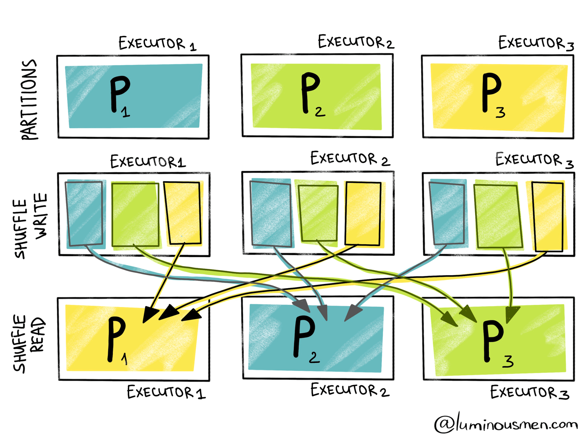

Partitions in Spark

## Spark Needs Performance Tuning

Spark로 작성된 Application은 실행을 넘어, 최적화가 필요합니다. 이는 Partition 단위로 작업을 실행하는 Spark 특성 때문입니다. 특히, Partition 간 shuffle이 발생하는 경우에 많은 자원과 시간을 소모하게 됩니다. 따라서, Spark Tuning(Optimization)이란 Shuffle 작업 속도를 빠르게 만드는 것과 다름 없습니다.

Shuffle 속도를 향상시키기 위해서는 partition 개수를 적절하게 조절해주어야합니다.

#### Spark Partition(spark.default.parallelism)

> `spark.default.parallelism` – Default number of partitions in resilient distributed datasets (RDDs) returned by transformations like `join`, `reduceByKey`, and `parallelize` when no partition number is set by the user.

Spark에서 사용하는 `RDD`, `DataFrame`, `DataSet`은 모두 Partition을 가장 작은 단위로 갖습니다. 이 Partition을 단위로 각 Executor의 Core는 작업(Task)를 적용합니다. 이중에 `RDD`는 `spark.default.parallelism`에 의해서 partition 값이 결정됩니다.

```python
from pyspark.sql import SparkSession
from pyspark import SparkConf

conf = SparkConf().setAppName('spark_partition_test').setMaster("yarn")

## 5 cores per executor
conf.set("spark.executor.cores","5") 
conf.set("spark.driver.cores", "5")
## 30 executors
conf.set("spark.executor.instances", "30")
## 10 GB per executor -> 2GB per core
conf.set("spark.driver.memory","10G")
conf.set("spark.executor.memory","10G")
## SparkSession has 30 * 5 cores, which each core has 2GB mem.
## So, spark.default.parallelism is 150(# of cores), and spark.sql.shuffle.partitions is 200(default)
spark = SparkSession.builder.enableHiveSupport().config(conf=conf).getOrCreate()
```

따로 `spark.default.parallelism`을 지정하지 않으면 core 개수만큼으로 partition 개수를 지정합니다. 따라서,  기본적으로 `RDD`는 150개의 partition으로 분할처리될 것입니다. 이는 core 개수와 같으므로 각 core가 task 1개를 처리하게 될 것입니다. 1개 executor가 5개 core를 가지고 있으므로 아래와 같은 매핑이 총 30개 발생할 것입니다(executor1 ~ executor30).


이 때, 1개 Core는 2GB나 되는 memory size를 할당받았고 Partition 1개에 대해서 1개 작업(Task)만 실행합니다. 만약 `RDD`가 300GB가 넘는 데이터이고, 각 partition에 균등하게 분할(distribution)되었다면 1개 Partition은 2GB 이상의 크기일 것입니다. 이 경우에 1개 Core가 처리할 수 있는 사이즈(2GB)를 초과하기 때문에 작업 수행 시간은 길어지게 됩니다. 

일반적으로 전체 core 개수의 2배~3배 정도까지 `spark.default.parallelism`을 설정해줄 것을 권장합니다. 따라서 위의 conf setting은 아래 항목을 추가해주어야합니다.

```python
...
## SparkSession has 30 * 5 cores, So proper number of partitions is 150 * 2 or 150 * 3.
conf.set("spark.defualt.parallelism","450")
spark = SparkSession.builder.enableHiveSupport().config(conf=conf).getOrCreate()
```

이처럼 `spark.default.parallelism`을 450으로 설정해도 Read Size가 900GB가 넘는다면(!!) partition은 여전히 2GB 이상이 분배됩니다. 따라서 **Cores 수 X 3**이라는 규칙은 참조만 하고, Read Size에 따라 유동적으로 해당 값을 결정해야합니다.

#### Spark Shuffle Partitions (spark.sql.shuffle.partitions)

`DataFrame`, `DataSet`의 경우에는 `spark.sql.shuffle.partitions`에 의해 partition 개수가 결정됩니다. 

> `spark.sql.shuffle.partitions` – Sets the number of partitions for joins and aggregations.

기본적인 개념은 위와 같고, `RDD`가 아닌 `DataFrame`, `DataSet`에 적용되는 옵션이라는 사실만 다릅니다.

## When Partition Shuffle gets Slow?

가장 큰 이유는 **Shuffle Spill** 때문입니다.





[참고]

[Spark Shuffle Partition과 최적화](https://tech.kakao.com/2021/10/08/spark-shuffle-partition/)

[Spark Partitions](https://luminousmen.com/post/spark-partitions)

[[Apache Spark] Partition 개수와 크기 정하기](https://jaemunbro.medium.com/apache-spark-partition-%EA%B0%9C%EC%88%98%EC%99%80-%ED%81%AC%EA%B8%B0-%EC%A0%95%ED%95%98%EA%B8%B0-3a790bd4675d)

[Best practices for successfully managing memory for Apache Spark applications on Amazon EMR](https://aws.amazon.com/ko/blogs/big-data/best-practices-for-successfully-managing-memory-for-apache-spark-applications-on-amazon-emr/)
