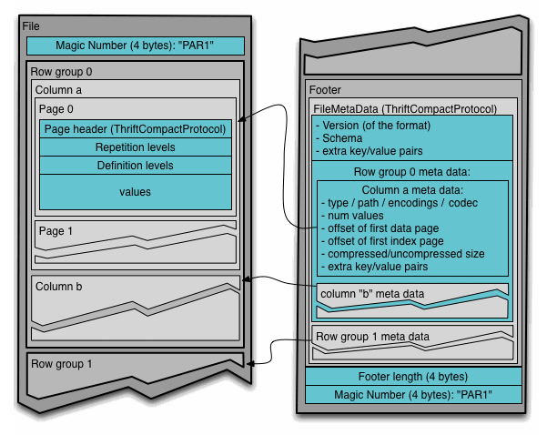

parquet 포맷과 predicate pushdown에 대해서

# Apache Parquet

[Apache Parquet](https://parquet.apache.org/)은 중첩 데이터를 효율적으로 저장할 수 있는 컬럼 기준 저장 포맷입니다. 컬럼 기준 저장 포맷은 파일 크기와 쿼리 성능 측면에서 모두 효율성이 높습니다. 동일한 컬럼의 값을 나란히 모아서 저장하기 때문에 인코딩 효율이 높기 때문에 row 기반 포맷(ex. csv)에 비해 파일 크기가 작습니다. 또한 쿼리 실행에 필요하지 않은 컬럼은 처리하지 않기 때문에 쿼리 성능이 높습니다.

## DataType

parquet 포맷의 가장 큰 장점은 중첩 구조의 데이터를 저장할 수 있다는 것입니다. 이는 Dremel의 [논문](https://storage.googleapis.com/pub-tools-public-publication-data/pdf/36632.pdf)에서 소개한 기술을 적용한 결과입니다. 결과적으로 parquet은 중첩된 필드를 다른 필드와 상관없이 독립적으로 읽을 수 있으며 이를 통해 성능을 향상시킬 수 있었습니다. 

parquet은 다음와 같은 기본자료형을 갖습니다.

| type                 | description                                       |
| -------------------- | ------------------------------------------------- |
| boolea               | 바이너리 값                                       |
| int32                | 부호 있는 32비트 정수                             |
| int64                | 부호 있는 64비트 정수                             |
| int96                | 부호 있는 96비트 정수                             |
| float                | single precision(32비트) IEEE 754 부동소수점 숫자 |
| double               | double precision(64비트) IEEE 754 부동소수점 숫자 |
| binary               | 순차 8비트 부호 없는 바이트                       |
| fixed_len_byte_array | 고정길이 8비트 부호 없는 바이트                   |

각 필드는 반복자(required, optional, repeated), type, name으로 구성됩니다. 간단한 parquet schema 예시는 다음과 같습니다.

```
message WeatherRecord{
	required int32 year;
	required int32 temperature;
	required binary stationID(UTF8);
}
```

특이하게, 문자열 자료형이 존재하지 않습니다. 위의 `stationID` 는 `binary`에 대한 해석 방법으로 `UTF8` 을 사용할 것을 지정하고 있습니다. 이처럼 parquet은 기본자료형에 대해 해석 방식을 정의하는 논리 자료형을 정의하고 있습니다.

논리 자료형 중에 특히 `LIST`와 `MAP` 은 중첩 스키마를 가능하게 합니다.

```
message m{
	required group a (LIST){
		repeated group list {
			required int32 element;
		}
	}
}

message m{
	required group a (MAP) {
		repeated group key_value {
			required binary key (UTF8);
			optional int32 value;
		}
	}
}
```

 이러한 중첩 구조를 저장할 때 Dremel이 제안한 인코딩 방법을 사용합니다. 스키마의 모든 기본자료형 필드의 값을 별도의 컬럼에 저장하고 그 구조는 명세 수준과 반복 수준의 두 정수로 인코딩합니다. 단층 레코드는 null을 사용하고 중첩이나 반복 수준이 올라가면 null이 아닌 값을 사용해서 비트 필드를 인코딩하는 일반적인 기법으로 명세 수준과 반복 수준을 젖아합니다. 이러한 방법으로 중첩 컬럼을 포함한 어떤 컬럼도 다른 컬럼과 상관없이 읽을 수 있습니다. 특히 parquet은 맵의 어떤 value도 읽지 않고 key만 읽을 수도 있습니다. 

## Structure



parquet은 크게 header, block, footer로 구성됩니다. 

### header

header는 parquet 파일 포맷임을 알려주는 4 byte 길이의 Magic Number인 PAR1만을 포함하고 있습니다. 

### block

각 블록은 Row group을 저장합니다. Row group은 column chunk로 구성되어 있고 각 column chunk는 page에 데이터를 기록합니다.  

parquet은 저장 시에 Row Group 내에서 각 column의 min, max, null count를 계산하여 저장해둡니다. 이는 Row group skip에 사용됩니다.

각 page는 하나의 column에 대한 값만 포함하고 있습니다. 따라서 page 내에 기록되는 값은 비슷한 값을 갖는 경향이 있으므로 압축에 유리합니다. 

압축은 두 가지 과정을 거칩니다. 먼저 값을 인코딩하여 저장합니다. 값의 차이를 저장하는 delta encoding, 값의 연속되는 반복횟수를 저장하는 run-length encoding, dictionary를 만들어 index를 나타내는 정수로 해당 값을 저장하는 dictionary encoding을 지원합니다. 이외에도 작은 몇 개의 값을 한 바이트에 저장하여 공간을 절약하는 bit packing과 같은 방법이 적용되기도 합니다.

인코딩 선정은 column의 자료형을 기준으로 자동으로 선택됩니다. Boolean은 RLE, Bit Packing이 주로 사용되고 이외에 대부분의 자료형은 dictionary가 사용됩니다. 단, 인코딩할 때 dictionary의 사이즈가 너무 커지면 일반 인코딩으로 대체되어 압축 효율을 확보할 수 없습니다. dictionary size는 page size까지 허용될 수 있으며 이를 넘어설 경우 일반 인코딩으로 대체됩니다. 

다음으로, page byte에 표준 압축 알고리즘을 추가로 적용할 수 있습니다. snappy, gzip, LZO와 같은 압축 알고리즘을 적용할 수 있습니다. 

parquet 설정에는 다음과 같은 항목들이 고려될 수 있습니다. 

| option                       | type    | default          |
| ---------------------------- | ------- | ---------------- |
| parquet.block.size           | int     | 134217728(128MB) |
| parquet.page.size            | int     | 1048576(1MB)     |
| parquet.dictionary.page.size | int     | 1048576(1MB)     |
| parquet.enable.dictionary    | boolean | true             |
| parquet.compression          | string  | UNCOMPRESSED     |

block size가 커지면, Row group이 더 많은 row(record)를 저장하게 됩니다. 따라서, 스캔 효율성이 높아질 수 있습니다. 그러나 메모리에 저장해야하는 사이즈가 커지므로(block 단위로 메모리에 저장하므로) block size를 계속해서 올릴 수는 없습니다. 참고로 parquet block은 HDFS block/DataNode 1개에서 읽을 수 있어야므로 Parquet block size가 HDFS block(128MB)보다 커지는 경우에는 parquet 자체를 읽을 수 없을 것입니다. 

page size는 단일 row 검색 효율과 관련있습니다. page는 parquet의 최소 저장 단위이고, 원하는 row(record) 하나를 찾고자 한다면 page의 압축을 풀고 디코딩해야합니다. 따라서 단일 row를 찾고자한다면 page.size가 작을수록 효율적입니다. 압축 해제와 디코딩 과정이 줄어들기 때문입니다. 그러나, page size가 줄어들게 되면 page 개수가 늘어나게 되고 이는 메타데이터(offset, dictionary)의 증가로 이어질 수 있습니다.

### footer

version, schema, extra key-value pair, block(row group 및 column)에 대한 메타데이터(FileMetaData)가 footer에 저장됩니다. footer의 마지막 두 필드는 FileMetaData의 길이를 인코딩한 Footer length와 PAR1입니다.

# Predicate PushDown

Spark, Hive에서는 Parquet 파일을 읽어들일 때, Predicate PushDown을 적용합니다. Predicate PushDown의 목적은 필요한 row만 빠르게 읽어들이는 것입니다. 앞서 parquet은 파일 저장 시 Row group 단위로 min, max, null count를 저장한다고 말씀드렸습니다. ppd는 row group에 저장된 min/max 저장값을 바탕으로 필요한 row group만을 스캔합니다.

예를 들어, parquet 파일의 메타 데이터가 아래와 같다고 가정해보겠습니다.

```bash
$ parquet-tools meta sample.parquet
...
row group 1 : RC:100
-----------------------------------------
A: INT32 ... [min: 1, max : 5, num_nulls: 0]
B: ...
row group 2 : RC:150
-----------------------------------------
A: INT32 ... [min: 3, max : 6, num_nulls: 0]
B: ...
```

위 메타 데이터를 해석하면 아래와 같습니다. 

> row group 1에는 100개 row에 대한 데이터를 저장하고 있으며, 해당 row들의 컬럼 A에 대한 최소값은 1, 최대값은 5이다.
>
> row group 2에는 150개 row가 존재하고, 컬럼 A에 대해서 최소값은 3, 최대값은 6이다.

해당 parquet 파일에 대해서 아래와 같은 spark 코드를 실행한다면 어떤 일이 발생할까요?

```python
df = spark.read.parquet("sample.parquet")
df.filter(df.A>5).show()
```

컬럼 A가 5보다 큰 row를 찾는다면, row group 1에서는 찾을 필요가 없습니다. 왜냐하면 최대값이 5이므로 row group 1 내부에는 `A>5` 를 만족하는 row가 존재하지 않기 때문입니다. 이처럼 row group 단위로 계산된 통계값을 바탕으로 확인할 필요가 없는 row group은 메모리에 올리지 않고 넘어가는 것(skip)이 parquet에서 발생하는 predicate pushdown이며 row group skip이라고도 불립니다.

Spark의 실행 계획 중 `Physical Plan`에서 이러한 predicate pushdown(`PushedFilters`)을 확인해볼 수 있습니다.

```
== Parsed Logical Plan ==
...
== Analyzed Logical Plan ==
...
== Optimized Logical Plan ==
...
== Physical Plan ==
...
...PushedFilters: [IsNotNull(A), GreaterThan(A, 5)]
...
```

이러한 옵션은 대체로 기본값이 true로 설정되어 있으며 아래와 같은 옵션으로 확인할 수 있습니다.

| engine | option                                    | description                                                  |
| ------ | ----------------------------------------- | ------------------------------------------------------------ |
| hive   | hive.optimize.ppd                         | setting controls whether predicate pushdown optimizations are enabled at all |
| hive   | hive.optimize.ppd.storage                 | setting controls whether predicates are pushed to the storage layer (the parquet-mr library) |
| spark  | spark.sql.parquet.filterPushdown          | setting controls pushing down predicates to Parquet for discarding individual records |
| spark  | spark.hadoop.parquet.filter.stats.enabled | discarding whole row groups                                  |

## sorting

predicate pushdown의 효율을 높이기 위해서는 filter에 사용되는 컬럼을 기준으로 정렬할 필요가 있습니다. 위에서 예시로 보여드렸던 `test.parqeut` 을 컬럼 A를 기준으로 정렬하여 저장한 뒤 메타 데이터를 확인해보겠습니다.

```bash
$ parquet-tools meta sample_sorted.parquet
...
row group 1 : RC:125
-----------------------------------------
A: INT32 ... [min: 1, max : 3, num_nulls: 0]
B: ...
row group 2 : RC:125
-----------------------------------------
A: INT32 ... [min: 4, max : 6, num_nulls: 0]
B: ...
```

만약 `df.filter(df.A > 4).show()`라는 쿼리를 실행했다면, 정렬되지 않았던 `test.parquet` 에서는 row group 1, row group 2를 모두 스캔해야합니다. 그러나 `sorted_test.parquet` 에서는 오직 row group 2만 스캔하면 됩니다. 이처럼 row group 단위의 min/max 값이 범위가 겹치지 않도록 해당 컬럼에 대해 정렬하여 저장하면 predicate pushdown의 효율을 극대화할 수 있습니다.

[참고]

하둡 완벽 가이드, 한빛미디어

[Apache Spark에서 컬럼 기반 저장 포맷 Parquet(파케이) 제대로 활용하기](https://engineering.vcnc.co.kr/2018/05/parquet-and-spark/)

[Predicate Pushdown in Parquet](https://docs.cloudera.com/documentation/enterprise/6/6.3/topics/cdh_ig_predicate_pushdown_parquet.html)
