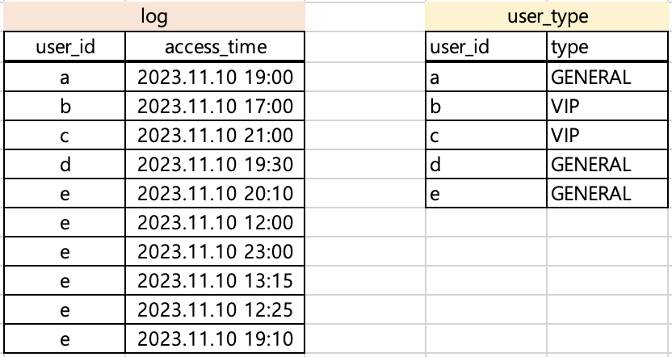
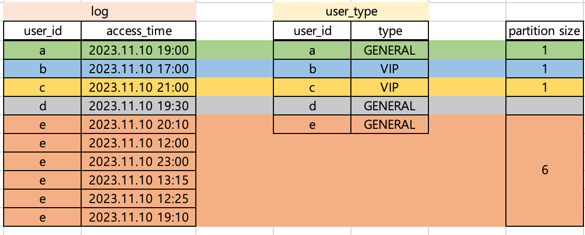
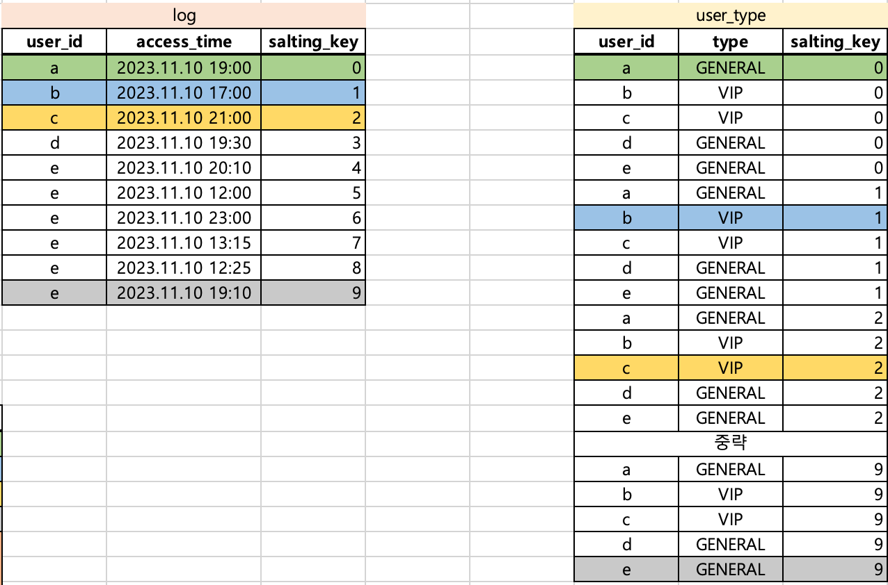
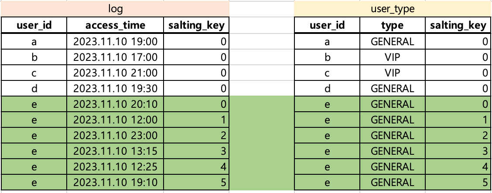
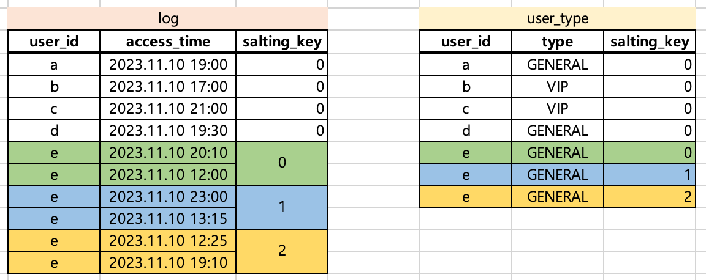

Data Skewness를 해결하는 Spark Salting Key 기법에 대해서 알아봅니다.

### What is Salting in Spark?

요리를 할 때 소금을 뿌림으로써 재료의 맛과 향을 더해줄 수 있습니다. spark의 salting 기법도 요리에서 소금을 뿌리는 것과 비슷합니다. 데이터가 더 잘 처리될 수 있도록 도와주는 역할을 합니다.

salting이란 spark에서 shuffle join하는 경우에 발생할 수 있는 데이터 불균형(skewness)을 해결하기 위해 사용되는 기법입니다. 

Spark에서 skewness는 성능 저하를 유발합니다. 
- bottle neck  
skewness가 있는 경우 spark job 완료까지 소요되는 시간(가동 시간, Total uptime)이 늘어납니다. spark job에서 10개의 task를 처리할 때, 9개의 task는 10초만에 완료하더라도 1개 task의 처리에 100초가 소요된다면 전체 spark job의 total uptime은 100초입니다. skewness가 발생하는 경우 앞선 예시처럼 skewness가 있는 데이터를 처리하는 task의 수행시간이 다른 task에 비해 늘어나게 되고, 전체 spark job의 uptime을 증가시키는 bottle neck을 유발합니다.

- job fail  
skewness는 spark job의 실패를 초래할 수도 있습니다. 특정 task가 처리해야할 데이터가 할당받은 리소스의 처리 능력을 넘는다면 task fail이 발생하게 되고 이는 spark job의 실패로 이어질 수도 있습니다.

salting 기법은 새로운 JOIN KEY(SALTING KEY)를 추가하여 skewness를 해결합니다. salting key를 기준으로 데이터가 한번 더 분산되기 때문에, join 연산 간에 특정 파티션에만 데이터가 쏠리는 현상을 방지할 수 있습니다. 

### Example

구체적인 예시로 salting key 기법이 적용되는 과정을 설명해보겠습니다.

먼저 skewness가 발생할 수 있는 상황을 가정해보겠습니다.



`log`와 `user_type` 이라는 DataFrame이 존재한다고 가정했습니다. `log`에 각 유저(`user_id`)의 type을 추가하려면 아래와 같이 코드를 작성하면 됩니다.

```python
joined = log.join(user_type, on='user_id', how='left')
```

type 컬럼을 추가하고려는 목적은 달성할 수 있으나 위와 같은 경우에 data skewness가 발생합니다. `user_id`가 `e`인 경우에 해당하는 row가 6개입니다. 따라서, `user_id`만을 가지고 join하는 경우 `e`를 처리하는 파티션 사이즈가 다른 파티션(`a~d`를 처리하는 파티션)에 비해 커지게 됩니다.  
상대적으로 비교했을 때, `a~d`를 처리하는 파티션 사이즈가 1인 것에 비해 `e`를 처리하는 파티션 사이즈는 6이므로 해당 파티션 처리는 다른 파티션에 비해 6배의 시간이 소요될 것입니다.



위와 같은 상황에서 발생한 skewness를 해결하기 위해 salting key를 적용해봅시다. 일단 모든 파티션 사이즈가 1로 동일하길 희망합니다. 이를 위해 salting key를 추가하고 `user_type` DataFrame의 row를 복제합니다.

```python
from pyspark.sql.functions import rand, array, explode
from pyspark.sql.types import IntegerType

SALTING_SIZE = 10
# log에 salting key 추가 / 0~9 사이의 무작위 정수값 추가
log = log.withColumn("salting_key",
                    (F.rand() * salt_size()).cast(IntegerType())
                     )

# user_type에 salting key를 추가, 모든 row가 0~9의 값을 갖게됨
user_type = user_type.withColumn("salting_key",
                                 explode(array([val for val in range(SALTING_SIZE)]))
                                 )
joined = log.join(user_type, on=['user_id', 'salting_key'], how='left')
```

`user_id`와 `salting_key`를 기준으로 join하므로 `log`의 각 row는 `user_type`의 1개 row와만 매칭됩니다. 따라서 모든 경우에 대해서 파티션 사이즈가 1로 매핑됩니다.



### Optimization

salting key를 적용하면 data skewness를 해결할 수 있음을 확인했습니다. 하지만 위의 예시에서는 아직 문제점이 존재합니다. `user_type`은 salting key를 추가하는 과정에서 그 데이터 사이즈가 10배 커졌습니다.

이 글에서 예시로 작성한 경우는 데이터셋이 매우 작으므로 문제가 되지 않지만, 실제 데이터를 가공하는 경우에는 특정 데이터셋을 10배로 키우는 것은 문제가 될 수 있습니다(아니, 대부분 문제가 됩니다).

이를 최적화하기 위해서는 어떻게 접근해야할까요?

#### [접근1] `SALTING_SIZE`를 조정한다

`SALTING_SIZE`를 8로 줄이면, 데이터 사이즈를 10배 증가하던 것을 8배 증가로 줄일 수 있습니다. 또한 `log` 데이터의 모든 rows에 대해서 join이 되는 것도 보장할 수 있습니다. 
```python
SALTING_SIZE = 8
```
그러나 여전히 데이터가 8배가 되는 것은 부담이 됩니다. 또한 데이터를 직접 확인해보지 않으면 파라미터(SALING_SIZE)를 어떤 값으로 설정해야하는지 판단할 수 없습니다. 

#### [접근2] 동적으로 SALTING_SIZE를 결정한다

로직을 추가하여 `user_type`을 복제할 사이즈를 자동으로 결정할 수 있습니다. 이 과정에서 `user_type` 전체를 복제하는 것이 아니라 `user_id` 별로 얼마나 복제해야할지 동적으로 결정한다면 메모리를 훨씬 더 아낄 수 있습니다.

```python
from pyspark.sql.functions import rand, array, explode, udf, col
from pyspark.sql.types import IntegerType, ArrayType

user_id_cnt = log.groupBy('user_id').count()

# log
log = log.join(user_id_cnt, on='user_id', how='left')
log = log.withColumn("salting_key",
                    (rand() * col("count")).cast(IntegerType())
                     )

@udf(returnType=ArrayType(IntergerType()))
def get_salting_array(count):
    '''
    count=3 => [0, 1, 2]
    '''
    return list(range(0, count))

# user_type
user_type = user_type.join(user_id_cnt, on='user_id', how='left')
user_type = user_type.withColumn("salting_key",
                                 explode(get_salting_array(col("count")))
                                 )

joined = log.join(user_type, on=['user_id', 'salting_key'], how='left')
```

`user_id_cnt`에 따라 결정된 salting_size는 아래와 같습니다. 따라서 `user_type`에서 `(e, GENERAL)`에 해당하는 row만 salting_key 0~5를 부여하여 6개로 복제됩니다. 



여기서 `user_type`의 복제를 더 최소화할 수 있는 마지막 접근법이 있습니다.

#### [접근3] join을 1:1 매핑에서 1:N이 가능하도록 수정한다
1:N 매핑이 가능하도록 로직을 수정하면, 접근2의 결과보다도 복제를 더 최소화할 수 있습니다.

`user_id=e`인 경우에 집중해봅시다. 현재 상태에서 join을 하게되면 1 task가 1 row를 처리합니다(`1row/task`). 대신 `user_type`에는 6 rows를 복제해야했습니다. 

그렇다면, 1 task가 2 rows씩 처리(`2rows/task`)하도록 한다면 복제해야하는 사이즈를 줄일 수 있지 않을까요?


```python
from pyspark.sql.functions import rand, array, explode, udf, col
from pyspark.sql.types import IntegerType, ArrayType
from math import ceil

PARTITION_SIZE = 2 # 1개 task가 처리할 rows 개수

user_id_cnt = log.groupBy('user_id').count()

@udf(returnType=IntegerType())
def get_salting_size(count):
    '''
    count=6 => ceil(6/2)
    count=1 => ceil(1/2)
    '''
    if count is None:
        return 1
    return ceil(count/PARTITION_SIZE)

@udf(returnType=ArrayType(IntergerType()))
def get_salting_array(count):
    '''
    count=3 => [0, 1, 2]
    '''
    return list(range(0, count))

# log
log = log.join(user_id_cnt, on='user_id', how='left')
log = log.withColumn("salting_size", get_salting_size(col('count')))
log = log.withColumn("salting_key",
                    (rand() * col("salting_size")).cast(IntegerType())
                     )

# user_type
user_type = user_type.join(user_id_cnt, on='user_id', how='left')
log = log.withColumn("salting_size", get_salting_size(col('count')))
user_type = user_type.withColumn("salting_key",
                                 explode(get_salting_array(col("salting_size")))
                                 )

joined = log.join(user_type, on=['user_id', 'salting_key'], how='left')
```

`get_salting_size`에 의해 `user_id`의 count 수를 그대로 salting_size로 사용하는 것이 아니라 연산을 거칩니다. `PARTITION_SIZE`란 하나의 task가 처리할 row 수를 의미합니다. 따라서 `user_id=e`의 경우 2 rows씩 처리하면 되므로 3 rows만 복제했습니다.




### Conclusion
- spark에서 data skewness를 줄이기 위해 salting key 기법을 사용할 수 있다
- salting key 사용 시 데이터 복제가 발생한다
- 동적으로 salting size를 결정하도록 코드를 구현하여 데이터 복제를 최소화할 수 있다


[참고]  
[[VROONG 테크 블로그]Salting 기법 예제 코드](https://mesh.dev/20220130-dev-notes-008-salting-method-and-examples/)  
