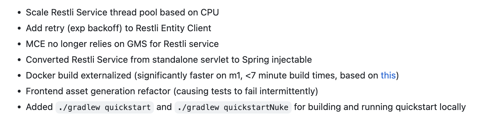

---

layout: post
current: post
cover: assets/built/images/kubernetes/docker-logo.png
navigation: True
title: multi-stage와 Builder Pattern
date: 2023-06-10 22:30:00 +0900
tags: [kubernetes]
class: post-template
subclass: 'post tag-kubernetes'
author: GyuhoonK

---
DataHub로 알아본 Docker build 전략 (multi-stage, Builder pattern)


### multi-stage build

multi stage build는 2개 이상의 베이스 이미지를 이용합니다. 하나의 이미지 A에서는 빌드를 하고 빌드 결과물을 다른 이미지 B로 COPY합니다.
Docker 공식 문서에서 제공하고 있는 예시를 살펴보겠습니다.

```Dockerfile
# syntax=docker/dockerfile:1

FROM golang:1.16 AS builder
WORKDIR /go/src/github.com/alexellis/href-counter/
RUN go get -d -v golang.org/x/net/html  
COPY app.go ./
RUN CGO_ENABLED=0 go build -a -installsuffix cgo -o app .

FROM alpine:latest  
RUN apk --no-cache add ca-certificates
WORKDIR /root/
COPY --from=builder /go/src/github.com/alexellis/href-counter/app ./
CMD ["./app"]
```

```shell
docker build -t alexellis2/href-counter:latest .
```

`builder`로 네이밍한 `golang:1.16`은 빌드를 실행(`go build`)하고 빌드 결과물(`/go/src/github.com/alexellis/href-counter/app`)을 `alpine:latest`로 복사합니다.  
이는 기존의 Builder pattern의 단점을 보완했습니다. Builder pattern이란 2개의 Dockerfile을 이용하는 방법입니다.  

### Builder pattern

Builder pattern은 production image(배포용 이미지)의 레이어를 최소화(slimmed-down)하기 위해 제안되었습니다. 개발용 이미지와 배포용 이미지를 분리합니다. 즉, 개발용 이미지에서는 어플리케이션을 개발하고 빌드하기 위한 모든 이미지를 포함하지만, 배포용 이미지에서는 어플리케이션과 어플리케이션을 실행하기 위한 의존성만을 포함합니다.

아래 예시에서, `build.Dockerfile`은 개발용 이미지이고, `Dockerfile`은 배포용 이미지입니다.

`build.Dockerfile`
```Dockerfile
# syntax=docker/dockerfile:1
FROM golang:1.16
WORKDIR /go/src/github.com/alexellis/href-counter/
COPY app.go ./
RUN go get -d -v golang.org/x/net/html \
  && CGO_ENABLED=0 go build -a -installsuffix cgo -o app .
```

`Dockerfile`
```Dockerfile
# syntax=docker/dockerfile:1
FROM alpine:latest  
RUN apk --no-cache add ca-certificates
WORKDIR /root/
COPY app ./
CMD ["./app"]
```

기존 Builder pattern에서는 위 2개의 도커파일(`build.Dockerfile, Dockerfile`)을 차례로 실행합니다. 

```shell
#!/bin/sh
echo Building alexellis2/href-counter:build
docker build -t alexellis2/href-counter:build . -f build.Dockerfile

docker container create --name extract alexellis2/href-counter:build  
docker container cp extract:/go/src/github.com/alexellis/href-counter/app ./app  
docker container rm -f extract

echo Building alexellis2/href-counter:latest
docker build --no-cache -t alexellis2/href-counter:latest .
rm ./app
```

1. 첫번째 이미지(`build.Dockerfile`)를 빌드한다
2. 첫번째 빌드에서 실행된 컨테이너에서 빌드 결과물(`app`)을 로컬로 복사한다(`docker container cp`)
3. 두번째 이미지를 빌드하면, 로컬에 복사된 결과물을 컨테이너 내부로 가져온다.

위와 같은 방법으로 빌드된 배포용 이미지는 최소한의 레이어만을 포함합니다. 즉, 배포에 더 용이합니다.
그러나 아래와 같은 단점을 갖습니다.

- 2개의 빌드 파일을 작성해야한다(빌드용 이미지와 빌드 결과물을 옮길 최종 결과물 이미지)
- 빌드 과정에서 사용해야하는 커맨드가 많다(컨테이너 내부에 접속하여 결과물을 로컬로 옮겨야한다)
- 로컬 환경에 빌드 결과물이 남는다


### DataHub v0.10 이전의 빌드 전략: multi-stage build
v0.10 이전 DataHub는 docker 빌드 시 mutl-stage build를 이용했습니다. 

아래는 v0.8.40에서 datahub-gms를 빌드하는 Dockerfile의 일부입니다([docker/datahub-gms/Dockerfile](https://github.com/acryldata/datahub/blob/v0.8.40/docker/datahub-gms/Dockerfile)).

```docker
FROM --platform=$BUILDPLATFORM alpine:3.14 AS prod-build

# Upgrade Alpine and base packages
RUN apk --no-cache --update-cache --available upgrade \
    && apk --no-cache add openjdk8 perl

COPY . /datahub-src
RUN cd /datahub-src && ./gradlew :metadata-service:war:build -x test
RUN cp /datahub-src/metadata-service/war/build/libs/war.war /war.war

FROM base as prod-install
COPY --from=prod-build /war.war /datahub/datahub-gms/bin/war.war
```

1. `prod-build`에서 `war.war`를 빌드한다.
2. 빌드 결과를 `prod-install`로 COPY한다.

multi-stage build 방식을 이용하기 때문에 위 Dockerfile을 실행할 때 로컬에 `war.war`는 남지 않습니다. 또한 builder pattern처럼 여러 개의 도커 커맨드를 실행할 필요가 없었습니다.

### DataHub v0.10.0의 빌드 전략: COPY from Local

그러나 v0.10.0 이후 DataHub는 multi-stage build 전략을 버렸습니다. 따져보자면 Builder Pattern에 가까운 빌드 전략을 채택했습니다. `prod-build`에서 `war.war`를 빌드했던 스텝을 없애고 로컬에 있는 빌드 결과물인 `war.war`를 컨테이너 내부로 COPY하고 있습니다. 

```docker
FROM base as prod-install
COPY war.war /datahub/datahub-gms/bin/war.war
```

따라서 Dockerfile을 실행하기 전에 사용자는 먼저 로컬에서 빌드를 수행해야합니다. 아래와 같은 명령어를 순서대로 실행해야합니다.

```bash
./gradlew :metadata-service:war:build
docker build -t datahub-gms:v0.10.0 . -f Dockerfile
```


해당 커밋에서는 이를 `Docker build externalized`라고 표현합니다. 


5번째 줄을 보면 해당 m1에서의 빌드속도가 7분 이하로 매우 빨라졌다고 설명하고 있습니다. 제 기억이 맞다면 v0.8.40에서 빌드 시 걸리는 속도가 20분 정도였으니 속도가 매우 빨라진 것은 맞는 것 같습니다.

왜 이런 선택을 했을까요? 위와 같은 제안이 처음 등장한 것은 아래 PR입니다.

[run java build in action runners instead of within Docker](https://github.com/datahub-project/datahub/pull/6726)

해당 PR은 Dockerfile로 빌드를 실행할 때, local build(ex. `./gradlew :metadata-service:war:build`)가 먼저 실행될 수 있도록 각 모듈별로 빌드 커맨드를 추가하고, docker 내부에서 빌드하는 부분(`prod-build`)을 빼자고 제안합니다. 

이 제안을 받아들여 david는 GHA(GitHub Actions)에서 소스코드 빌드 & 도커 빌드가 동시에 실행될 수 있도록 `build.gradle`도 함께 수정한 것으로 보입니다.

### 정리
- multi-stage build는 Builder Pattern에 비해 Dockerfile 작성과 실행이 간단하다.
- Builder Pattern은 필요한 최소의 레이어만 배포하므로 가볍다.
- 필요에 따라 multi-stage build와 Builder Pattern 중에 선택하여 Dockerfile을 작성한다.

[참고]  
[datahub PR#6744](https://github.com/datahub-project/datahub/pull/6744)  
[datahub PR#6726](https://github.com/datahub-project/datahub/pull/6726)  
[multi-stage](https://docs.docker.com/build/building/multi-stage/)
[Builder pattern vs. Multi-stage builds in Docker](https://blog.alexellis.io/mutli-stage-docker-builds/)