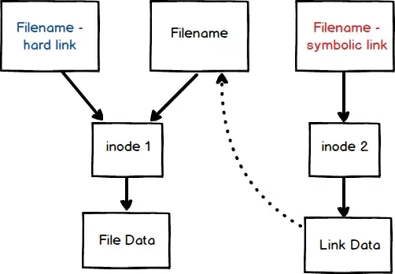

---

layout: post
current: post
cover: assets/built/images/linux/linux_logo.png
navigation: True
title: Linux 사용자 관리, 파일속성 그리고, 특수권한
date: 2022-11-19 22:30:00 +0900
tags: [linux]
class: post-template
subclass: 'post tag-linux'
author: GyuhoonK

---
Linux 사용자 관리, 파일속성 그리고, 특수권한에 대해서 알아봅니다.

# Linux 사용자,그룹과 파일 관리
Linux는 파일 관리를 위해 아래와 같은 개념을 도입했습니다. 
1. 사용자와 그룹(User and Group)
2. 파일 허가권(Permission)
3. 파일 소유권(Ownership)


## 1. 사용자와 그룹(User and Group)
리눅스가 사용자와 그룹 개념을 도입함으로써, 1대의 리눅스 서버에 여러 명이 동시에 접속해서 사용할 수 있습니다. 
처음에 리눅스를 설치하면, `root`라는 이름을 가진 super user가 있습니다. `root`는 시스템의 모든 작업을 실행할 수 있는 권한이 있고, 시스템에 접속할 수 있는 사용자를 생성할 수 있는 권한도 있습니다. 
사용자(User)는 혼자서 존재하지 않고 어떤 그룹(Group)에 속해야합니다. 

```bash
$ cat /etc/passwd
nobody:x:-2:-2:Unprivileged User:/var/empty:/usr/bin/false
root:x:0:0:System Administrator:/var/root:/bin/sh
daemon:x:1:1:System Services:/var/root:/usr/bin/false
```
위의 각 행의 의미는 아래와 같습니다.
```
{사용자 이름}:{암호}:{사용자ID}:{사용자가 소속된 그룹}:{추가 정보}:{홈 디렉토리}:{기본 셀}
```
암호가 `x`로 표시된 경우에 해당 암호는 `/etc/shadow`에서 확인할 수 있습니다.
이번에는 그룹(Group)을 확인해봅니다.
```bash
$ cat /etc/group
nobody:x:-2:
nogroup:x:-1:
wheel:x:0:root
daemon:x:1:root
kmem:x:2:root
sys:x:3:root
```
각 행의 의미는 아래와 같습니다.
```
{그룹 이름}:{비밀번호}:{그룹 ID}:{보조 그룹 사용자}
```
`보조 그룹 사용자`란 이 그룹을 주 그룹(main group)이 아닌 보조 그룹(sub group)으로 사용하는 사용자의 목록이 추가됩니다. 여러명이 있는 경우에는 컴마로 구분됩니다. 

## 2. 파일 허가권(Permission)과 소유권(Ownership)
리눅스는 각각의 파일과 디렉터리마다 소유권과 허가권을 갖습니다. 아래와 같이 확인이 가능합니다.
```bash
$ ls -l
-rw-r--r-- 1 root root 0 7월 15 16:11 sample.txt
```
표시된 정보는 아래 표와 같습니다.

| -         | rx-r--r--   | 1       | root        | root          | 0               | 7월 15 16:11          | sample.txt |
| --------- | ----------- | ------- | ----------- | ------------- | --------------- | --------------------- | ---------- |
| 파일 유형 | 파일 허가권 | 링크 수 | 파일 소유자 | 파일 소유그룹 | 파일 크기(byte) | 마지막 변경 날짜/시간 | 파일 이름  |

각 항목에 대해서 간략하게 정리해보겠습니다.
### 파일 유형
어떤 종류의 파일인지를 나타내며 아래와 같은 종류가 있습니다.

| 표시 | 파일 유형     |
| ---- | ------------- |
| `d`  | 디렉터리      |
| `-`  | 일반 파일     |
| `b`  | 블록 디바이스(Block Device) |
| `c`  | 문자 디바이스(Character Device) |
| `l`  | 링크(Link)          |

`b`(블록 디바이스)는 하드디스크, 플로피디스크, CD/DVD 등의 저장장치를 말합니다. `c`(문자 디바이스)는 마우스, 키보드, 프린터 등의 입출력장치에 해당합니다. `l`(링크)는 '바로 가기 아이콘'처럼 연결되어있는 파일을 의미합니다(실제 파일은 다른 곳에 존재합니다).

### 파일 허가권(Permission)
`rw-`, `r--`, `r--` 로 3개씩 끊어서 인식해야합니다. 먼저 `rwx`의 의미는 아래와 같습니다.

| 허가권 | 의미    |
| ------ | ------- |
| `r`    | READ    |
| `w`    | WRITE   |
| `x`    | EXECUTE |

3개씩 끊었을 때 앞에서부터의 갖는 의미는 아래와 같습니다.

| 블록  | 대상               | 의미                          |
| ----- | ------------------ | ----------------------------- |
| `rw-` | 소유자(user)       | 소유자는 읽거나 쓸 수 있다    |
| `r--` | 그룹(group)        | 그룹은 읽을 수만 있다         |
| `r--` | 그외 사용자(other) | 그 외 사용자는 읽을 수만 있다 |

허가권은 아래와 같이 숫자로도 표현될 수 있습니다.

|            | User | User | User | Group | Group | Group | Other | Other | Other |
| ---------- | ---- | ---- | ---- | ----- | ----- | ----- | ----- | ----- | ----- |
|            | r    | w    | -    | r     | -     | -     | r     | -     | -     |
| 2진법      | 1    | 1    | 0    | 1     | 0     | 0     | 1     | 0     | 0     |
| 10진법     | 4    | 2    | 0    | 4     | 0     | 0     | 4     | 0     | 0     |
| 합(10진법) | 6    |      |      | 4     |       |       | 4     |       |       |

`rwx`를 2진법 3자리수에 대응하여 위와 같이 풀이하는 것도 가능합니다. 따라서  `rw-r--r--`라고 길게 쓴 파일허가권에 대한 설명은 2진법으로는 `110100100`이고, 이를 3자리씩 끊어서 10진법으로 변환하면 `644`에 해당합니다.
반대로 파일 허가권이 `754`인 경우에는 `111101100`이고, 이는 `rwxr-xr--`로 풀이됩니다. 이 경우 의미는 소유자는 읽기/쓰기/실행이 가능하고, 그룹은 읽기/실행이 가능, other는 읽기만 가능입니다.
참고로, 디렉터리로 이동(진입)하기 위해서는 `x`(실행) 권한이 반드시 필요합니다. 따라서 일반적으로 소유자/그룹/other 모두에게 실행 권한이 설정되어 있습니다. 

파일의 허가권을 변경하고 싶은 경우에는 `chmod` 명령어를 실행해야합니다. `root` 혹은 소유자만이 해당 파일의 허가권을 변경할 수 있습니다. 아래와 같이 사용합니다.
```bash
$ chmod 777 sample.txt
$ chmod u+x sample.txt # User의 권한에 실행 권한을 추가
$ chmod u-wx sample.txt # User의 권한에 쓰기/실행 권한을 제거
```

### 파일 소유권(Ownership)
소유권은 파일을 소유한 **사용자**와 **그룹**을 의미합니다. `sample.txt`의 경우 `root` 사용자와 `root` 그룹이 소유하고 있습니다. 소유권은 아래와 같은 명령어로 변경할 수 있습니다.
```bash
$ chown ubuntu sample.txt # sample.txt의 소유자를 ubuntu로 변경
$ chown ubuntu.ubuntu sample.txt # sample.txt의 소유자와 소유 그룹을 ubuntu 그룹으로 변경
$ chgrp ubuntu sample.txt # 그룹만 ubuntu로 변경
```

### 링크(Link)
링크는 하드 링크(Hard Link)와 심볼릭 링크(Symbolic Link)로 나뉩니다. 먼저, 링크를 이해하기 전에 `inode`에 대해서 알고 있어야합니다. 

#### inode
inode는 리눅스/유닉스 파일 시스템에서 사용하는 자료구조로서, 파일이나 디렉터리의 정보를 저장하고 있습니다. 모든 파일/디렉터리는 각각 1개씩의 inode를 갖고 있으며 inode 내에 파일의 소유권, 허가권, 파일 종류 등의 정보와 해당 파일의 실제 위치(address)가 저장되어 있습니다. inode가 저장되어 있는 공간을 inode block이라고 하며 일반적으로 전체 디스크 공간의 1%가 inode block으로 사용됩니다. 반대로, Data Block은 실제로 데이터가 저장되어 있는 공간으로 나머지 99%를 사용합니다.

링크 생성 시 링크 대상이 되는 파일의 `inode`를 공유하느냐, 새로운  `inode`를 생성하느냐에 따라 하드 링크와 심볼릭 링크로 나뉩니다.

 

위 그림에서 표현된 것처럼, 하드링크는 대상(`Filename`)의 `inode1`을 공유합니다. 따라서 `Filename`의 소유권, 권한, 파일 종류 데이터를 공유하고, Data Block도 같은 공간을 바라보게 됩니다.반대로 심볼릭링크로 생성할 경우 새로운 `inode2`를 생성하고 해당 `inode2`의 Data Block은 파일 데이터가 아닌 `Filename`의 주소를 저장하고 있는 `Link Data`(파일포인터)입니다(실제 데이터를 저장하고 있지 않습니다). Windows의 바로가기 아이콘은 심볼릭 링크에 해당합니다.
```bash
$ ln basefile hardlink # 하드링크 파일 생성
$ ln -s basefile softlink # 소프트링크(심볼릭링크) 생성
$ ls -il # inode 번호를 가장 앞에 출력함 
4063514 -rw-r--r-- 2 root root 60 7월 16 15:31 basefile
4063514 -rw-r--r-- 2 root root 60 7월 16 15:31 hardlink # basefile과 같은 inode
4063516 lrwxrwxrwx 1 root root 8  7월 16 15:33 softlink -> basefile # basefile과 inode가 다르다
```
현재 `softlink` 파일은 현재 `basefile`의 위치로 링크되기 때문에 `basefile`을 이동 시키면 소프트링크는 유지되지 않습니다. `hardlink`는 파일포인터를 이용하지 않고 같은 inode를 바라보기때문에 링크가 유지됩니다.
```bash
$ mv basefile ../ # basefile 위치 변경 (상위 디렉터리로 이동)
$ cat hardlink # 링크 확인
파일 링크 연결 확인
$ cat softlink # 링크 확인
cat: softlink: 그런 파일이나 디렉터리가 없습니다
```
다시 `basefile`을 원래 위치로 복귀시키면 소프트링크가 작동하는 것을 확인할 수 있습니다. 
```bash
$ mv ../basefile . # 현재 디렉터리로 이동 
$ cat softlink # 링크 확인
파일 링크 연결 확인
```

# 특수 권한(Special Permissions)에 대해서
리눅스의 특수 권한은 세 가지가 있습니다. 
1. SUID
2. GUID
3. sticky bit  

특수 권한은 파일의 소유자(owner)가 아닌 user에게 더 높은 권한을 부여하지 않고도 해당 파일을 실행할 수 있도록 허용하기 위해 탄생했습니다. User `A`가 생성한 파일을 다른 유저가 실행하고자 할 때 가장 간단한 해결책은 무엇일까요? 혼자서 사용하는 리눅스 환경이라면 단순하게  `sudo`  커맨드를 입력하고 `root`  계정의 권한을 획득하여 실행할 수 있을 것입니다. 그러나 여러 멤버들과 함께 사용하는 리눅스 환경에서는 `sudo` 커맨드에 대한 권한이 없는 경우가 더 많을 뿐 아니라 설령 허용된다고 하더라도 모든 문제를 `root`  권한으로 해결하고자하는 것은 위험한 발상입니다. 결국 모든 사용자가  `root`  권한을 요구하게 되고 이는 리눅스의 사용자/그룹/파일 관리 시스템에 위배되는 현상이기 때문입니다. 이러한 현상을 해결하기 위해 등장한 것이 **특수 권한**입니다.
## SUID

SUID(**S**et Owner **U**ser **ID**)는 user가 파일을 실행할 수 있도록 설정합니다.  구체적으로, SUID를 설정하게 되면 user는 해당 파일을 실행할 때, owner와 같은 권한을 갖는 채로 실행이 가능해집니다.

만약에  `root`가 어떤 파일을 생성하였고, 해당 파일의 실행 권한이 `root` 에게만 있다고 가정해봅시다. 아래와 같은 경우가 그에 해당합니다.

```bash
gyuhoonkim$ ls -l 
-rw-r--r-- 1 root root 0 7월 15 16:11 testfile1
-rw-r--r-- 1 root root 0 7월 15 16:11 testfile2
gyuhoonkim$ testfile1
`testfile1`: Permission denied
```

이 경우, `root` 외의 계정은 `testfile1`을 읽을 수는 있지만, 실행할 수는 없습니다. 이때 `suid` 를 설정하게되면,  `root` 외의 계정에서도 위 `testfile1` 을 실행할 수 있습니다. 실행하는 순간  `root`의 권한을 획득하기 때문입니다.

```bash
gyuhoonkim$ sudo
root$ chmod 4744 testfile1 # 실행권한 있음
root$ chmod u+s testfile2 # 실행권한 없음
root$ ls -l
-rwsr--r-- 1 root root 0 7월 15 16:11 testfile1
-rwSr--r-- 1 root root 0 7월 15 16:11 testfile2
```

`root`가 파일에 대해 실행권한(`x`)를 가지고 있는 상태에서  SUID를 부여하게 되면 권한 표시에서 `s`(소문자)로 표시됩니다. 반대로, `root` 가 실행권한을 가지고 있지 않았다면  `S`(대문자)로 표시됩니다.

이제 `gyuhoonkim`에서  `testfile1`을 실행할 수 있습니다.

```bash
root$ su gyuhoonkim
gyuhoonkim$ testfile1
실행 성공
```

이러한 권한 관리가 필요한 대표적인 경우는 `passwd`  명령어입니다.  user는 `passwd` 명령어로 패스워드를 설정/변경하는 경우에 자동으로  `/etc/passwd`, `/etc/shadow` 파일도 변경하게 됩니다.

그런데 이 두 파일은 `root`가 생성한 파일이므로 `root`권한이 없으면 수정할 수 없습니다. 

```bash
$ ls -a /etc/passwd
-rw-r--r-- 1 root root 7868  8 11 15:44 /etc/passwd #644
$ ls -a /etc/shadow
-rw-r----- 1 root root 7868  8 11 15:44 /etc/shadow # 640
```

그러나 `root`가 아닌 계정(`gyuhoonkim`)에서 `passwd`를 실행하면,  위의 두 파일이 변경됩니다. `root` 가 아닌데도 위 두 파일을 변경할 수 있는 이유는  `passwd`에 있습니다.

```bash
$ ls -a /usr/bin/passwd
-rwsr-xr-x 1 root root 51096 8 11 15:44 /usr/bin/passwd* # 4755
```

`passwd` 는 SUID가 설정된 명령어이기 때문에, 실행되는 순간 `owner`인 `root` 권한을 획득합니다. 따라서 일반 user가 `passwd`를 실행하는 순간 `root`권한을 가지고 `/etc/passwd`, `/etc/shadow` 파일을 수정(`write`)할 수 있게 되는 것입니다.

## GUID

SUID와 비슷합니다. GUID가 설정된 파일은 실행할 때 `group`의 권한으로 실행됩니다. 만약 GUID가 설정된 디렉터리 하위에 디렉터리를 생성한다면, 생성된 디렉터리와 파일들은 설정된 `group`을 부여받게 됩니다.

SUID와 비슷하지만, group에 `s`/`S`를 표시합니다.

```bash
$ ls -l
drwxr-xr-x 2 test1 test1 4096 6월 26 21:16 guid_dir1
drwxr-xr-x 2 test2 test2 4096 6월 26 21:16 guid_dir1
$ chmod 2755 guid_dir1
$ chmod g+x+s guid_dir2
$ ls -l
drwxr-sr-x 2 test1 test1 4096 6월 26 21:16 guid_dir1
drwxr-Sr-x 2 test2 test2 4096 6월 26 21:16 guid_dir2
$ sudo # root 계정으로 변경
root$ cd guid_dir1
root$ mkdir test_dir1 
root$ touch test_file1
root$ ls -l
drwxr-sr-x 2 root test1 4096 6월 26 22:16 dir1/ # Group owner가 test1
-rw-r--r-- 1 root test1 0    6월 26 22:16 test_file1 # Group owner가 test1
```

GUID는 `/var/mail` 디렉터리 관리에 사용됩니다. `/var/mail` 디렉터리는 `mail` group owner를 가지고 있는데 이 하위에 생성되는 모든 디렉터리는  `mail`  group owner를 갖도록 생성되어야 `mail` 그룹을 통해 관리가 가능합니다.

```bash
$ ls -ld /var/mail # GUID 셋팅 확인
drwxrwsr-x 2 root mail 4096 6월 26 22:30 /var/mail 
$ useradd -m test3
ls -ld /var/mail/test3 # Group Onwer가 mail로 생성되었음
-rw-rw---- 1 test3 mail 0 6월 26 22:40 /var/ail/test3 
```


## GUID
## sticky bit

sticky bit는 디렉터리에 적용되는 옵션입니다. sticky bit가 설정되면, 설정된 디렉터리와 내부 파일에 접근할 수 있는 user는 자신이 생성한 파일만 삭제할 수 있고, 다른 user의 파일은 수정하거나 삭제할 수 없습니다. 이런 특징은 공유 폴더를 관리할 때에 사용됩니다. sticky bit가 설정된 디렉터리나 내부 파일들의 권한이 777로 설정되어 있다고 하더라도, sticky bit 옵션 때문에 삭제는 불가능합니다(생성은 가능합니다). 

```bash
$ ls -ld
drwxr-xr-x 2 root root 4096 6월 26 23:00 dir1
drwxr-xr-x 2 root root 4096 6월 26 23:00 dir2
drwxr-xr-x 2 root root 4096 6월 26 23:00 dir3

# sticky bit 부여
$ chmod 1754 dir1 # Other의 e 권한 회수(100)
$ chmod o+t dir2
$ chmod +t dir3

$ ls -ld
drwxr-xr-T 2 root root 4096 6월 26 23:00 dir1 # Other가 e권한 없는 경우 T로 표시
drwxr-xr-t 2 root root 4096 6월 26 23:00 dir2
drwxr-xr-t 2 root root 4096 6월 26 23:00 dir3
```

이러한 특성은  `/tmp`와 같이 공유 폴더를 관리할 때 사용합니다. 공유폴더 내부에서는 누구나 파일을 생성할 수 있지만, 다른 user가 생성한 파일에 대해서 삭제/수정이 불가능합니다.

```bash
$ cd dir2
$ su test1
test1$ touch testfile1
test1$ touch testfile2

# test2 계정에서 확인
$ su test2
test2$ rm tesetfile1
tesetfile1: failed to remove `tesetfile1`: 명령을 허용하지 않음
test2$ rm testfile2
testfile2: failed to remove `testfile2`: 명령을 허용하지 않음

# root 계정에서 확인
$ su root
root$ rm tesetfile1 # 삭제 성공

# test1(파일을 생성한 계정)에서 확인
$ su test1
test1$ rm testfile2 # 삭제 성공
```


[참고]  
[이것이 루분투 리눅스다(2017)](https://cafe.naver.com/thisisLinux)  
[What is the difference between a hard link and a symbolic link?](https://medium.com/@1154_75881/what-is-the-difference-between-a-hard-link-and-a-symbolic-link-14db61df7707)  
[Special Permissions: SUID, GUID, and sticky bit](https://linuxhint.com/special-permissions-suid-guid-sticky-bit/)  
[[UNIX/Linux]특수 권한(setuid, setgid, sticky bit)](https://eunguru.tistory.com/115)
