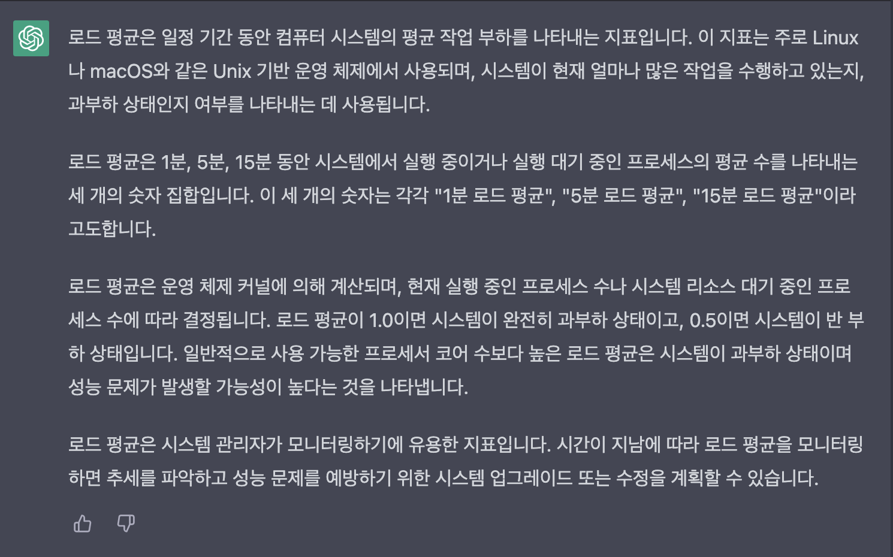
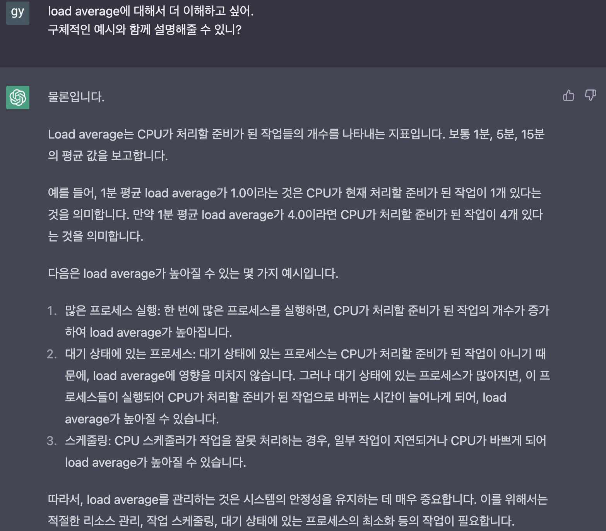
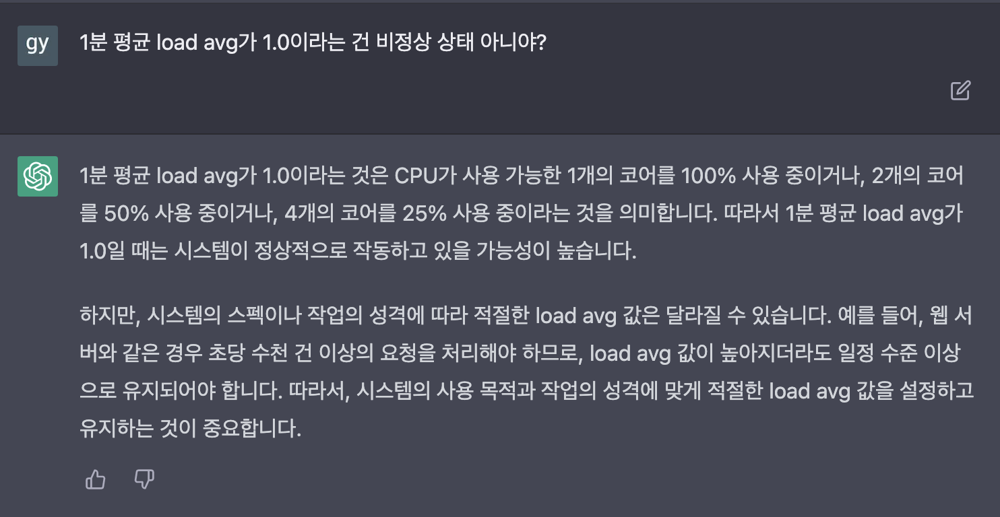
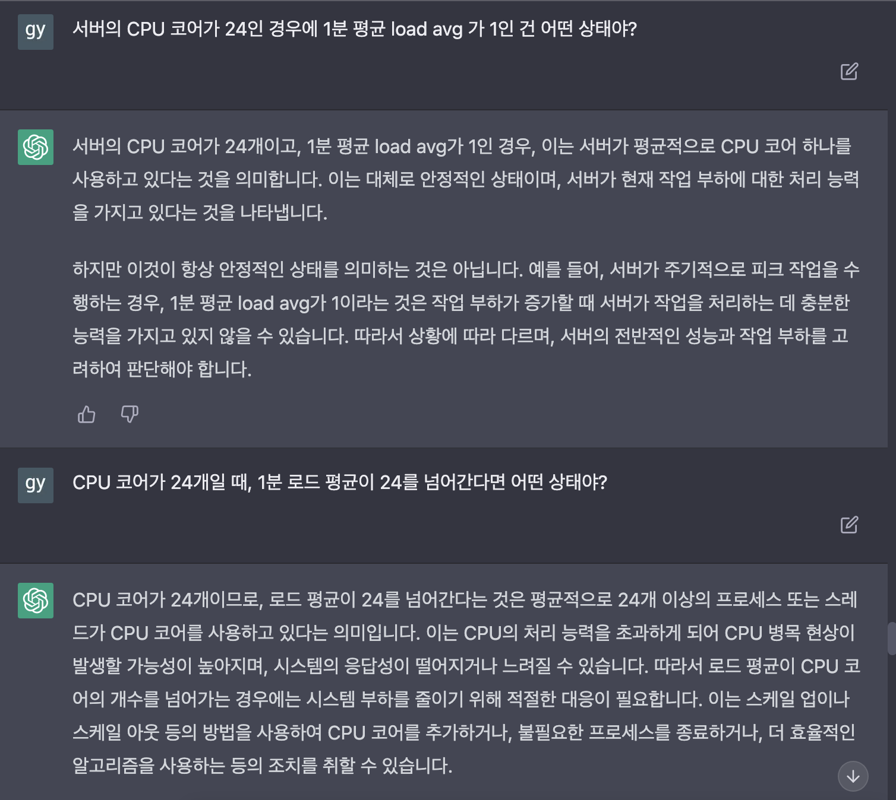
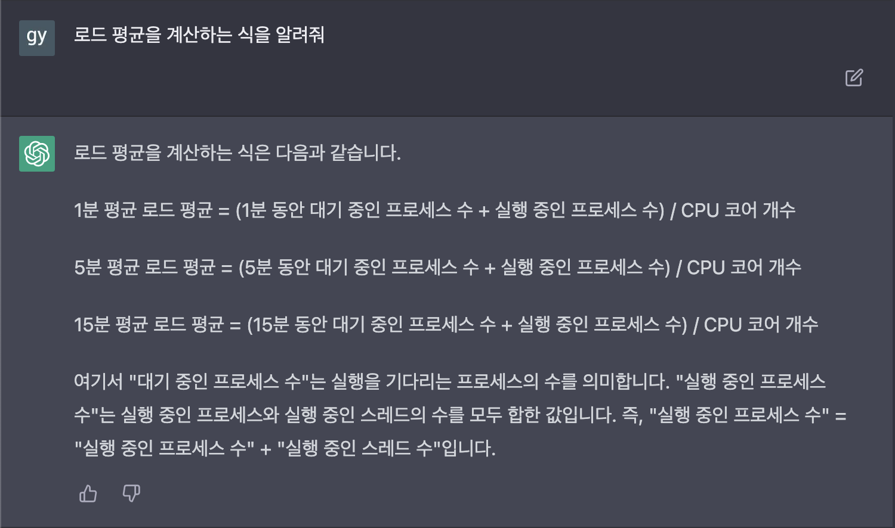
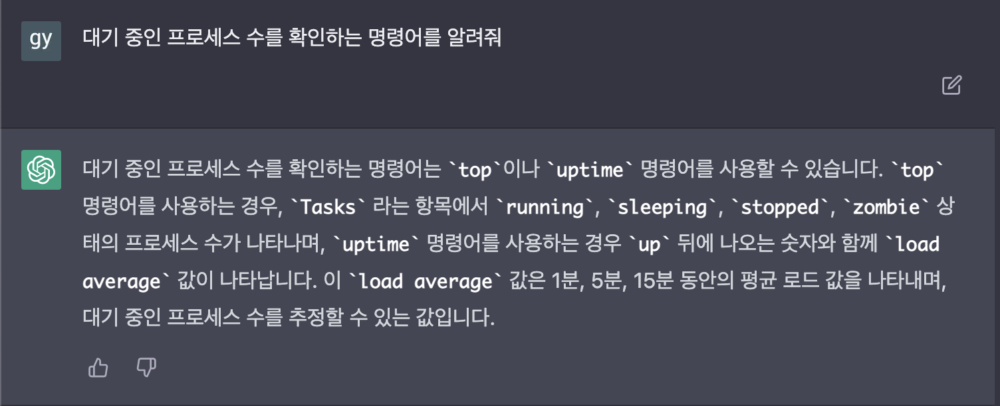
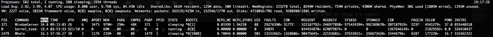

---

layout: post
current: post
cover: assets/built/images/linux/linux_logo.png
navigation: True
title: Load Average란?(chagGPT로 알아보기)
date: 2023-03-11 22:30:00 +0900
tags: [linux]
class: post-template
subclass: 'post tag-linux'
author: GyuhoonK

---
chatGPT로 load average로 파헤쳐보기

### Load Average 알람과의 첫만남
저는 네이버웹툰에서 데이터 엔지니어로서 근무 중입니다. 데이터 엔지니어의 업무 중 하나가 데이터마트를 생성하고 주기적으로 데이터마트가 잘 업데이트되도록 하는 것입니다. 어느날 새로운 데이터마트를 생성해야했었고, 꽤 과거의 기간부터 현재까지의 데이터를 단기간에 적재해야했습니다.  
예를 들어, 2010년 1월 1일부터 현재인 2023년 3월까지의 데이터를 일간 단위(daily)로 적재해야한다면 10년이 넘는, 즉 3650일(회) 이상의 배치 작업을 짧은 기간에 수행해야합니다.  
이런 배치를 수행하는 과정에서 Load Average 알람을 처음 접하게 되었습니다. 해당 배치를 실행하는 서버의 Load average가 임계치를 넘어섰으니 적절한 조치를 취해야한다는 내용이었습니다. 

### Load Average가 뭐지?
해당 알람을 받았지만.. 사실 Load Average가 무엇인지 정확히 몰랐습니다. 서버 구동 시에 관리되는 메트릭이구나, 일정 임계치를 넘어서면 문제가 되는구나, 지금 내가 실행한 작업에 의해 영향이 있을 수 있겠구나 정도만 파악했고 제 작업을 잠시 중단하니 Load Average가 낮아졌습니다.  
서버에서 구동 중인 작업(process)와 연관이 있겠구나 정도만 파악을 했고 정확히 알아보기 위해 검색을 시작했습니다. 운영체제를 좀 더 열심히 공부할 걸 하는 후회와 함께...
그러다가 요즘 무엇인가 공부를 하는데에 chatGPT가 효율적이란 후기들이 생각났고 저도 chagGPT한테 load average에 대해서 물어봤습니다. 

### chatGPT야, Load Average가 뭐야?

 
chatGPT는 깔끔하게 답변해주어서 읽는 것만으로도 대강 어떤 내용인지 이해를 할 수 있었습니다. 
- 현재 시스템이 얼마나 많은 작업을 수행하는지를 판단하기 위한 지표로서 활용된다. 
- 1분, 5분, 15분으로 나누어 실행 중이거나 실행 대기 중인 프로세스의 평균 수를 나타낸다.
- 로드 평균이 1.0이면 완전 과부하 상태이므로 문제가 발생할 수 있다.

구체적인 예시와 함께 해당 내용을 이해하고 싶었습니다. 이번엔 이렇게 질문했습니다.
 

load average의 값이 갖는 의미를 좀 더 자세히 설명해주었고, load average가 높아질 수 있는 경우에 대해서도 설명해주었습니다.  

첫번째 답변에서 load average가 1이라면, **완전 과부하 상태**라고 했는데 두번째 답변에서는 'load average가 1일 수도 있고, 4인 경우가 있을 수도 있다'고 설명했고, 이건 완전 과부하 상태와 전혀 관련 없다는 듯이 설명했습니다. 이 부분이 이해가 가지 않아 다시 질문했습니다. 

 

load average가 1이라면 오히려 정상 작동하고 있을 가능성이 높다고 설명합니다. 그 이유는 CPU 코어가 1개, 2개, 4개인 경우를 생각해보았을 때 각각 CPU 사용률이 100%, 50%, 25%이기 때문이라고 말합니다.   
여기서 조금 헷갈렸지만 다시 생각해보니 chatGPT가 조금 불친절해도 틀린 말은 하지 않았다는 걸 깨달았습니다. CPU 코어가 1개인 경우는 요즘에는 거의 없습니다. 제가 알람을 받았던 서버의 CPU도 24 core CPU였습니다. 24 core CPU에서 load average가 1이라면 CPU를 약 4% 정도만 사용하는 상태입니다. 따라서 대부분의 경우에 load average가 1인 것은 시스템이 정상일 확률이 높다는 설명입니다.  
더불어, chatGPT의 첫번째 답변은 1 core CPU를 상정하고 답변했던 것으로 보입니다. 1 core CPU에서 load average가 1이라면 100%로 사용 중이므로 시스템이 비정상적으로 작동할 것이기 때문입니다.

저의 이런 생각이 맞는지 확인하기 위해 구체적인 예시로 chagGPT에게 다시 질문했습니다.

 

load average에 대해 제가 생각했던 것이 맞았음을 알 수 있었습니다. 

이번엔 구체적으로 load average가 어떻게 계산되는지 알아보고, 직접 제 맥북에 적용하여 계산해보고자 했습니다.

 

chatGPT에 따르면, 로드 평균을 계산하기 위해서 대기 중인 프로세스 수, 실행 중인 프로세스 수, CPU 코어 개수를 알아야합니다. 참고로 현재 제 맥북의 CPU 코어수는 10입니다. 계산을 위해서 프로세스 수를 확인하면 될 것 같습니다. 해당 명령어도 chatGPT에게 물어보았습니다.

 

`top` 명령어를 사용해서 프로세스 개수를 확인해보았습니다.

 

총 프로세스 개수가 582개이고, 580개가 sleeping(대기), 2개가 running(실행)인 상태였습니다. 그런데 chatGPT에 따르면 `실행 중인 프로세스 수=실행 중인 프로세스 수+실행 중인 스레드 수`입니다. 따라서, 현재 실행 중인 스레드 수인 2934도 load average 계산에 포함해야합니다.   
그런데 이렇게 계산하면 (582+2394)/10=297.6으로 터무니없는 값이 나옵니다. 현재 `top` 명령어로 확인되는 load average(`2.92 3.99 4.07`)과도 거의 100배 가까이 차이가 납니다. 

이 이후부터는 `top`, `uptime` 명령어를 사용해가며 확인한 값(프로세스 수와 실제로 표시되는 load avg)을 chagGPT에 제공하며 실제로 load average가 어떻게 계산되는지 확인하려고 했지만 제가 의도한 답변을 받을 수 없었습니다. 그래서 포기하고, 이번엔 제가 직접 구글링해보았습니다. 

### kernel에서 계산하는 load avg
실제로 커널에서 load average를 계산하는 함수는 `calc_load()`라는 함수입니다. 
kernel 2.0.40의 함수가 가장 간단한 형태라 이해하기 편할 것 같아 예시로 가져와보았습니다. 
```c
// kernel/sched.c
static inline void calc_load(unsigned long ticks)
{
    unsigned long active_tasks; /* fixed-point */
    static int count = LOAD_FREQ;

    count -= ticks;
    if (count < 0) {
            count += LOAD_FREQ;
            active_tasks = count_active_tasks();
            CALC_LOAD(avenrun[0], EXP_1, active_tasks);
            CALC_LOAD(avenrun[1], EXP_5, active_tasks);
            CALC_LOAD(avenrun[2], EXP_15, active_tasks);
    }
}
```
`count_active_tasks()` 함수는 active task 개수를 계산하는데 아래와 같은 코드입니다. 
```c
static unsigned long count_active_tasks(void)
{
        return nr_active() * FIXED_1;
}

unsigned long nr_active(void)
{
        unsigned long i, running = 0, uninterruptible = 0;

        for_each_online_cpu(i) {
                running += cpu_rq(i)->nr_running;
                uninterruptible += cpu_rq(i)->nr_uninterruptible;
        }

        if (unlikely((long)uninterruptible < 0))
                uninterruptible = 0;

        return running + uninterruptible;
}
```
`nr_active()`는 nr_running(TASK_RUNNING), nr_uninterruptible(TASK_UNINTERRUPTIBLE)인 프로세스의 개수를 더해서 리턴합니다. 즉, 실행 중인 프로세스와 대기 상태인 프로세스 개수를 계산합니다.  
따라서 지정된 `tick` 단위마다, active task(RUNNING, UNINTERRUPTIBLE)를 계산하여 저장하고 이를 이용하여 load average를 계산한다는 것을 알 수 있습니다.  
이 부분에 대한 이해가 깊지는 않지만, 스레드에 대한 고려는 없는 것으로 보입니다. 따라서 chatGPT가 `실행 중인 스레드의 개수도 더해야한다`고 설명한 부분은 틀린 답변이 아닌가 싶습니다.  
참고로 load average를 보여주는 함수는 아래와 같습니다.
```c
// fs/proc/loadavg.c
static int loadavg_proc_show(struct seq_file *m, void *v)
{
        unsigned long avnrun[3];

        get_avenrun(avnrun, FIXED_1/200, 0);

        seq_printf(m, "%lu.%02lu %lu.%02lu %lu.%02lu %ld/%d %d\n",
                LOAD_INT(avnrun[0]), LOAD_FRAC(avnrun[0]),
                LOAD_INT(avnrun[1]), LOAD_FRAC(avnrun[1]),
                LOAD_INT(avnrun[2]), LOAD_FRAC(avnrun[2]),
                nr_running(), nr_threads,
                task_active_pid_ns(current)->last_pid);
        return 0;
}
```
위 함수는 5개 값, `1분,5분,15분 로드평균 (실행 중인 task개수)/(전체 task 개수) (최근 실행된 task의 PID)`를 보여줍니다.

그렇다면 실제로 보여지는 load average값은 어떻게 계산되는 걸까? tick마다 계산한 모든 값을 저장하고 있다가 평균을 계산할 수도 있겠지만 이런 방법은 너무 많은 자원을 소모합니다. 예를 들어 1초마다 load를 저장하는 경우 1분, 5분, 15분은 각각 60개, 150개, 900개의 값을 저장해야합니다. 따라서, 이전 load average값만을 이용하여 간단하게 계산하는 방법을 도입했고 리눅스는 EMA(Exponential Moving Average)를 사용합니다.

$$
load(t)=load(t-1)e^{\frac{-5}{60m}}+n(t)(1-e^{\frac{-5}{60m}})
$$

- $$m$$: 리포팅을 위한 시간 (1분, 5분, 15분 등)
- $$load(t)$$: 현재의 Load 값
- $$load(t-1)$$: 지난 Load 값
- $$n(t)$$: 현재의 Active Task 개수

여기서 $$e^{-5/60m}$$가 EMA의 가중치 역할($$\alpha$$)을 합니다.
위와 같은 수식은 `sched.h` 헤더파일에서 확인할 수 있습니다. 

```c
/*
 * These are the constant used to fake the fixed-point load-average
 * counting. Some notes:
 *  - 11 bit fractions expand to 22 bits by the multiplies: this gives
 *    a load-average precision of 10 bits integer + 11 bits fractional
 *  - if you want to count load-averages more often, you need more
 *    precision, or rounding will get you. With 2-second counting freq,
 *    the EXP_n values would be 1981, 2034 and 2043 if still using only
 *    11 bit fractions.
 */
extern unsigned long avenrun[];         /* Load averages */

#define FSHIFT          11              /* nr of bits of precision */
#define FIXED_1         (1<<FSHIFT)     /* 1.0 as fixed-point */
#define LOAD_FREQ       (5*HZ+1)        /* 5 sec intervals */
#define EXP_1           1884            /* 1/exp(5sec/1min) as fixed-point */
#define EXP_5           2014            /* 1/exp(5sec/5min) */
#define EXP_15          2037            /* 1/exp(5sec/15min) */

#define CALC_LOAD(load,exp,n) \
        load *= exp; \
        load += n*(FIXED_1-exp); \
        load >>= FSHIFT;
```
load average를 EMA로 계산하기 위해 고정소수점(fixed-point)을 이용하고 있으며, 10 bit는 정수, 11bit는 소수에 할당됩니다.  
1분 load average를 계산하는 경우에, $$e^{-5/60}$$은 부동소수점으로 표현시 약 $$1884$$의 값을 갖습니다.

$$
e^{\frac{-5}{60m}}=0.942...\\
0.942 \times 2^{11} = 1884.250...
$$

`EXP_1, EXP_5, EXP_15`는 부동소수점 계산을 위해 미리 계산해놓은 고정소수점으로 계산된 근사값이며, 이를 이용하여 load average를 계산하고 있습니다.  
`CALC_LOAD` 매크로의 마지막 라인에서 `FSHIFT`(소수부 bit 수)만큼 shift right해주는 이유는 곱셉 결과 소수부가 22 bit로 확장되었기 때문에 이 결과 중에 11 bit만큼만을 소수부로 사용하기 위해서입니다.
따라서, `CALC_LOAD`에서 구현한 식은 $$load(t)$$를 계산하는 수식과 동일한 수식임을 알 수 있습니다.

### 마무리

프로세스들의 CPU 사용량이 높아지면 load average도 증가합니다. 즉, active task의 개수가 많아지는 경우 load average도 증가합니다. 한편, I/O(Disk I/O, Network I/O) 작업이 많아지는 경우에도 load average가 증가할 수 있습니다. 제가 받았던 알람의 경우에 CPU 사용률은 치솟지 않고 load average만 상승했기 때문에 I/O 쪽의 문제가 아닌지 추측하고 있습니다(정확한 원인 파악은 하지 못했습니다).  

chatGPT 덕분에 구글링으로 몇 시간, 혹은 며칠을 고생했을 의문점을 1~2시간 정도만 투자하고 대강의 내용을 파악하고 제가 궁금한 부분을 더 깊게 파볼 수 있었습니다. 글에는 chatGPT에게 load average에 대해서 물어본 부분만 캡쳐하여 올렸지만, 고정소수점의 연산에 대한 이해에서도 chatGPT의 도움을 받았습니다.  
앞으로도 CS 부분에서 모르는 부분은 chatGPT를 이용하여 적극적으로 검색하고 기록해나가야겠습니다!


[참고]  
[Load Average에 대하여](https://lunatine.net/2016/02/19/about-load-average/)  
[고정소수점 구현해보기 1. 사칙연산](https://bab2min.tistory.com/183)