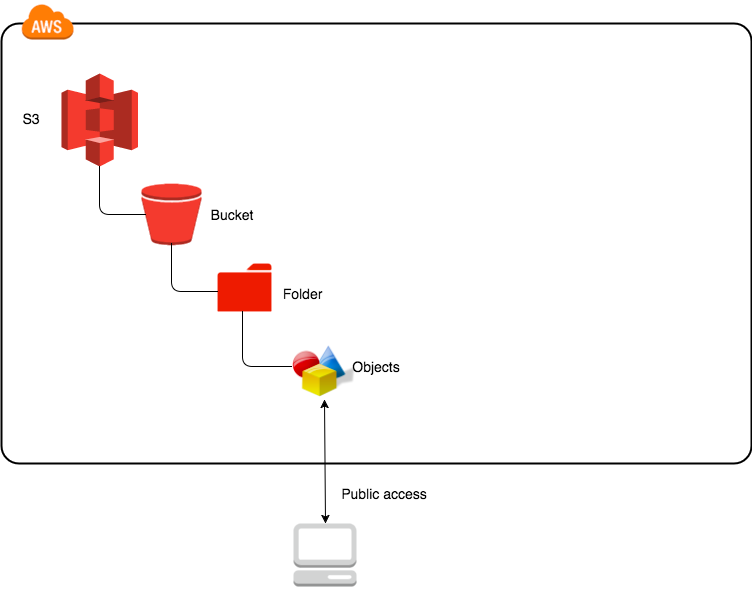

AWS S3 내 zip파일을 다운로드 받지 않고, 내용물만 다운로드 받기





AWS S3 Storage는 위와 같이 Bucket - Container(Folder) - Objects 구조입니다. 따라서 스토리지에 저장된 특정 파일을 다운로드 받고자 하는 경우에, 보통 아래와 같은 코드로 스토리지 내 저장된 파일을 다운로드 받습니다.

```python
import boto3
s3 = boto3.client('s3',
                 region_name = 'us-east-1',
                 aws_acess_key_id=AWS_KEY_ID,
                 aws_secret_access_key=AWS_SECRET)
s3.download_file(
Bucket = 'my_bucket',
Key = 'my_container/my_file.csv'
Filename = 'downloaded_file.csv')
```

위의 예시는 csv 파일이기 때문에, 비교적 간단하게 실행할 수 있습니다.

그렇다면, 다운로드 받고자 하는 object가 **zip파일**과 같은 압축 파일이라면 어떻게 해야할까요?

처음 드는 생각은 

 1. zip파일을 다운로드 한다.

 2. zip파일을 압축 해제하여 원하는 파일을 찾는다.

    

아래와 같은 코드를 실행하면 문제 없이 원하는 파일을 다운로드 받을 수 있습니다.

```python
## [a.csv, b.csv, c.csv] -> [abc.zip]으로 압축되었다고 가정
## a.csv를 다운로드 받으려는 코드

import boto3
s3 = boto3.client('s3',
                 region_name = 'us-east-1',
                 aws_acess_key_id=AWS_KEY_ID,
                 aws_secret_access_key=AWS_SECRET)
s3.download_file(Bucket = 'my_bucket',
                 Key = 'my_container/abc.zip',
                 Filename = 'downloaded_abc.zip')

from zipfile import ZipFile
z = ZipFile('downloaded_abc.zip')
z.extract('a.csv')
z.close()
```

위 코드는 object에 해당하는  ```abc.zip```에 3개의 파일밖에 저장되지 않았으며, 그 용량도 매우 작아 효율성의 문제가 제기되지 않습니다.

그러나 아래와 같은 상황이라면 어떨까요?

1. ```abc.zip``` 내에 10만개의 파일을 압축하고 있지만, 다운로드해야할 파일은 zip파일 내부의 딱 1개인 경우
2. ```abc.zip``` 내에 압축된 파일들의 용량이 매우 크고, 다운로드해야할 파일은 zip파일 내부의 딱 1개인 경우

위와 같은 상황의 공통점은 압축 파일 전체를 다운로드할 필요는 없다는 것입니다. 불필요한 파일들(1개를 제외한 나머지 파일)에 대해서도  DISK IO 작업이 수행되므로, 리소스 측면에서도 시간 측면에서도 손해입니다. 즉, 이러한 두 가지 상황에서는  ```abc.zip```파일을 다운로드 받는 위의 코드는 매우 비효율적이며 시간을 낭비하게 됩니다.

그렇다면, **zip파일을 다운로드 받지 않고, 내부의 압축된 파일 중 특정 파일만 다운로드 받을 수 있는 방법은 무엇일까요?**

이러한 접근을 위해서는, 먼저 ```boto3.resource```  로 object에 접근해야합니다.

object 는 다음 코드로 접근할 수 있습니다.

```python
s3 = boto3.resource('s3',
                 region_name = 'us-east-1',
                 aws_acess_key_id=AWS_KEY_ID,
                 aws_secret_access_key=AWS_SECRET)
s3_object = s3.Object('my_bucket',
                      'my_container/abc.zip')
s3_object
# s3.Object(bucket_name = 'my_bucket', key='my_container/abc.zip')
# A resource representing an Amazon Simple Storage Service (S3) Object 
print(s3_object.content_length) # 전체 파일 길이를 반환(byte)
# 123
print(s3_object.get(Range='bytes=1-3'))
# s3_object의 1바이트 ~ 3바이트에 해당하는 부분을 반환합니다
# 1바이트~3바이트에 해당하는 데이터는 s3_object.get(Range='bytes=1-3')['Body']로 전달됩니다.
# 그럼 어디부터 어디까지 읽어야하는 걸까요? <- 우리가 구현하고자 하는 핵심입니다.
```

Storage로부터 파일에 접근했습니다. 현재 접근한 object에는 HTTP Header가 포함되어 있습니다. 헤더를 제외한 실제 내용물(이 경우에는 압축 파일 내부)만을 찾아서 `ZipFile`에게 전달할 수 있어야합니다!

여기서 우리가 주목해야할 값은 `'Body':StreamingBody()` 입니다. ```StreamingBody()```객체에 실제  AWS S3 Storage에 저장된 object 파일의 정보가 담겨있습니다. 문제는 HTTP Header와 HTTP Body가 구분되지 않는다는 점이죠.

```StreamingBody()```는 다음과 같은 객체입니다.

```python
class botocore.response.StreamingBody(raw_stream, content_length):
'''Wrapper class for an http response body.
This provides a few additional conveniences that do not exist in the urllib3 model:
Set the timeout on the socket (i.e read() timeouts)
Auto validation of content length, if the amount of bytes we read does not match the content length, an exception is raised.'''
close()
'''Close the underlying http response stream.'''
iter_chunks(chunk_size=1024)
'''Return an iterator to yield chunks of chunk_size bytes from the raw stream.'''
iter_lines(chunk_size=1024, keepends=False)
'''Return an iterator to yield lines from the raw stream.
This is achieved by reading chunk of bytes (of size chunk_size) at a time from the raw stream, and then yielding lines from there.'''
next()
'''Return the next 1k chunk from the raw stream.'''
read(amt=None)
'''Read at most amt bytes from the stream.
If the amt argument is omitted, read all data.'''
set_socket_timeout(timeout)
'''Set the timeout seconds on the socket.'''
```

즉, ```s3.Object.get()```를 통해  얻어진 ```StreamingBody```객체는 `s3.Object` 를 호출한 결과물입니다. 그리고 해당 객체는 file-like object로 보여집니다. `read()` 함수를 정의하고 있기 때문입니다. 

`ZipFile`의 정의를 살펴보면, Disk에 존재하는 파일(파일 경로)뿐 아니라, 파일류 객체(file-like object)를 전달할 수 있다고 말하고 있습니다.

```python
class zipfile.ZipFile(file, mode='r', compression=ZIP_STORED, allowZip64=True, compresslevel=None, *, strict_timestamps=True):
'''ZIP 파일을 엽니다, 여기서 file은 파일에 대한 경로 (문자열), 파일류 객체 또는 경로류 객체일 수 있습니다.'''
```

헤더를 제외하고 자동으로 Body를 찾아주길 기대하며, 우리는 ```StreamingBody```를 `zipFile`에 인자로 전달해봅니다!

그러나, 시도해보면 아래와 같은 에러가 나옵니다.

```python
import boto3
from zipfile import ZipFile
s3 = boto3.resource('s3',
                 region_name = 'us-east-1',
                 aws_acess_key_id=AWS_KEY_ID,
                 aws_secret_access_key=AWS_SECRET)
s3_object = s3.Object('my_bucket',
                      'my_container/abc.zip')
streaming_body = s3_object.get()['Body'] # Range를 지정하지 않으면 전체 바이트를 읽어온다
with ZipFile(streaming_body) as z:
  print(z.namelist())
```

```
Traceback (most recent call last):
  File "test.py", line 9, in <module>
    with ZipFile(s3_object["Body"]) as z:
  File "/usr/local/Cellar/python/3.6.4_4/Frameworks/Python.framework/Versions/3.6/lib/python3.6/zipfile.py", line 1108, in __init__
    self._RealGetContents()
  File "/usr/local/Cellar/python/3.6.4_4/Frameworks/Python.framework/Versions/3.6/lib/python3.6/zipfile.py", line 1171, in _RealGetContents
    endrec = _EndRecData(fp)
  File "/usr/local/Cellar/python/3.6.4_4/Frameworks/Python.framework/Versions/3.6/lib/python3.6/zipfile.py", line 241, in _EndRecData
    fpin.seek(0, 2)
AttributeError: 'StreamingBody' object has no attribute 'seek'
```

```seek```이란 함수가 없어, 해당 압축 파일을 해제할 수 없다고 합니다.

그렇다면, 이를 해결하기 위해 `seek` 함수를 정의하고 `ZipFile`을 통해 읽어올 수 있도록 해보겠습니다.

먼저, `ZipFile`에서 필요하다고 말하는 `seek`이란 어떤 함수일까요?

`class.io.IOBase`에서 이를 확인할 수 있습니다.

> seek(offset, whence=SEEK_SET)
> 스트림 위치를 지정된 바이트 offset으로 변경합니다. offset은 whence가 가리키는 위치를 기준으로 해석됩니다. whence의 기본값은 SEEK_SET입니다. whence의 값은 다음과 같습니다:
>
> SEEK_SET 또는 0 – 스트림의 시작(기본값); offset은 0이거나 양수여야 합니다
>
> SEEK_CUR 또는 1 – 현재 스트림 위치; offset은 음수일 수 있습니다
>
> SEEK_END 또는 2 – 스트림의 끝; offset은 일반적으로 음수입니다
>
> seekable()
> 스트림이 무작위 액세스를 지원하면 True를 반환합니다. False이면, seek(), tell() 및 truncate()가 OSError를 발생시킵니다.

이를 참고하여, 새로운 클래스를 정의해봅니다

```python
import io

# io.RawIOBase는 io.IOBase를 상속하는 클래스
class S3File(io.RawIOBase):
    def __init__(self, s3_object):
        self.s3_object = s3_object 
        self.position = 0

    def seek(self, offset, whence=io.SEEK_SET):
        if whence == io.SEEK_SET: # 시작 위치로부터 position설정
            self.position = offset
        elif whence == io.SEEK_CUR: # 현재 위치로부터 position 설정
            self.position += offset
        elif whence == io.SEEK_END: # 끝 위치로부터 offset(음수)만큼 돌아가서 설정
            self.position = self.s3_object.content_length + offset
        else:
            raise ValueError("invalid whence (%r, should be %d, %d, %d)" % (
                whence, io.SEEK_SET, io.SEEK_CUR, io.SEEK_END
            ))

        return self.position

    def seekable(self):
        return True
```

이제, `StreamingBody`를 읽어올 수 있을까요? 아래 코드를 실행해보았지만 아쉽게도 에러가 발생했습니다.

```python
import boto3
s3 = boto3.resource('s3',
                 region_name = 'us-east-1',
                 aws_acess_key_id=AWS_KEY_ID,
                 aws_secret_access_key=AWS_SECRET)
s3_object = s3.Object('my_bucket',
                      'my_container/abc.zip')
s3_file = S3File(s3_object)
with ZipFile(s3_file) as z:
  print(z.namelist())
```

```
Traceback (most recent call last):
  File "example.py", line 38, in <module>
    with zipfile.ZipFile(s3_file) as zf:
  File "/usr/local/Cellar/python/3.6.4_4/Frameworks/Python.framework/Versions/3.6/lib/python3.6/zipfile.py", line 1108, in __init__
    self._RealGetContents()
  File "/usr/local/Cellar/python/3.6.4_4/Frameworks/Python.framework/Versions/3.6/lib/python3.6/zipfile.py", line 1171, in _RealGetContents
    endrec = _EndRecData(fp)
  File "/usr/local/Cellar/python/3.6.4_4/Frameworks/Python.framework/Versions/3.6/lib/python3.6/zipfile.py", line 251, in _EndRecData
    data = fpin.read()
NotImplementedError
```

`read` 를 구현해주어야할 것 같습니다. `io.RawIOBase` 를 보면 이 함수의 역할은 다음과 같다고 합니다.

> read(size=-1)
> 객체에서 최대 size 바이트를 읽고 반환합니다. 편의상, size가 지정되지 않거나 -1이면, EOF까지의 모든 바이트가 반환됩니다. 그렇지 않으면, 하나의 시스템 호출만 수행됩니다. 운영 체제 시스템 호출이 size 바이트 미만을 반환하면 size 바이트 미만이 반환될 수 있습니다.
> 0바이트가 반환되고, size가 0이 아니면, 파일의 끝을 나타냅니다. 객체가 비 블로킹 모드이고 사용 가능한 바이트가 없으면 None이 반환됩니다.
> 기본 구현은 readall()과 readinto()로 위임합니다.

이제 `ZipFile` 에서 파일을 읽기 위해 필요한 `read`함수를 구현해봅니다.

```python
class S3File(io.RawIOBase):
    ...

    @property
    def size(self):
        return self.s3_object.content_length

    def read(self, size=-1):
        if size == -1:
            # 함수 정의에 따라, EOF까지의 바이트를 반환
            range_header = "bytes=%d-" % self.position
            self.seek(offset=0, whence=io.SEEK_END)
        else:
            # new_position 설정
            new_position = self.position + size
            # content_length(size)를 넘긴 경우, EOF까지의 바이트를 반환
            if new_position >= self.size:
                return self.read()
						
            range_header = "bytes=%d-%d" % (self.position, new_position - 1)
            self.seek(offset=size, whence=io.SEEK_CUR)
				# rage_header에서 지정한 만큼만, StreamingBody로부터 읽어들여옵니다
        return self.s3_object.get(Range=range_header)["Body"].read()

    def readable(self):
        return True
```

`read`가 구현되었므로, 이제 `ZipFile`을 실행하게 되면, 사용하는 환경에 따라 일정 Byte를 읽어들여오고 해당 Byte에서 실제 파일이 존재하는 부분을 추출합니다. 몇 번의 `read`를 통해 현재 위치(`self.position`)을 바꿔가며`s3.Object`에서 헤더는 제외하고 압축된 파일 내용인  Body만을  읽어들일 것입니다. 우리는 이러한 부분까지는 구현할 필요가 없습니다. 지금까지 작업한 내용을 통해 `ZipFile`이 위의 과정(헤더 스킵하기 위해 `seek`, `read`)을 하기 위해 필요한 함수를 정의했기 때문이죠!

이제 다시 코드를 실행해보겠습니다.

```python
import boto3
s3 = boto3.resource('s3',
                 region_name = 'us-east-1',
                 aws_acess_key_id=AWS_KEY_ID,
                 aws_secret_access_key=AWS_SECRET)
s3_object = s3.Object('my_bucket',
                      'my_container/abc.zip')
s3_file = S3File(s3_object)
with ZipFile(s3_file) as z: # 이제 ZipFile은 s3_object의 내용을 읽을 수 있습니다!!
  print(z.namelist())
# [a.csv, b.csv, c.csv]
```

이제 `ZipFile` 은 `s3.Object`에서 압축된 파일만을 읽어들일 수 있습니다!

나아가, 압축 파일 내에 어떤 파일이 있는지 알고 있다면 바로 파일을 다운로드 받을 수도 있습니다.

```python
import boto3
s3 = boto3.resource('s3',
                 region_name = 'us-east-1',
                 aws_acess_key_id=AWS_KEY_ID,
                 aws_secret_access_key=AWS_SECRET)
s3_object = s3.Object('my_bucket',
                      'my_container/abc.zip')
s3_file = S3File(s3_object)
with ZipFile(s3_file) as z:
  z.extract('a.csv')

```

기존 방법에 비해 빠를까요? 실험해보겠습니다.

```python
# abc.zip에 400개의 파일을 압축했습니다.
# 방법 1 : zip 다운로드 이후 압축 해제
import boto3
from zipfile import ZipFile

s3 = boto3.client('s3',
                 region_name = 'us-east-1',
                 aws_acess_key_id=AWS_KEY_ID,
                 aws_secret_access_key=AWS_SECRET)
s3.download_file(Bucket = 'my_bucket',
                 Key = 'my_container/abc.zip',
                 Filename = 'downloaded_abc.zip')

z = ZipFile('downloaded_abc.zip')
z.extract('a.csv')
z.close()
# 9.74s 소요

# 방법 2 : 정의한 S3File을 이용하여 zip 압축 내 필요 파일만 다운로드
s3 = boto3.resource('s3',
                 region_name = 'us-east-1',
                 aws_acess_key_id=AWS_KEY_ID,
                 aws_secret_access_key=AWS_SECRET)
s3_object = s3.Object('my_bucket',
                      'my_container/abc.zip')
s3_file = S3File(s3_object)
z = ZipFile(s3_file)
z.extract('a.csv')
z.close()
# 475ms 소요 (약 0.5초)
```

거의 20배 가까이 속도 차이가 납니다! 나머지 399개 파일에 대한 DISK IO가 발생하지 않았기 때문이죠.

파일 개수가 많을수록, 그리고 용량이 클수록 이러한 시간 차이는 더 커질 것입니다.


[참고] https://alexwlchan.net/2019/02/working-with-large-s3-objects/
