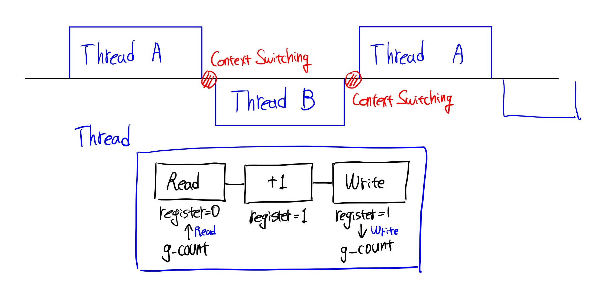
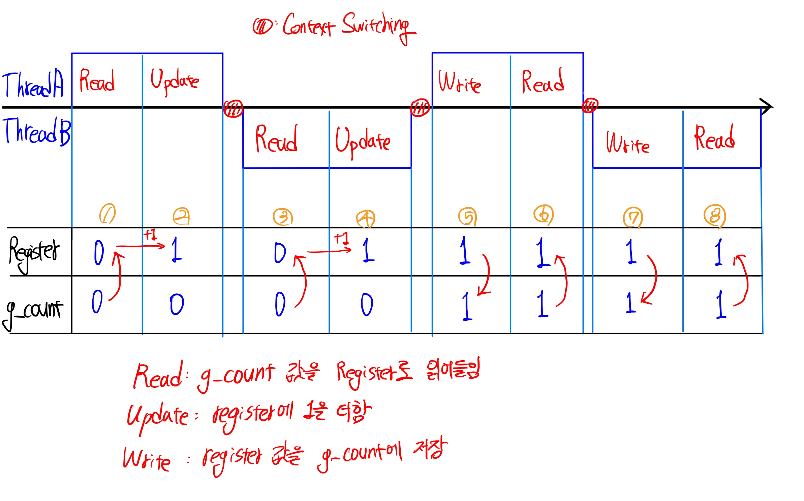
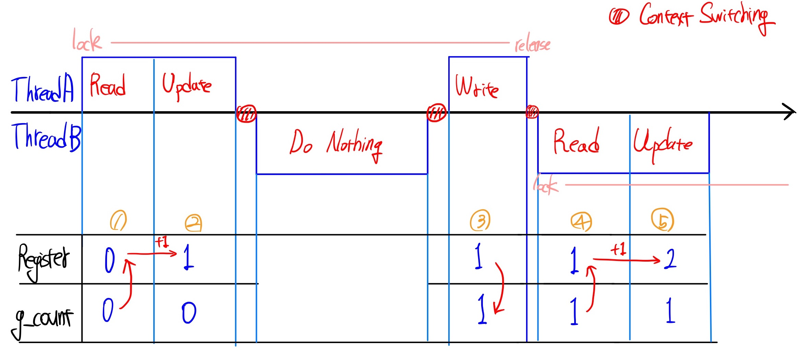

Python - Thread, Mutex, Semaphore

# Thread란 ?

간단하게, 하나의 Process 내에서 여러 개의 작업을 실행할 수 있도록 구현하는 것을 thread라고 합니다. 일반적으로 Process는 하나의 작업만을 CPU에서 실행하도록 구현되지만, Thread를 선언하여 하나의 Process가 여러 개의 Process처럼 동작하도록 합니다. 이는 IPC(InterProcessCommunication)과 비슷한 개념이지만, Thread는 하나의 Process 내에서 여러 작업을 실행하는 것인데 비해 IPC는 다수의 Process가 데이터를 공유한다는 점에서 차이가 있습니다.

예를 들어, 하나의 thread는 데이터를 처리하는 역할만 수행하고 다른 thread는 데이터 처리 결과를 시각화하는 역할만 수행한다면 데이터를 처리하면서 동시에 실시간으로 데이터가 처리되는 결과를 확인할 수 있습니다. IPC도 같은 목적을 가지고 있습니다.

Thread는 Process 내의 메모리 공간(Text(Code), Data, Heap)을 공유하기 때문에 Kernel Space를 다루어야하는 IPC에 비해 덜 복잡하게 구현할 수 있습니다.

|                  | Thread                                                       | IPC                                                          |
| ---------------- | ------------------------------------------------------------ | ------------------------------------------------------------ |
| 메모리 공간 공유 | - 각 thread는 stack 영역을 할당<br>- Text, Data, Heap 영역에서 thread 간 데이터 공유됨 | Kernel Space만 공유됨                                        |
| 메모리 사용      | 4GB 내에서 multi-thread 구현                                 | (Process 개수) * 4GB 필요                                    |
| 구현 방법        | Library로 제공됨                                             | -Kernel Space를 경유(Pipe, Shared Memory, message queue)<br>- Process Signal, Socket 이용 |

# Threading in Python

python은  `threading` 패키지를 통해 thread를 간단하게 구현할 수 있습니다.

10000번을 카운팅하는 함수를 50회 실행하고자 한다고 가정해보겠습니다. 

이는 아래처럼 thread를 통해 병렬로(동시에) 실행할 수 있습니다.

```python
import threading

# thread할 함수 정의
def thread_main():
  global g_count
  for i in range(10000): 
    g_count = g_count + 1
    
threads = []
for i in range(50): 
    th = threading.Thread(target = thread_main)
    threads.append(th)

g_count = 0
for th in threads: 
    th.start()
    
for th in threads:
    th.join()
print('g_count = ', g_count)
# g_count = 500000
```

현재 Process 내에서 50개의 thread가 구현되었고 이들은 10000번 카운팅하는 `thread_main` 함수를 동시에 실행합니다.

이번에는 10000번이 아니라 1000000번 카운팅하는 것으로 변경하여 thread를 실행해보겠습니다.

```python
import threading

# thread할 함수 정의
def thread_main():
  global g_count
  for i in range(1000000): 
    g_count = g_count + 1
    
threads = []
for i in range(50): 
    th = threading.Thread(target = thread_main)
    threads.append(th)

g_count = 0
for th in threads: 
    th.start()
    
for th in threads:
    th.join()
print('g_count = ', g_count)

# g_count =  13291376
# CPU times: user 3.13 s, sys: 29.5 ms, total: 3.16 s
# Wall time: 3.14 s
```

출력 결과가 50 * 1000000 = 50000000가 나와야할 것 같은데 전혀 이상한 값이 출력되었습니다.

이러한 현상이 발생하는 이유는 무엇일까요?

# Critical Section

thread들이 Process 내 메모리 공간을 공유하면서 이러한 문제점이 발생합니다.

위 코드를 간단하게 2개 thread로 바꾸어 보면 아래와 같은 그림이 될 것입니다.




`g_count` 값을 register로 읽고(Read), register에 1을 더한 뒤(Update) 해당 값을 다시 `g_count` 에 Write해주는 일련의 과정을 thread들이 수행합니다. 이때 하나의 CPU에서는 위 그림처럼 Thread A - Thread B가(혹은 더 많은 수의 thread가) Contetxt Switching을 통해 교체해가며 해당 작업을 수행합니다. 현재 구현한 Thread를 Read-Update-Write라고 생각하면 위와 같이 덧셈이 누락된 원인이 무엇인지 추론해볼 수 있습니다.

Context Switching이 정말 운 좋게도, 항상 Write가 끝난 뒤에 발생한다면 좋겠지만 실제 Scheduler는 그러한 부분까지 고려하여 Switching 시키지 않습니다.



위 그림처럼, Update 단계 이후 Write하기 직전에 Context Switching이 발생할 수 있습니다. 단계별로 어떤 일이 발생했는지 알아보겠습니다.

① Read : Thread A는 `g_count` 를 읽고 register에 저장합니다. ( `g_count = 0`)

② Update :  `g_count` 에 1을 더하기 위해, register에 1을 더합니다.

③ Read : Context Switching이 발생하여, Thread A의 작업 정보는 PCB로 저장(`register=1`)하고, Thread B를 실행합니다. 이제는 Thread B가 다시 `g_count` 값을 register로 읽어옵니다.( `g_count = 0`)

④ Update : Thread A의 동작과 마찬가지로 `g_count` 에 1을 더하기 위해, register에 1을 더합니다.

⑤ Write : Context Switching이 발생하여 Thread A가 다시 실행됩니다. PCB에서 register값을 읽어들여옵니다(`register = 1`). 이제 register의 값을 `g_count` 에 적어야합니다. Thread B에 의해 업데이트된 현재 register 값은 1이므로 `g_count`는 1이 더해졌습니다. `g_count = 1`

⑥ Read : 다음 작업을 위해 다시 `g_count` 값을 register에 등록합니다.

⑦ Write : Context Switching이 발생하고, Thread B의 PCB에서 register를 읽습니다(`register=1`). 이번에는 Thread B가 `g_count`에 값을 저장합니다. 현재 register 값이 1이므로 1을 그대로 `g_count`에 전달합니다. 

이 시점에서 Thread 작업은 2번 완료되었으므로 `g_count`는 2가 되어야하지만 1번의 덧셈이 누락되어 1이 되었음을 확인할 수 있습니다. 

위와 같은 문제점이 발생하는 이유는 Thread 간 공유되는 변수에 동시에 여러 Thread가 동시에 접근하고 있기 때문입니다. 이처럼, Thread가 동시에 접근하는 경우에 연산 결과, 혹은 데이터 누락이 발생할 수 있는 영역을 **Critical Section**(임계영역)이라고 부릅니다.

결과적으로 연산 결과가 13291376와 같이 이상한 값이 출력되는 이유는 카운팅할 숫자가 많아짐에 따라 위 예시 같은 경우들이 다수 발생하였고, 이에 따라 누락된 카운팅이 발생한 것입니다.

# Synchronization - Mutex

이러한 Critical Section에서 발생하는 문제점을 해결하는 방법을 동기화(synchronization)라고 부릅니다. 상호배제(Mutual Exclusion, MutEx)는 이러한 문제점을 해결하기 위한 동기화 방법 중 하나입니다.

python에서는 간단하게, `threading.lock()` 을 통해 상호배제 동기화를 지원하고 있습니다.

```python
import threading
from threading import Lock

lock = Lock()

def thread_main_mutex():
  global g_count
  lock.acquire() # 아래 코드 블록은 한번에 하나의 thread에 의해서만 실행됩니다
  for i in range(1000000):
  	g_count += 1 
  lock.release() # lock 해제
    
threads = []
for i in range(50): 
    th = threading.Thread(target = thread_main_mutex)
    threads.append(th)

g_count = 0
for th in threads: 
    th.start()
    
for th in threads:
    th.join()
print('g_count = ', g_count)

# g_count =  50000000
# CPU times: user 3.02 s, sys: 9.92 ms, total: 3.03 s
# Wall time: 3.03 s
```

위 코드에서 동기화가 어떻게 작동하는지 단순하게 그려보면, 아래 그림과 같습니다.



`lock()`, `release()` 을 적용하게 되면, 위 그림처럼 동작합니다. Thread A가 critical section에서 작업을 하는 동안, Thread B는 critical section의 데이터을 읽거나, 쓸 수 없습니다. 따라서 덧셈(카운팅)이 누락되는 경우가 발생하지 않아 출력 결과가 50000000이 나오는 것을 확인할 수 있습니다.

# Synchronization - Semaphore 

또 다른 동기화 방법에는 Semaphore가 있습니다. critical section에 동시에 접근할 수 있는 thread를 관리한다는 개념은 같지만, mutex가 이를 1개로 지정하는 것에 비해, semaphore는 N개의 thread가 접근할 수 있도록 지정합니다.

즉, mutex는 semaphore 동시에 접근 가능한 thread를 1개로 지정한 경우(binary semaphore)로 볼 수 있습니다.

```python
import threading
from threading import Semaphore

sem = Semaphore(2)

def thread_main_semaphore():
    global g_count
    sem.acquire() # 아래 코드 블록은 2개 thread가 동시에 실행할 수 있습니다
    for i in range(1000000):
        g_count += 1
    sem.release()
    
threads_sem = []

for i in range(50): 
    th = threading.Thread(target = thread_main_semaphore)
    threads_sem.append(th)
    
g_count = 0        
for th in threads_sem: 
    th.start()
    
for th in threads_sem:
    th.join()
print('g_count = ', g_count)

# g_count =  33725184
# CPU times: user 3.07 s, sys: 17.1 ms, total: 3.08 s
# Wall time: 3.08 s
```

동기화를 사용하지 않았던 케이스처럼, Semaphore를 지정하는 경우에도 2개 thread가 동시에 접근하게 되므로 덧셈 누락이 발생합니다. 그러나 `g_count` 값이 33725184로 동기화를 적용하지 않았던 케이스가 13291376인 것과 비교한다면 꽤 많은 덧셈 누락을 방지할 수 있는 것으로 보입니다.


위 세 가지(동기화 적용 안함, mutex, semaphore)의 계산 결과와 걸리는 시간을 비교해보면서 글을 마치겠습니다.

1000000으로는 시간 차이가 극명하게 드러나지 않기 때문에 각 thread가 10000000번 카운팅하는 것으로 셋팅하고 실험했습니다.

|                          | time  | g_count   | success rate |
| ------------------------ | ----- | --------- | ------------ |
| No threading             | 31.9s | 500000000 | 100%         |
| Only threading           | 31.0s | 32379893  | 6.48%        |
| threading with mutex     | 30.8s | 500000000 | 100%         |
| threading with semaphore | 30.6s | 327324001 | 65.46%       |

Q. critical section에 제약을 걸지 않은 Only threading이 mutex, semaphore를 적용한 케이스보다 더 빨리 수행되어야할 것 같은데 더 긴 시간이 소요되었습니다. 이유를 공부해서 아래에 추가하겠습니다..!


[참고]

패스트캠퍼스 - 컴퓨터 공학 전공 필수 올인원 패키지 Online.

