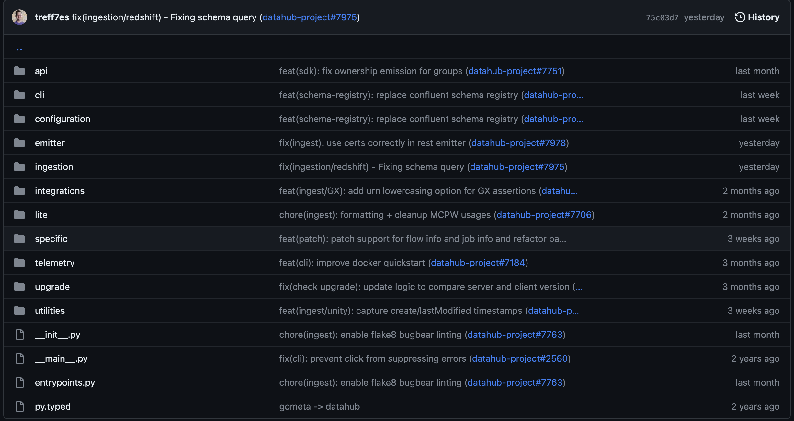
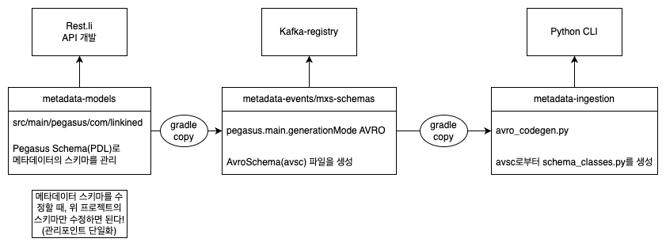

DataHub에서 avro schema 파일(avsc)을 사용하는 방법

### DataHub CLI 패키지
DataHub는 DataHub API를 python 패키지로 제공하고 있습니다. [acryl-datahub](https://pypi.org/project/acryl-datahub/)

```shell
$ pip install 'acryl-datahub[datahub-rest]'
$ datahub ingest -c ./examples/recipes/mssql_to_datahub.dhub.yml
```

`acryl-datahub[datahub-rest]`를 설치하면, python 코드 내에서 datahub 패키지를 사용할 수 있습니다. datahub 패키지 내에는 DataHub에서 사용하는 메타데이터의 스키마를 정의해놓은 `schema_classes`도 있습니다.

```python 
from datahub.metadata.schema_classes import DatasetSnapshotClass
```

`schema_classes`는 DataHub의 서브 프로젝트 중 `metadata` 모듈이 속해 있는 `metadata-ingestion`에서 관리됩니다.

### metadata.schema_classes는 어디에 있는거지?

DataHub에서 메타데이터의 스키마를 어떻게 정의하고 있는지 확인하고 싶어서, git repo에서 배포되고 있는 소스코드를 찾아보았습니다([metadata-ingestion/src/datahub](https://github.com/acryldata/datahub/tree/master/metadata-ingestion/src/datahub)).
그런데 `metadata-ingestion`의 소스코드(`datahub/metadata-ingestion/src/datahub`)에서는 `meatadata` 모듈을 찾을 수 없었습니다.



`meatadata` 모듈을 미리 작성해놓지 않고, 빌드에 의해 생성되는 것으로 추측했습니다. 빌드 파일(`datahub/metadata-ingestion/build.gradle`)에서 `metadata` 모듈에 해당하는 소스코드를 생성하는 task를 확인할 수 있었습니다.

`build.gradle`에 정의된 codegen task에서 `metadata` 모듈을 생성합니다.

```gradle
task codegen(type: Exec, dependsOn: [environmentSetup, installPackage, ':metadata-events:mxe-schemas:build']) {
  inputs.files(project.fileTree(dir: "../metadata-events/mxe-schemas/src/", include: "**/*.avsc"))
  outputs.dir('src/datahub/metadata')
  commandLine 'bash', '-c', "source ${venv_name}/bin/activate && ./scripts/codegen.sh"
}
```

위 task는 아래처럼 간단하게 3가지 단계로 요약할 수 있습니다.
1. `metadata-events` 내부의 avro schema 파일(avsc)을 읽는다
2. `codegen.sh`를 실행하여 1에서 읽은 파일을 python 파일로 변환한다
3. 변환한 파일은 `src/datahub/metadata`에 저장한다

`codegen.sh`는 `avro_codegen.py` 스크립트를 실행합니다. avsc에서 읽은 정보를 재조합하여 python 파일(`metadata` 모듈)을 생성할 수 있는 로직을 담고 있습니다.

그렇다면 `metadata-events`에 avsc 파일이 존재할 것이라고 예측하고 해당 서브 프로젝트를 살펴보았습니다.

### metadata-events: Avro Schema(avsc) 생성하기

`metadata-ingestion`에서 python 패키지 빌드하기 위해 사용하는 avsc 파일도 `metadata-events`를 빌드하여 생성해야했습니다. 즉, DataHub 프로젝트는 서브 프로젝트들 간에 의존성(dependency)을 갖습니다. 
avsc 파일을 생성하기 위해서는 `metadata-events` 중 `mxe-schemas`를 빌드해야합니다. `metadata-events/mxe-schemas/build.gradle`은 아래와 같습니다. 

```gradle
// `datahub/metadata-events/mxe-schemas/build.gradle`
task copyMetadataModels(type: Copy) {
  from("../../metadata-models/src/main/pegasus/")
  into file("src/main/pegasus")
}

generateAvroSchema.dependsOn copyMetadataModels
pegasus.main.generationModes = [PegasusGenerationMode.PEGASUS, PegasusGenerationMode.AVRO]

task copyOriginalAvsc(type: Copy, dependsOn: generateAvroSchema) {
  from("src/mainGeneratedAvroSchema/avro")
  into file("src/renamed/avro")
}
```

위 빌드를 간단하게 텍스트로 요약해보면 아래 3단계를 거칩니다. 

1. 서브 프로젝트 `metadata-models`의 소스 파일을 복사해온다(`copyMetadataModels`)
2. 복사해온 소스 파일을 이용하여 PEAGASUS, AVRO 포맷의 파일을 생성한다(`egasus.main.generationModes`)
3. 생성된 AVSC 파일은 `src/renamed/avro` 경로에 복사한다(`copyOriginalAvsc`)

서브프로젝트 `metadata-ingestion`에서 참조하고 있는 avsc 파일 경로는 `"**/*.avsc"`이기 때문에 3번 과정에서 생성된 avsc 파일(`src/renamed/avro` 하위에 있는 avsc 파일들)을 참조합니다.

### `avro_codegen.py`는 어떻게 모듈을 생성하지?

다시 `metadata-ingestion` 서브 프로젝트로 돌아와서 생성된 ascv 파일을 읽고 `meatadata` 모듈을 생성하는 지 확인해보았습니다. 

`avrogen.write_schema_files`를 실행하여 소스코드를 생성합니다.

`write_schema_files`는 `avro.schema.make_avsc_object`를 통해 생성된 avro schema 객체를 입력받아 `schema_classes.py`를 작성합니다.

입력받는 avro schema 객체는 `avro.schema.make_avsc_object`로 생성됩니다. json파일을 읽어서 avro schema 객체를 생성하는 역할입니다. 

따라서 `avro_codegen.py`를 간소화하면 아래와 같은 과정을 수행합니다.

```python
from avrogen import write_schema_files

# 생성된 avsc 파일들을 json 형태로 읽어들입니다
for schema_file in schema_files:
        schema = load_schema_file(schema_file)
        schemas[Path(schema_file).stem] = schema

# 생성된 avro schema 객체를 하나의 객체로 합칩니다
merged_schema = merge_schemas(list(schemas.values()))

# 하나의 객체로 합친 결과를 `schema_classes.py`로 작성합니다
write_schema_files(merged_schema, outdir)
```

### 왜 이런 구조를 사용하는걸까?

애초에 왜 이렇게 복잡한 구조를 사용하는걸까요? 아래와 같은 의문이 생기지 않을 수 없었습니다.

- 처음부터 `schema_classes.py` 파일도 작성하면 되는거 아닌가? avsc 파일 생성할 때는 클래스 별로 잘 생성하던데 왜 여기는 모든 클래스를 뭉뚱그려서 넣어놨지..?
- avsc 파일은 왜 생성되도록 만들어놓은거야? 모든 프로젝트에서 참조하는 스키마라면 그냥 하드코딩되있어도 괜찮은 것 아닌가?
- 이런 구조가 다른 오픈소스들에서도 자주 사용되는 구조인건가? avro 패키지에 코드 생성 함수가 있는 걸 보면 그런 것 같기도 하고...

이런 의문들은 위 과정들을 다시 한번 살펴보면서 어느 정도 해소되었습니다.

#### DataHub는 Rest.li, kafka, python 에서 동일한 스키마를 사용해야한다

DataHub는 크게 3가지 기술을 이용하여 구성되어 있습니다. 
- Rest.li Framework: `meatadata-service`에서 API를 구현하기 위해 사용됩니다. 
- Kafka: 정확히는 kafka-registry에서 해당 topic이 지정한 schema 형태를 갖추었는지 확인합니다.
- Python: CLI를 구현하기위해 사용합니다. 

그런데 이 3가지 기술 스택이 각각 사용하는 스키마 형태(포맷)이 다릅니다. 
- Rest.li Framework: PDL Schema(Pegasus)를 이용합니다 ([PDL Schema](https://linkedin.github.io/rest.li/pdl_schema))
- Kafka-registry: avro(avsc)를 이용하여 스키마를 등록합니다. 
- Python: 클래스를 선언하여 해당 포맷을 관리합니다.

따라서 Avro만으로 스키마를 작성한다면, Rest.li에서는 이를 사용할 수 없고, PDL을 따로 작성해야합니다. 
이런 문제를 해결하기 위해 DataHub 개발자들은 Pegasus로만 스키마(PDL)를 작성했습니다. 이후에 avro 스키마가 필요할 때마다, 스키마를 생성하는 task(`pegasus.main.generationModes`)를 이용해서 Avro Schema 파일(avsc)를 생성합니다. 

이런 구조를 가지게 되면, 결과적으로 프로젝트의 전체 구조를 볼 때, PDL 한가지만 수정하면 Kafka에서 사용하는 avsc 파일과 Python에서 사용하는 `schema_classes.py`는 자동으로 생성하는 아키텍쳐를 갖습니다. 관리 포인트가 한가지로만 줄어드는 것입니다.




#### 스키마 공유(Sharing Schema)

이런 사례가 있는지 StackOverflow에 검색을 해봤습니다.

- [How to share avro schema between different microservices?](https://stackoverflow.com/questions/69919046/how-to-share-avro-schema-between-different-microservices)

위 포스트의 질문은 다음과 같습니다.

> avro 스키마(avsc)를 사용하고 있는데, 다른 기술 스택(kotlin)을 사용하는 팀에게 이걸 공유할 수 있는 좋은 방법이 있을까요?

위 질문은 kotlin과 공유하기 위한 방법을 묻고 있기 때문에 답변들은 maven build를 이용할 것을 권장합니다. 즉, 수동으로(manually) 스키마 파일을 하나하나 클래스로 옮기는 것은 절대 해서는 안되고 DataHub처럼 자동으로 빌드할 수 있는 방법을 마련해야한다는 것입니다.

DataHub는 gradle을 통해 이를 자동화하였고, maven을 통해 avsc로부터 클래스를 자동으로 생성하는 방법은 [avro-schema-examples](https://github.com/zolyfarkas/avro-schema-examples)에서 확인할 수 있습니다.


### 정리

- avro schema를 python 클래스로 사용하기 위해서는 `avro, avrogen` 패키지를 이용한다.
- 마이크로서비스 개발 시에 서로 다른 기술 스택에서 공통 스키마를 공유하는 아키텍쳐는 (당연히) 존재한다.
- avro schema를 공유하기 위한 방법은 gradle, maven과 같은 빌드 툴을 통해 반드시 자동화되어야 한다.