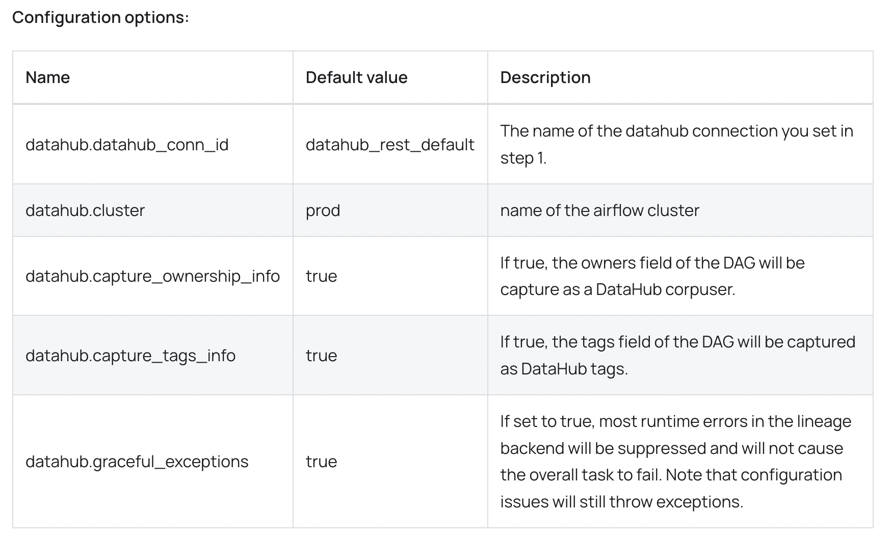
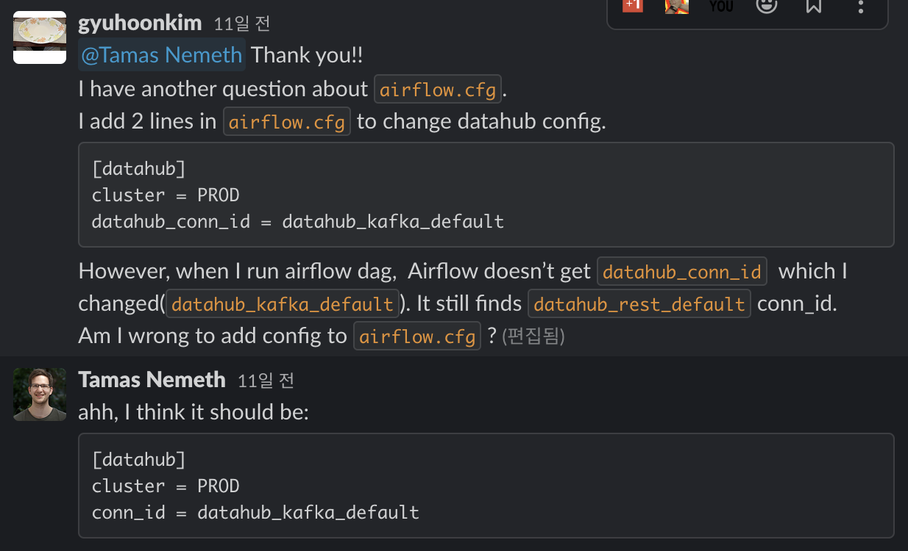
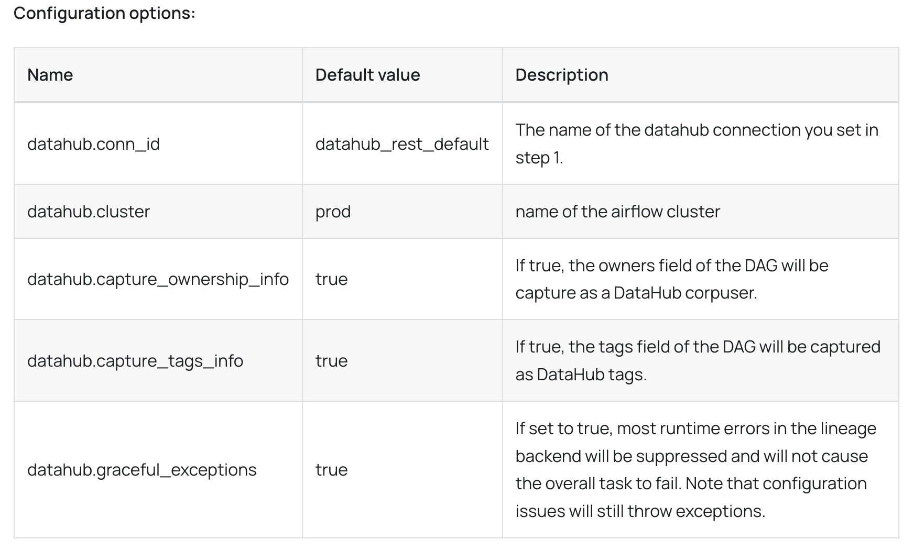
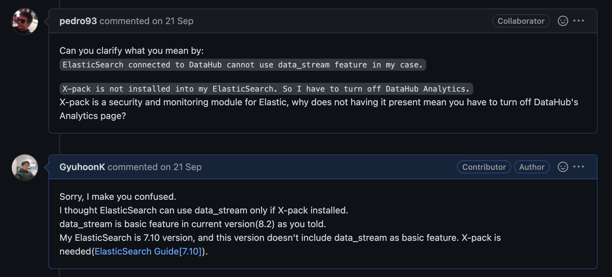

오픈소스 컨트리뷰션 회고

# DataHub

저의 첫 컨트리뷰션의 대상이 된 오픈소스는 [DataHub](https://datahubproject.io/)입니다. DataHub는 데이터 디스커버리 플랫폼입니다. [Demo 사이트](https://demo.datahubproject.io/) 에 접속해보시면 어떤 역할을 하는 플랫폼인지 직관적으로 이해할 수 있습니다. 수 많은 데이터들이 다양한 데이터베이스에 저장되고, 데이터베이스 내에서도 수 많은 테이블로 저장되고 있습니다. DataHub는 이러한 데이터들의 메타데이터를 한 곳에 모아 한눈에 볼 수 있는 기능을 제공합니다.

저는 DataHub를 사내에 도입하는 과정에서 수정이 필요한 부분을 발견했습니다. 물론 사내에 도입하는 과정에서 해당 부분을 수정하여 배포하였습니다. 여기에 추가로 제가 수정한 부분을 컨트리뷰션해보았습니다!

# What to Contribute? 

## 1. typo in guide

가장 먼저 컨트리뷰션 한 내용은 오타 수정입니다. DataHub는 Airflow의 DAG 메타 정보(tag, run list 등)를 입력받을 수 있습니다. 이를 위해서는 Airflow에 DataHub에서 개발한 라이브러리를 설치하고 Airflow와 DataHub를 연결하는 connection을 생성해야합니다.

connection은 DataHub의 GMS 컴포넌트 혹은 DataHub와 연결된 Kafka 중 하나를 선택해야합니다. 저는 Kafka와 연결하기를 희망했고 이 과정에서 공식문서를 참고하여 수정을 진행했습니다.



`airflow.cfg` 를 아래와 같이 수정했지만, Kafka와 연결되지 않았고 여전히 GMS와 연결되고 있었습니다.

```
# airflow.cfg
[datahub]
datahub_conn_id = datahub_kafka_default
```

위와 같이 config 파일을 수정하는 것이 맞는지 DataHub에서 운영하는 커뮤니티 채널 중 Slack에 문의했고, 개발자로부터 아래와 같은 답변을 받았습니다.



`datahub_conn_id`가 아니라 `conn_id`로 입력한 결과 Airflow가 Kafka와 연결되는 것을 확인할 수 있었습니다. 즉시 수정이 가능한 간단한 부분이라 PR을 생성하여 문서 수정을 요청하였습니다.


명백한 오타였고, 개발자와 나눈 대화를 첨부했기에 따로 질문 없이 거의 즉시 approval되어 반영되었습니다. 현재는 수정된 상태인 것을 확인할 수 있습니다.



## 2. bug fix

### Problem

두번째 케이스는 위보다는 조금 복잡합니다. Datahub Usage Analytics, Data Landscape Summary가 문제였습니다. 먼저, Datahub Usage Analytics는 DataHub 유저 로그를 트래킹하여 분석 결과를 제공합니다. [analytics 탭](https://demo.datahubproject.io/analytics)에서 확인할 수 있는데, 접속한 유저수, 검색량, 검색 쿼리, 액션과 같은 데이터를 제공합니다. Data Landscape Summary 역시 analytics 탭에 접속하여 확인해야하는데 해당 기능이 제공하는 정보는 현재 DataHub에서 관리되고 있는 메타데이터에 대한 개요(summary)를 보여줍니다.

위 2개의 기능은  모두 analytics 탭을 통해 접근하여 확인해야한다는 공통점이 있지만, 개발자의 입장에서 볼 때 서로 관련이 있는 기능은 아닙니다.

DataHub Usage Anlytics의 경우에는 배포 시에 helm chart에서  `global.datahub_analytics_enabled` 을 `true`로 셋팅하는 경우에만 유저 트래킹을 할 수 있습니다. 해당 옵션이 `true`로 설정되면 ElasticSearch 내부에서  `data_stream` 기능을 사용하는 인덱스(`datahub_usage_event`)를 생성하여 해당 인덱스로부터 대쉬보드에 정보를 뿌려줍니다.

반대로 Data Landscape Summary는 사용을 위해 따로 기능이 필요하지 않습니다. 이미 ingestion이 완료된(DataHub에 주입이 완료된) 메타데이터들을 바탕으로 어떤 소스로부터 몇 개의 메타데이터가 존재하는 지를 보여주는 기능이기 때문에 ElasticSearch와 관련이 없고, 단지 MySQL에 저장된 정보를 참고할 뿐입니다.

저는 DataHub Usage Analytics 기능을 사용하길 원치 않았습니다. 제가 사용하는 ElasticSearch에서 `data_streams`가 지원되지 않았기 때문에 사용이 불가능했다가 정확한 표현입니다. DataHub Usage Analytics 기능을 사용하지 않기 위해 `global.datahub_analytics_enabled`을 `false`로 설정했을 때 제가 의도치 않은 버그가 발생했습니다. analytics 탭을 누르면 아예 에러 코드가 발생하고, Data Landscape Summary도 확인이 불가능했습니다. 


### Cause

이러한 문제의 원인은 `global.datahub_analytcis_enabled`를 `false`로 설정할 경우 `datahub_usage_event` 라는 인덱스를 생성하지 않는데 프론트엔드의 구현에서는 analytics 탭을 클릭할 때 `datahub_usage_event` 를 반드시 검색하도록 설정되어있기 때문이었습니다.

```
Caused by: org.elasticsearch.ElasticsearchStatusException: Elasticsearch exception[type=index_not_found_exception, reason=no such index [datahub_usage_event]]                                                                                                                                                     
     at org.elasticsearch.rest.BytesRestResponse.errorFromXContent(BytesRestResponse.java:187)                                                               
```

이러한 구현은 문제가 있다고 생각했습니다. 유저 트래킹 기능을 사용하지 않더라도 Data LandScape Smmary은 확인할 수 있어야합니다. 둘은 독립된 기능으로 서로 영향을 주고 받지 않기 때문입니다. 

### Solution

여러 가지 해결책이 있을 수 있겠으나 제가 생각한 가장 간단한 방법은 `global.datahub_analytics_enabled`가 `false`로 설정되었을 때에도 `datahub_usage_event` 를 생성하는 것입니다. 해당 인덱스는 어떤 데이터를 저장하지도 않고, 데이터를 fetch할 일도 없으므로 `data_streams` 도 사용하지 않고  dummy index를 생성했습니다. 이렇게 dummy로 인덱스를 생성했더니 analytics 탭에 접속했을 때 에러도 발생하지 않고 data landscape summary도 확인할 수 있었습니다.

### contribute

확인된 내용을 바탕으로, `docker/elasticsearch-setup/create-indices.sh` 파일을 수정하여 커밋했습니다. DataHub 개발자는 본인이 이해한 내용이 맞는지, 왜 해당 기능이 필요한 것인지, 왜 `data_streams` 기능을 사용하지 못하는 경우가 존재하는지와 같은 내용을 질문했고 코멘트를 받을 때마다 열심히 답변했습니다.



버그의 발견, 해결 방법을 생각해내고 구현해내는 것보다 개발자에게 이 기능이 필요한 이유와 어떤 이유 때문에 버그가 발생했는지를 설명하는 것이 더 어려웠던 것 같습니다. 그래도 포기하지 않고 끊임없이 질문해주시고 제 생각을 물어보려고 하는 모습을 보며 인류애를 느꼈습니다. 이러한 **친절함**이 오픈소스가 성공하고 있는 이유가 아닐까요?

### approve

부족한 영어 실력을 가지고 열심히 해당 PR이 필요한 이유를 설명한 결과, 약 일주일 정도 걸려서 approve를 받고 해당 PR 내용이 `v0.9.0`에 포함되었습니다!


# Retrospect

이미 성숙한 오픈소스에 컨트리뷰터로 기여하기는 어려울 것이라 생각합니다. 사용자가 많을수록 많은 버그가 발견되고 이미 많은 솔루션이 제시되었을 것이기 때문입니다. DataHub는 아직 `v1.0.0`도 배포되지 않은 초기 오픈소스이기 때문에 아직 많은 버그들이 존재하며 버그를 발견해도 이를 해결하여 컨트리뷰트해주는 사람이 많지 않았기에 제게도 컨트리뷰션을 할 기회가 다가왔다고 생각합니다.

컨트리뷰션 과정에서 나의 생각을 정리하는 것과 내가 겪고 있는 상황을 전달할 수 있는 커뮤니케이션 능력이 제 생각보다 훨씬 더 중요함을 깨달았습니다. 

- 내가 제시하고 있는 솔루션은 어떤 논리적 흐름을 거쳤는지를 설명하는 것
- 이러한 논리적 흐름이 발생하게 된 상황/배경이 어땠는지 중요 포인트를 요약하여 정리하는 것

컨트리뷰션 뿐만 아니라 개발자로서 일하고 성장하는데 있어서 매우 중요한 요소임을 직접 경험하게 된 것 같아 좋은 기회였습니다. 

다른 한가지 깨달은 것은 답답해하지 않고 상대방의 생각과 상황을 이해하기 위해 질문하는 태도입니다. 아마 제 PR에 assignee였던 pedro93은 조금 답답했었지 않을까요? 어색한 영어 문장으로 현재 상황을 애매하게 기술해놓았기 때문에 읽으면서 답답한 기분이었을 것 같습니다. 그래도 포기하지 않고, 계속 질문하며 PR이 필요한 이유와 이러한 생각을 하게 된 원인을 물어봐주는 그에게 너무나도 감사했습니다. 제가 받은 친절함을 다른 누구에게도 베풀고 싶다는 생각입니다.

 [참고]

[컨트리뷰션 시작하기](https://naver.github.io/OpenSourceGuide/book/BetterContribution/why-contribute-to-open-source.html)

[contributions]

[docs: datahub_conn_id => conn_id in Airflow Integration #5920](https://github.com/datahub-project/datahub/pull/5920)

[fix(elasticsearch_index): create datahub_usage_event index where `datahub_analytics_enabled` set to `false` #5974](https://github.com/datahub-project/datahub/pull/5974)

