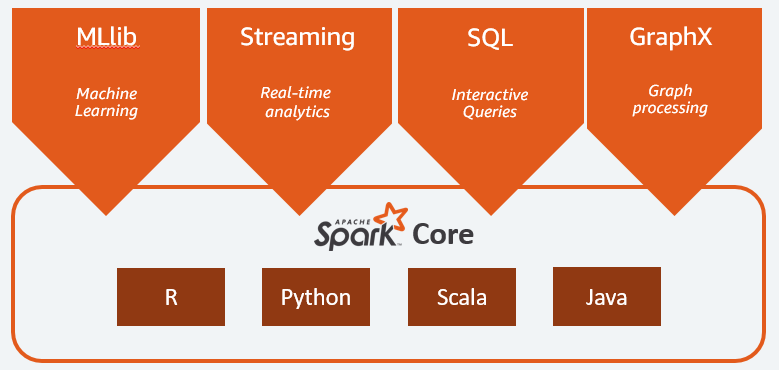

Learning Apache Spark 3 with Scala (Section1)


# Spark Component


Driver Program 사용자가 입력하는 스크립트입니다. 그리고 입력된 내용은 Cluster Manager 작성된 내용이 전달됩니다. 이때 컴퓨터 안의 전체 클러스터를 조정할 수 있는 시스템이 필요한데, 그게 Hadoop cluster일 수 있고 Hadoop의 YARN 클러스터 매니저가 그 역할을 하게 됩니다.

각각의 머신에는 각기 다른 노드가 있고 노드는 각기 다른 executor를 실행합니다. 그리고 모든 executor 과정은 전체 클러스터에 걸쳐 분배되고 각자만의 cache를 가집니다. 또한 각 executor는 task를 갖는데 data에 task를 적용합니다. Driver Program은 Cluster Manager에게 명령을 보내거나 필요하다면 executor에 직접 명령을 내리기도 합니다. executor는 서로 소통하며 동기화합니다. 물론 Cluster Manager도 모든 executor 과정에 명령할 수 있습니다. 무엇을 그리고 어디에서 실행하는지를 조정하고 호출해서 결과를 모아 모든 과정이 끝나면 최종 결과를 사용자에게 전달합니다.


# Spark is Fast : DAG

Spark는 Hadoop의 MapReduce를 대체합니다. 왜냐하면 최대 100배 정도까지 빠르게 실행되기 때문입니다. 충분한 메모리가 있다면 100배 정도 빠르다고 추정됩니다. MapReduce보다 이렇게나 빠른 이유는 바로 **directed acyclic graph, DAG** 엔진 덕분입니다. 이 엔진은 여러분이 드라이버 스크립트에 설명해놓은 workflow를 보고 이를 자동으로 최적화해줍니다. 이와 반대로, MapReduce는 딱 한 가지의 방법을 처리할 데이터에 맞춰 끼워 넣는 방식입니다. 데이터를 병렬적으로 작업하고 그러면 데이터를 다시 합쳐서 최종 결과를 정의합니다. 이러한 DAG 엔진은 Spark가 메모리를 기반으로 하기 때문에 가능합니다.

# High Level API




## Spark Streaming

실시간으로 데이터를 수집할 수 있습니다. 예를 들어, 웹사이트에서 Spark Streaming을 이용하여 발생하는 로그 파일을 계속 Spark로 데이터를 공급하는 파이프라인을 생각할 수 있습니다. 예를 들어, 웹사이트 상에 500개의 에러가 생겼다고 칩시다. Spark Streaming 시스템은 발생한 500개의 에러가 Apache Spark에 스트리밍되도록 구성되어야합니다. 그러면 실시간으로 500개의 에러를 확인할 수 있습니다. 임계치를 넘을 경우, 에러를 해결하기 위한 프로그램이 실행되도록 설정할 수 있습니다. 가장 흔한 형태의 애플리케이션은 로그 데이터를 변환해서 다른 곳에 입력하는 것입니다. Spark Streaming 과정을 이용해서 로그로부터 데이터를 수집하고 그것을 변환시켜 저장시킬 수 있습니다.(Elastic Search와 유사) 

## Spark SQL

SQL 명령을 통해 Spark와 통합할 수 있습니다. Spark는 하나의 거대한 DB로 취급됩니다. 데이터를 테이블 구조에 따라 정의하면, SQL으로 해결해야 하는 문제를 정의할 수 있습니다. 즉, Spark SQL을 사용하여 문제를 정의하고 해결할 수 있습니다. 이후에는 Spark가 해당 실행을 어떻게 병렬화해야하는지 스스로 알아내고 실행합니다. 이를 통해 프로젝트와 관련 있는 DB를 탄련적으로 이용할 수 있습니다. 즉 database를 수평적으로 확장할 수 있습니다. 과거에는 분산 컴퓨팅을 원하면 SQL 데이터베이스를 고르지 않던가, 단일 관계 데이터베이스를 골라야 했지만 이제는 SparkSQL 덕분에 수평적으로 두 개 DB를 동시에 사용할 수 있습니다(사실 수평으로 분할된 서버 환경에서 DB를 확장하는 것이 그렇게 효율적이지는 않습니다). 

Spark SQL과 Spark는 구분이 불분명합니다. Spark Core에서  `DataFrames`와 `DataSets` 을 이용하기 때문입니다. 이런 API는 SQL과 구조, 사용 방식면에서  비슷합니다. 그렇다면  `DataFrames`과 `DataSets`를 Spark SQL이면서 Spark Core인 걸까요? 이처럼 SparkSQL과 Spark Core는 구분이 불분명합니다. 분명한 점은, Spark SQL가 Spark를 사용하는 방법 중에서 가장 많이 사용된다는 점입니다.

## MLLib 

Apache Spark 상에서 분산 처리 기반의 기계 학습을 실행할 수 있습니다. 선택할 수 있는 알고리즘이 제한적이긴 하지만, 기본적인 알고리즘은 모두 지원합니다. 

## GraphX

GraphX는 컴퓨터 과학 측면에서의 그래프와 관련된 API입니다. GraphX 사용자 간 연결된 소셜 네트워크 그래프를 분석할 수 있습니다. 그러나 GraphX는 많이 사용되지 않습니다. 최근 들어 잘 업데이트와 지원이 중단되었기 때문입니다(극단적으로는 Spark의 실패한 프로젝트라고 말할 수 있습니다)

# Why Scala ?

## Apache Spark is implemented in Scala

첫 번째로, Spark 자체가 Scala로 작성되었습니다. 즉 Scala로 스크립트를 작성해야 Spark 자체가 어떻게 쓰였고 최적화됐는지 더 잘 알 수 있습니다. 

## Scala is Functional Programming Language 

Scala가 함수형 프로그래밍 언어이기 때문에 분산 처리에 적합합니다. Java, Python과는 다르게 Scala는 함수가 전체 클러스터에 걸쳐 분산되는 방식으로 코드를 작성하도록 강요합니다. 따라서, Spark 드라이버 스크립트를 Scala 언어로 작성하면 병렬적으로, 안전하게 그리고 쉽게 코드를 작성할 수 있습니다. 

## JVM

Scala가 Java bytecode로 컴파일되고 결국엔 Java 인터프리터인 JVM에서 실행됩니다. 이는 Java도 마찬가지입니다. 하지만 Python 언어로 Spark 스크립트를 쓰게 되면 하나의 layer를 더 거쳐야합니다. 결국 Python 코드를 Java bytecode로 바로 컴파일 해줄 수 없고 변환시켜줘야 하기 때문입니다. Scala로 작성된 코드는 실행되는 저수준 언어에 가깝습니다. 예전보다 Scala와 Python의 차이가 그렇게 크진 않지만, 여전히 속도 면에서 차이가 존재합니다. 

# What's new in Spark 3

Spark 3에서 변경점은 무엇이 있는지 알아보겠습니다.

## MLLib

RDD 인터페이스를 기반으로 한 기계 학습 라이브러리입니다.`DataFrames`을 기반으로 한 MLLib는 여전히 사용하고 있습니다. RDD를 사용하는 MLLib 원래 버전은 공식적으로 완전히 없애진 않았지만, 업데이트를 하지 않고 있습니다. 버그나 에러가 존재해도 이제 신경쓰지 않습니다. 그래서 Apache Spark에서 기계 학습을 할 때는 `DataFrames`을 기반으로 한 MLLib 라이브러리를 사용해야합니다.

## Spark 3 is Faster than Spark 2

Spark 2보다 17배 정도나 빨라졌다는 평가를 받고 있습니다. 적응형 실행이나 동적 파티션 프루닝과 같은 방법을 사용해 성능을 향상시켰습니다. 이러한 변화가 Spark 3가 더 나은 성능을 자랑하는 데 기여를 많이 했습니다. 

또 다른 점은 Python 2가 사라졌습니다. 

## Deep Learning

딥 러닝 기능 자체가 Spark 3에 구현되지는 않았지만, GPU 인스턴스를 이용할 수 있도록 지원합니다. 즉 GPU 노드가 있는 클러스터를 실행하게 되면, 그걸 이용할 수 있습니다. 그러면 ML Spark나 Tensor Flow 같은 프로젝트를 스파크에 추가해서 Spark를 Tensor Flow와 같은 딥 러닝 프레임워크랑 합치면 Spark는 클러스터에서 GPU 하드웨어를 사용할 수 있습니다. 즉, Spark 자체가 딥러닝은 못하지만, GPU를 Spark에 추가할 수 있습니다.

## Binary File

Spark 3에 바이너리 파일 기능이 생겼습니다. 예를 들어, `spark.read.format`을 바이너리 파일로 선언하면 처리되지 않은 전체 바이너리 데이터를 데이터 프레임 딱 한 줄로 입력해줍니다. 이미지 파일처럼 바이너리 데이터를 다루게 되면 편리합니다. 각각의 바이너리 파일을 데이터 프레임 형태로, 즉 한 행으로 나타내고 스파크 클러스터에 분산시켜서 바이너리 데이터를 처리하기 위한 코드를 작성하기가 유용합니다. Spark 3에서는 바이너리 데이터를 처리하고 분산하는 게 더 쉬워졌습니다. 

## GraphX is deprecated 

그래프 처리와 관련해서 Spark graph가 새로 생겼습니다. Spark 3에서 새로 도입되었고 사이퍼 쿼리 언어로 port 할 수 있죠. SQL처럼 구체적인 언어이긴 한데 그래프 구조로 된 데이터를 위한 언어입니다. Spark graph는 결국 사이퍼 쿼리 언어를 기반으로 한 GraphX의 새로운 버전입니다. GraphX 보다 좀 더 확장해서 쓸 수 있고 훨씬 유용합니다. 프로퍼티 그래프 모델이나 그래프 알고리즘으로 불렸고, Morpheus와 Cypher for Spark로 알려지기도 했습니다. 이제 Spark의 한 부분으로 흡수돼서 Spark graph라는 이름을 갖게 되었습니다.

이외에도 이제 data lake가 가능합니다. Spark에선 Delta Lake라 불립니다. 아마존과 같이 data lake를 다루시는 분한테는 좋은 기능일 것입니다. 비구조적인 CSV 데이터를 일관성 있게 처리하는 게 가능합니다.

# Scala 설치 및 실행 실습 디버깅

HelloWord를 실행하는 과정에서 아래와 같은 에러 메시지가 출력되었습니다.

```scala
java.net.BindException: Can't assign requested address:
Service 'sparkDriver' failed after 16 retries (on a random free port)!
Consider explicitly setting the appropriate binding address for the service
'sparkDriver' (for example spark.driver.bindAddress for SparkDriver)
to the correct binding address.
```

/etc/hosts에 아래와 같은 host를 추가하여 해결했습니다.

```shell
>> vim /etc/hosts

## Spark HostName ##
127.0.0.1    HostName.local
```


[참고]

[Learning Apache Spark 3 with Scala](https://www.udemy.com/course/best-scala-apache-spark/)

[[spark] Service 'sparkDriver' failed after 16 retries (on a random free port)! 오류](https://itholic.github.io/etc-sparkdriver-retires-err/)

[Spark-Cluster Mode Overview](https://spark.apache.org/docs/latest/cluster-overview.html)

[[PySpark] Apache Spark 와 RDD 자료구조](https://techblog-history-younghunjo1.tistory.com/151)

