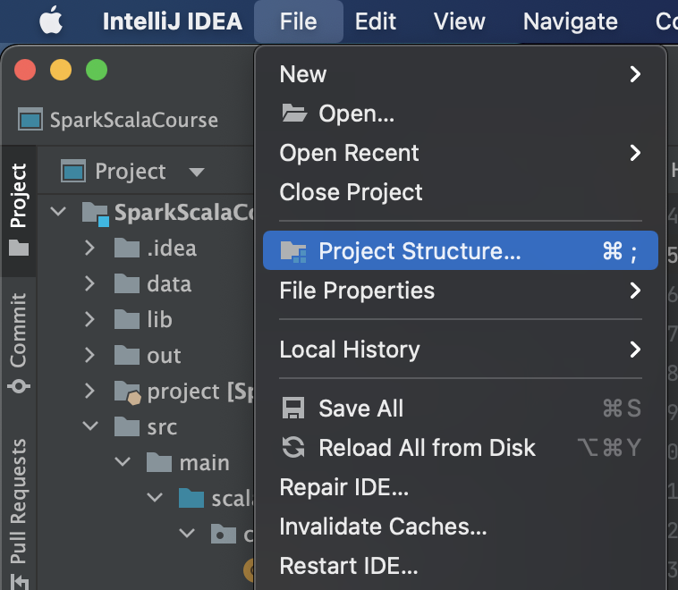
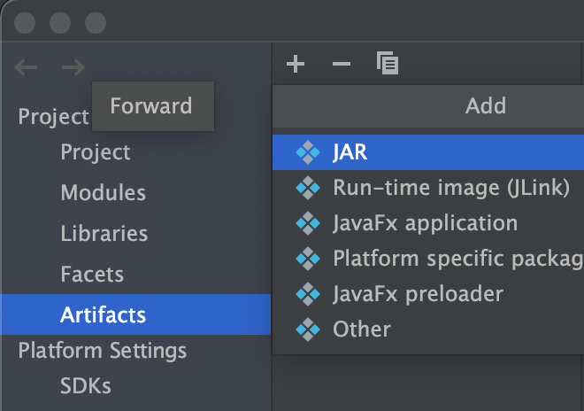
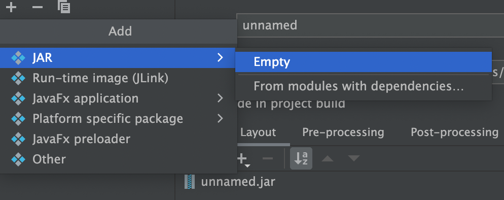
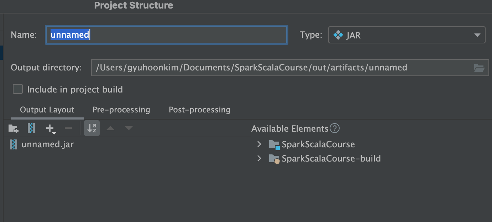
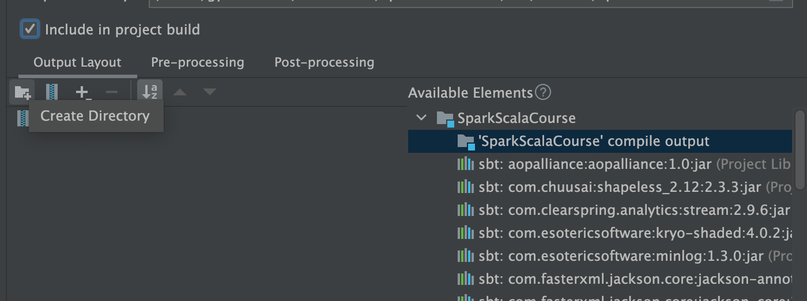
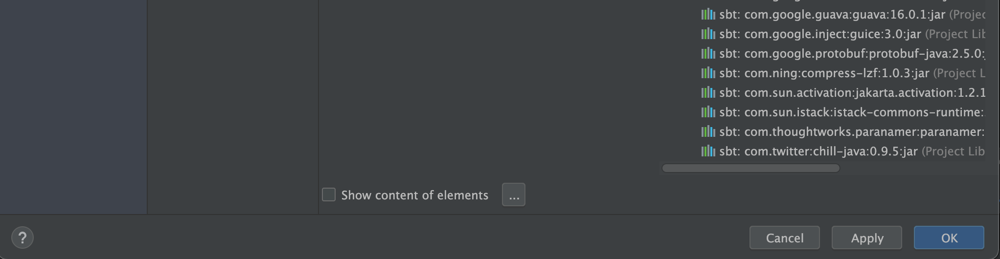

Learning Apache Spark 3 with Scala (Section6 - Running Spark on Cluster)

## Download Spark

IntelliJ 환경이 아닌, 클러스터 환경에서 spark-submit 명령어를 통해 스크립트를 실행해보겠습니다. 먼저 spark 실행 파일을 다운로드 받습니다.

[Download Apache Spark](https://spark.apache.org/downloads.html)

파일을 다운로드 받아 압축을 해제한 뒤, 기억하기 쉬운 경로에 옮겨두었습니다.

```bash
(base) gyuhoonkim@Gyuhoonui-MacBookAir ~ % cd ~
(base) gyuhoonkim@Gyuhoonui-MacBookAir ~ % ls
spark-3.0.3-bin-hadoop2.7
(base) gyuhoonkim@Gyuhoonui-MacBookAir ~ % cd spark-3.0.3-bin-hadoop2.7 
(base) gyuhoonkim@Gyuhoonui-MacBookAir spark-3.0.3-bin-hadoop2.7 % ls
LICENSE		README.md	conf		jars		python
NOTICE		RELEASE		data		kubernetes	sbin
R		bin		examples	licenses	yarn

```

## spark-submit

spark-submit을 하기 전에, 우리는 jar 파일을 만들어야합니다. interlliJ를 이용하여 SparkCourse에서 사용 중인 전체 코드를 jar파일로 패키징해보겠습니다. 

1. IntelliJ에서 `Project Structure`를 선택합니다.



2. `Artifacts`에서 + 버튼을 클릭합니다.



3. `JAR > empty`를 선택합니다.



4. `Name`에 원하는 이름을 입력합니다. 저는 SparkCourse로 하겠습니다.



5. `Avaliable Elements` 항목에서 `SparkScalaCourse compile output`을 선택합니다. 이는 컴파일이 완료된 byte-code입니다. `Include in project build` 항목도 체크해줍니다. (프로젝트 내에서 사용하고 있는 의존성 패키지는 모두 spark에 설치되어 있으므로 제외했습니다)



6. 마지막으로 하단의 `OK` 버튼을 눌러줍니다.

   

위 과정을 순서대로 따르면, 우리가 입력했던 경로인 `/Users/gyuhoonkim/Documents/SparkScalaCourse/out/artifacts/SparkCourse` 폴더 내에 jar 파일이 생성된 것을 확인할 수 있습니다. 

아래와 같은 명령어로 우리가 만든 jar 파일에서 원하는 class를 실행할 수 있습니다.  `HelloWorld.scala` 를 실행해보겠습니다. 

```bash
(base) gyuhoonkim@Gyuhoonui-MacBookAir ~ % ~/spark-3.0.3-bin-hadoop2.7/bin/spark-submit \
--class com.sundogsoftware.spark.HelloWorld \
SparkScalaCourse/out/artifacts/SparkCourse/SparkCourse.jar 
```

## sbt

위처럼 intelliJ의 기능을 이용할 수도 있지만, 더 일반적인 방법은 sbt를 사용하여 패키징하는 것입니다. sbt는 scala를 위한 maven 정도로 생각하면 됩니다. sbt는 라이브러리와 의존성 트리를 관리합니다. 필요로 되는 라이브러리나 특정 jar파일에 의존하는 스크립트가 있는 경우, 자동으로 검색하여 컴파일하는 jar파일에 포함시켜 패키징합니다.

[Download sbt](https://www.scala-sbt.org/download.html)

저는 M1 맥북이라서 `brew`로는 설치할 수가 없었고, `sdk`로 설치했습니다.

이후 아래 디렉토리 구조를 셋업합니다.

```shell
.
├── build.sbt
├── project
│   ├── assembly.sbt
│   └── build.properties
└── src
    └── main
        └── scala
```

root 위치에 `build.sbt` 파일이 존재해야합니다. 이는 가장 중요한 역할을 합니다.

```scala
name := "testProject"

version := "1.0"

organization := "com.sundogsoftware"

scalaVersion := "2.12.10"

libraryDependencies ++= Seq(
"org.apache.spark" %% "spark-core" % "3.0.3" % "provided",
"org.apache.spark" %% "spark-sql" % "3.0.3" % "provided"
)
```

- `ScalaVersion` : 사용하는 Spark에 따라 scala 버전이 달라질 수 있습니다. 항상 패키지 전에 Spark 버전을 확인하고 그에 맞는 scala 버전을 확인해야합니다.  
- `libraryDependencies` :  라이브러리 의존성은 Seq 자료형으로 컴마(,)를 기준으로 나누어 필요한만큼 추가작성할 수 있습니다. 위처럼 `provided`라 적혀있는 경우에는 해당 패키지가 사용 환경에서 이미 설치되었음을 알려주는 명령어입니다. Spark가 이미 설치된 환경에서 배포할 jar 파일을 컴파일하는 경우에는 spark 패키지를 포함할 필요가 없을 것입니다. 

`src/min/scala` 디렉토리 내에 패키징할 scala 파일을 위치하면 됩니다.

`project` 디렉토리 내에는 `assembly.sbt`, `build.properties` 파일이 존재해야합니다. 해당 파일은 아래와 같이 작성되어있습니다.

```scala
// assembly.sbt
addSbtPlugin("com.eed3si9n" % "sbt-assembly" % "0.14.10")

// build.properties
sbt.version=1.6.2
```

`assembly.sbt`는 사용할 플러그인을 결정하고, `build.properties`는 sbt build 시 사용할 sbt 버전을 결정합니다.

이러한 설정을 마치고, 컴파일할 스크립트를 올바르게 위치시켰으면 root 위치에서 아래 명령어를 가지고 패키징합니다.

```shell
(base) gyuhoonkim@Gyuhoonui-MacBookAir sbt % sbt assembly
(base) gyuhoonkim@Gyuhoonui-MacBookAir sbt % sbt package
```

target 디렉토리가 새로 생성되고 해당 scala 버전에 맞는 디렉토리 내에 jar 파일이 생성됩니다.

```shell
sbt/target
├── testProject-assembly-1.0.jar
├── testProject-1.0.jar
├── classes
├── sync
├── test-sync
├── update
└── zinc
```

| cmd          | result                       |
| ------------ | ---------------------------- |
| sbt assembly | testProject-assembly-1.0.jar |
| sbt package  | testProject-1.0.jar          |

컴파일이 완료된 jar 파일은 아래처럼 spark-submit에 제출하면 실행됩니다.

```bash
(base) gyuhoonkim@Gyuhoonui-MacBookAir ~ % ~/spark-3.0.3-bin-hadoop2.7/bin/spark-submit \
MinTemperaturesDataset-assembly-1.0.jar
```

## sbt-assembly vs. sbt-package

`sbt assembly` :  소스코드(`src/main/scala/`)뿐만 아니라  dependency가 있는 라이브러러리까지 포함하여 jar 파일로 패키징합니다. 즉, `build.sbt` 의 `libraryDependencies`에 작성했던 목록을 포함하여 작성한 코드를 실행하기 위해 필요한 모든 라이브러리들이 jar 파일에 포함되어있습니다. 

```bash
~$ vi target/scala-2.11/| testProject-assembly-1.0.jar |
META-INF/MANIFEST.MF
...
scala/util/matching/Regex$MatchIterator.class
scala/util/matching/Regex$Replacement$class.class
scala/util/matching/Regex$Replacement.class
scala/util/matching/Regex.class
scala/util/matching/UnanchoredRegex$class.class
scala/util/matching/UnanchoredRegex.class
scala/volatile.class
sparkTest$.class
sparkTest.class
```


`sbt package` : 소스코드만 jar 파일로 생성합니다. `src/main/scala/` 내부에 존재하는 소스코드만을 jar 파일에 포함시켜 패키징합니다. dependency가 있는 라이브러리는 포함되어있지 않음을 확인할 수 있습니다.

```bash
~$ vi target/scala-2.11/test_2.11-1.0.jar
META-INF/MANIFEST.MF
sparkTest$.class
sparkTest.class
```


[참고]

[Learning Apache Spark 3 with Scala](https://www.udemy.com/course/best-scala-apache-spark/)

[what-are-key-differences-between-sbt-pack-and-sbt-assembly](https://stackoverflow.com/questions/22556499/what-are-key-differences-between-sbt-pack-and-sbt-assembly)
