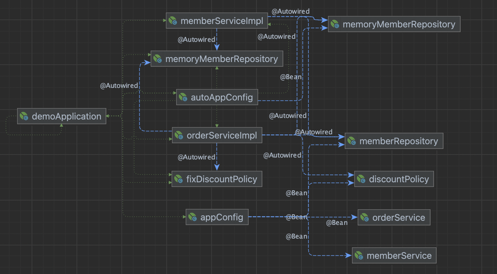

Spring Container에서 Bean 정의를 정리합니다.

## BeanFactory
- 스프링 컨테이너의 최상위 인터페이스이다.
- 스프링 빈을 관리하고 조회하는 역할(`getBean`)을 한다
- 정확하게는 Spring Container는 BeanFactory에 해당한다

## ApplicationContext 
- 일반적으로 Spring Container라하면 ApplicationConetxt를 말한다
- ApplicationContext는 BeanFactory를 확장한 인터페이스로, BeanFactory의 모든 역할을 상속받는다
- AnnotationConfigApplicationContext와 같은 구현 객체를 사용한다
- BeanFactory의 기능(빈 관리/조회) 외에 수많은 부가 기능을 제공한다
  - 메시지 소스를 활용한 국제화 기능
  - 환경변수
  - 애플리케이션 이벤트
  - 편리한 리소스 조회
- 기본적으로 싱글톤 컨테이너를 생성한다
  - 컨테이너 내에서 자동으로 의존관계를 설정한다
  - 정확하게는 [Bean 생성]과 [의존관계 주입 단계]가 나누어져있다

## AppilcationContext 내에 Spring Bean 정의하기

### [1] Java 코드 이용
- factory method를 이용하여 Bean을 정의한다고 표현한다
- annotation(`@Configuration, @Bean`) 기반 자바 코드 설정을 사용한다

```java
// hello/demo/AppConfig.class
@Configuration // App의 설정 정보(구성 정보)를 담고 있다
public class AppConfig {
    @Bean
    public MemberRepository memberRepository() {
        return new MemoryMemberRepository();
    }

    @Bean
    public DiscountPolicy discountPolicy(){
        return new RateDiscountPolicy();
    }
    @Bean
    public MemberService memberService() {
        return new MemberServiceImpl(memberRepository());

    }
    @Bean
    public OrderService orderService() {
        return new OrderServiceImpl(memberRepository(), discountPolicy());
    }
}
```

위 `AppConfig.java`를 이용하여 Spring Container를 생성할 때는 아래와 같이 이용한다

```java
// hello/demo/MemberApp.java
ApplicationContext applicationContext = new AnnotationConfigApplicationContext(AppConfig.class);
```

Spring은 Bean을 생성하고 아래와 같이 의존 관계를 자동으로 주입한다



### [2] XML 파일 이용

- 최근 사용하지 않는 추세이다
- 컴파일 없이 사용 가능하다 

```xml
<?xml version="1.0" encoding="UTF-8"?>
<beans xmlns="http://www.springframework.org/schema/beans"
       xmlns:xsi="http://www.w3.org/2001/XMLSchema-instance"
       xsi:schemaLocation="http://www.springframework.org/schema/beans http://www.springframework.org/schema/beans/spring-beans.xsd">
    <bean id="memberService" class="hello.demo.member.MemberServiceImpl" >
        <constructor-arg name="memberRepository" ref="memberRepository"></constructor-arg>
    </bean>

    <bean id="memberRepository" class="hello.demo.member.MemoryMemberRepository">
    </bean>

    <bean id="orderService" class="hello.demo.order.OrderServiceImpl">
        <constructor-arg name="memberRepository" ref="memberRepository"></constructor-arg>
        <constructor-arg name="discountPolicy" ref="discountPolicy"></constructor-arg>
    </bean>

    <bean id="discountPolicy" class="hello.demo.discount.RateDiscountPolicy"></bean>

</beans>
```

`GenericXmlApplicationContext` 구현 객체를 이용하여 스프링 컨테이너 내에 Bean을 생성한다

```java
GenericXmlApplicationContext ac = new GenericXmlApplicationContext("appConfig.xml");
```

## BeanDefinition 확인하기
- BeanDefinition이란 Bean 설정 메타 정보를 추상화해놓은 인터페이스이다
- 작성해놓은 `@Bean, <Bean>` 하나 당 하나의 메타 정보를 생성한다
- 아래와 같은 BeanDefinitionReader가 ApplicationContext의 구현 객체 내에 포함되어 있어 BeanDefinition을 조회할 수 있다
  - AnnotatedBeanDefitiionReader(AppConfig.java)
  - XMLBeanDefinitionReader(appConfig.xml)
  - XXXBeanDefinitionReader(기타))
- BeanDefinition을 코드 내에서 직접 생성하여 스프링 컨테이너에 등록할 수도 있다 (잘 사용하진 않는다)

```java
void findApplicationBean() {
        String[] beanDefinitionNames = ac.getBeanDefinitionNames();
        for (String beanDefinitionName: beanDefinitionNames){
            org.springframework.beans.factory.config.BeanDefinition beanDefinition = ac.getBeanDefinition(beanDefinitionName); // BeanDefinitionReader를 사용함

            if (beanDefinition.getRole() == org.springframework.beans.factory.config.BeanDefinition.ROLE_APPLICATION) {
                System.out.println("beanDefinitionName = " + beanDefinitionName + "beanDefinition = " + beanDefinition);
            }
        }
    }
```

## 정리
- Spring container란 엄밀히 말하면 BeanFactory를 의미하며, 일반적으로는 ApplicationContext를 말한다
- ApplicationContext는 BeanFactory의 모든 기능을 상속받고 있으며, 부가적인 기능을 제공한다
- Bean을 정의할 때는 annotation과 xml을 이용할 수 있다
- 정의된 Bean의 메타 정보는 BeanDefinitionReader(`getBeanDefinition`)를 이용하여 조회할 수 있다


  
[참고]  
[[inflearn]스프링 핵심 원리 - 기본편](https://www.inflearn.com/course/%EC%8A%A4%ED%94%84%EB%A7%81-%ED%95%B5%EC%8B%AC-%EC%9B%90%EB%A6%AC-%EA%B8%B0%EB%B3%B8%ED%8E%B8/dashboard)  
[[Spring]Bean Overview
](https://docs.spring.io/spring-framework/reference/core/beans/definition.html)